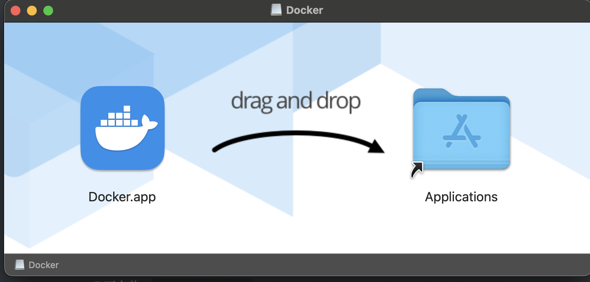
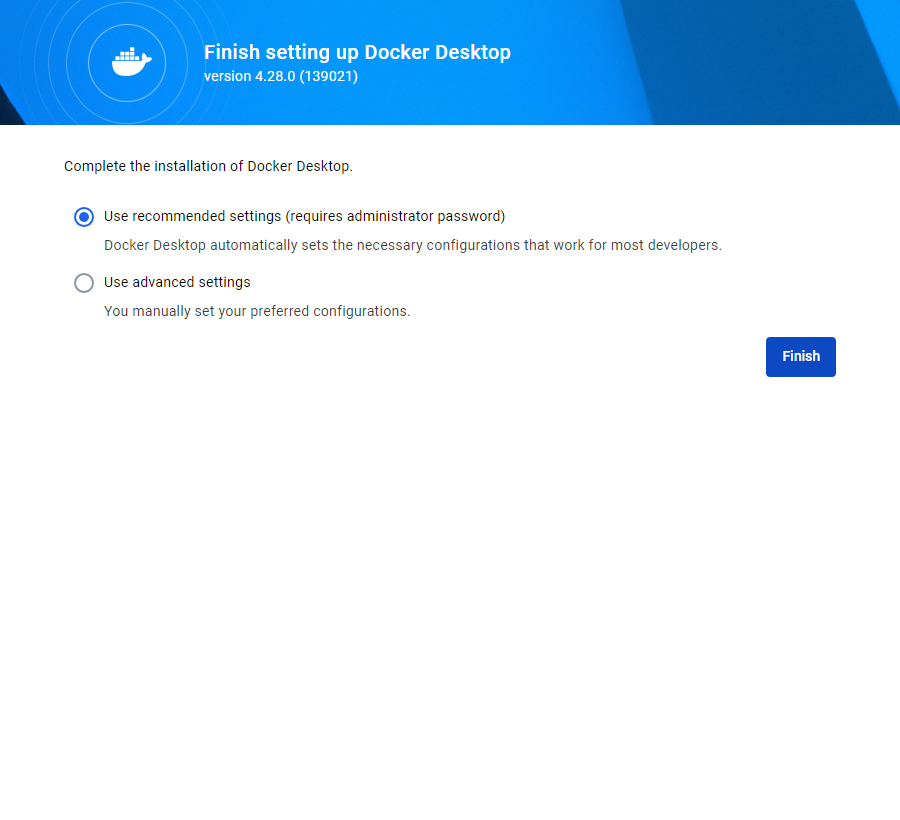
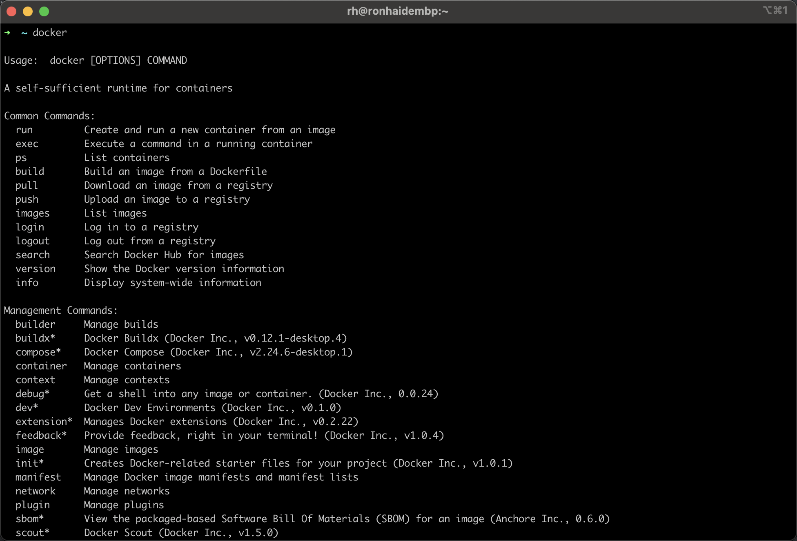

# 安装Docker环境

 整体流程：卸载 - 准备 - 安装 - 测试

 Docker官网：https://www.docker.com

 # 卸载旧版(可选)

   目的是确保安装最新的Docker，只有重新构建Docker后才能修改内存。

 - 停止docker服务

   ```bash
    sudo systemctl stop docker
   ```

 - 查看已安装的docker软件包
       ```bash
       sudo yum list installed | grep docker
       ```

 - 卸载已安装的docker软件包
       ```bash
       sudo yum remove containerd.io.x86_64 docker* -y
       ```

 - 删除Docker数据和配置文件

   ```bash
   sudo rm -rf /var/lib/docker		# 存放容器、镜像、卷、网络的配置
   sudo rm -rf /var/lib/containerd	# 管理docker容器生命周期的组件(docker容器的运行环境)
   sudo rm -rf /etc/docker		# docker的配置文件
   ```

 # Linux

 - 查看系统版本
       Docker 需要至少 CentOS 7 作为基础操作系统，且建议系统内核版本不低于3.10

     ```bash
     cat /etc/centos-release  #contos
     uname -a
     ```

 - 安装依赖

   ```bash
   sudo yum install -y yum-utils device-mapper-persistent-data lvm2
   ```

   Yum-utils 为下部安装作准备,yum-config-manager 在这个包里

   device-mapper-persistent-data是Linux下存储技术(DeviceMapper)的驱动

   lvm2的作用则是创建逻辑磁盘分区

 - 设置docker安装源

   ```bash
    sudo yum-config-manager --add-repo https://mirrors.aliyun.com/docker-ce/linux/centos/docker-ce.repo
    sudo sed -i 's+download.docker.com+mirrors.aliyun.com/docker-ce+' /etc/yum.repos.d/docker-ce.repo
    sudo yum makecache fast  # 提前在本地创建软件包索引缓存，以此来提高搜索和安装软件的速度
   ```

 ## 安装Docker社区版

 ### 安装命令

   ```bash
   sudo yum install -y docker-ce docker-ce-cli containerd.io docker-buildx-plugin docker-compose-plugin
   ```

 - 注意

   - ce版为免费的社区版，ee版为收费的企业版
   - docker-ce-cli 是 Docker Engine 的命令行界面
   - containerd.io 是容器运行时的基本组件，负责管理容器的生命周期、镜像管理和存储
   - docker-buildx-plugin 官方提供的构建工具,可快速、高效地构建 Docker 镜像,并支持跨平台
   - docker-compose-plugin 容器编排插件。允许通过一个配置文件来描述服务,并通过命令来管理这些服务

 - 启动服务   

   ```bash
    sudo systemctl start docker	# 启动docker服务
   ```

   注意：

   docker应用需要用到各种端口，因此之后每启动一个容器都应逐一去防火墙开放对应端口，否则容器无法启动，为避免因此带来的繁琐操作，建议在启动docker服务前将防火墙关闭！

   	sudo systemctl stop firewalld		# 关闭防火墙
   	sudo systemctl disable firewalld	# 禁止防火墙开机自动启动

 ### 镜像加速(可选)

 ​    docker官方镜像仓库网速较差，最好设置国内镜像站点
 ​    依次执行如下命令(参考：https://cr.console.aliyun.com/cn-hangzhou/instances/mirrors),需要登录自己的阿里帐号

 ```bash
 sudo mkdir -p /etc/docker
 sudo tee /etc/docker/daemon.json <<-'EOF'
 {
   "registry-mirrors": [
     "https://hub-mirror.c.163.com",
     "https://ustc-edu-cn.mirror.aliyuncs.com",
     "https://ghcr.io",
     "https://mirror.baidubce.com",
     "https://lnog75gn.mirror.aliyuncs.com"
   ]
 }
 EOF
 
 
 sudo systemctl daemon-reload
 sudo systemctl restart docker
 ```

 **mac上修改**

 可以编辑 Docker Desktop 的配置文件 `~/.docker/daemon.json` 来修改 Docker 守护进程的全局配置，影响所有容器的行为。

 重启docker服务,linux,windows和mac直接重启docker desktop

 ```base
 sudo systemctl daemon-reload
 sudo systemctl restart docker
 ```

 ### 测试安装

 ```bash
   docker -v			# 查看docker引擎版本
   docker compose version	# 查看docker-compose版本
 
   docker pull hello-world	# 拉取镜像
   docker run hello-world	# 启动容器
 ```

 # mac安装

 进入官网地址下载Docker Desktop，根据自己的系统下载相应的安装包。


 下载地址：https://www.docker.com/products/docker-desktop/  

 

 安装好后打开，选择第一个默认设置，大多数开发者使用，后面的是自定义设置。

 

 设置好了后就可以在命令行运行docker，非常方便。

 

# Windows

 进入官网地址下载Docker Desktop，根据自己的系统下载相应的安装包。


下载安装好后，运行会报WSL错误


执行以下命令，将把 WSL 2 设置为默认版本。如果您的系统中没有安装 WSL 2 内核，则会自动下载并安装（win10同样）

```bash
 wsl --set-default-version 2
```

如果WSL 2内核更新失败，以管理员打开PowerShell运行以下命令

```bash
wsl --update
```


安装成功后打开正常


## 运行mysql

### 拉取MySQL镜像

输入以下命令以从Docker Hub拉取最新的MySQL镜像

````bash
docker pull mysql
````

### 运行docker

```bash
docker run --name mysql-server -e MYSQL_ROOT_PASSWORD=root123 -e MYSQL_DATABASE=mydb -e MYSQL_USER=blog -e MYSQL_PASSWORD=root123 --publish 3306:3306 -d mysql:latest --character-set-server=utf8mb4 --collation-server=utf8mb4_unicode_ci
```

上述命令中：

- --name mysql-server：将容器命名为mysql-server。
- -e MYSQL_ROOT_PASSWORD=your_password：设置root用户的密码。
- -e MYSQL_DATABASE=mydb：创建一个名为mydb的数据库。
- -e MYSQL_USER=myuser：创建一个名为myuser的新用户。
- -e MYSQL_PASSWORD=mypassword：为新用户设置密码。
- --publish 3306:3306：将容器的3306端口映射到主机的3306端口。
- -d mysql:latest：使用最新版本的MySQL镜像。
- --character-set-server=utf8mb4：设置服务器的默认字符集为utf8mb4。
- --collation-server=utf8mb4_unicode_ci：设置服务器的默认排序规则为utf8mb4_unicode_ci。

### 连接到MySQL服务器
您现在可以使用任何MySQL客户端，如MySQL Workbench、DBeaver或命令行客户端连接到MySQL服务器。使用主机地址`127.0.0.1`，端口`3306`，以及之前设置的用户名和密码。

