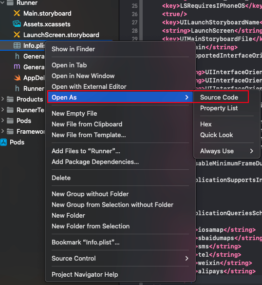

# 轮播组件

## card_swiper库

说明地址：https://pub.dev/packages/card_swiper

```bash
card_swiper : ^3.0.0
```

## 使用

```dart
 List swiperList = [
    {'url': 'https://www.ronhai.com/images/focus/focus01.png'},
    {'url': 'https://www.ronhai.com/images/focus/focus01.png'},
    {'url': 'https://www.ronhai.com/images/focus/focus01.png'},
  ];
Swiper(
   itemBuilder: (BuildContext context, int index) {
     return Image.network(
       controller.swiperList[index]['url'],
       fit: BoxFit.fill,
     );
   },
   itemCount: 3,
   autoplay: true,
   pagination: SwiperPagination(builder: SwiperPagination.dots),
   // control: SwiperControl(),//左右箭头
 ),
```

圆角实现

```dart
Widget swiper() {
    return Container(
      width: ScreenAdapter.getScreenWidth(),
      height: ScreenAdapter.height(280),
      padding: const EdgeInsets.fromLTRB(30, 0, 30, 0),
      decoration: const BoxDecoration(color: Colors.red),
      child: Container(
          width: ScreenAdapter.getScreenWidth(),
          decoration: BoxDecoration(
              borderRadius: BorderRadius.circular(16), color: Colors.pink),
          child: ClipRRect(
            clipBehavior: Clip.hardEdge, //确保裁剪行为强制生效，避免滚动时圆角效果消失
            borderRadius: BorderRadius.circular(16),
            child: Swiper(
              itemBuilder: (BuildContext context, int index) {
                return Image.network(
                  swiperList[index]['url'],
                  fit: BoxFit.cover,
                );
              },
              itemCount: 3,
              autoplay: true,
              pagination:
                  const SwiperPagination(builder: SwiperPagination.dots),
            ),
          )),
    );
  }
```


# 屏幕适配组件

说明地址：https://pub.dev/packages/flutter_screenutil

中文文档:https://github.com/OpenFlutter/flutter_screenutil/blob/master/README_CN.md

## 安装

```bash
dependencies:
  flutter:
    sdk: flutter
  # 添加依赖
  flutter_screenutil: ^{latest version}
```

## 属性

| 属性            | 类型              | 默认值         | 描述                                                         |
| --------------- | ----------------- | -------------- | ------------------------------------------------------------ |
| designSize      | Size              | Size(360, 690) | 设计稿中设备的尺寸(单位随意,建议dp,但在使用过程中必须保持一致) |
| deviceSize      | Size              | null           | 物理设备的大小                                               |
| builder         | Widget Function() | Container()    | 一般返回一个MaterialApp类型的Function()                      |
| orientation     | Orientation       | portrait       | 屏幕方向                                                     |
| splitScreenMode | bool              | false          | 支持分屏尺寸                                                 |
| minTextAdapt    | bool              | false          | 是否根据宽度/高度中的最小值适配文字                          |
| context         | BuildContext      | null           | 传入context会更灵敏的根据屏幕变化而改变                      |
| child           | Widget            | null           | builder的一部分，其依赖项属性不使用该库                      |
| rebuildFactor   | Function          | *default*      | 返回屏幕指标更改时是否重建。                                 |

初始化并设置适配尺寸及字体大小是否根据系统的“字体大小”辅助选项来进行缩放在使用之前请设置好设计稿的宽度和高度，传入设计稿的宽度和高度(单位随意,但在使用过程中必须保持一致) 一定要进行初始化(只需设置一次),以保证在每次使用之前设置好了适配尺寸:

## 配置

您必须在app中使用它一次

```dart
import 'package:flutter/material.dart';
import 'package:get/get.dart';
import 'app/routes/app_pages.dart';
import 'package:flutter_screenutil/flutter_screenutil.dart'; //引用

void main() {
  //配置入口
  runApp(ScreenUtilInit(
    designSize: const Size(1080, 2400),
    minTextAdapt: true,
    splitScreenMode: true,
    builder: (context, child) {
      return GetMaterialApp(
        title: "Application",
        initialRoute: AppPages.INITIAL,
        getPages: AppPages.routes,
      );
    },
  ));
}
```

## 使用

```dart
import 'package:flutter_screenutil/flutter_screenutil.dart';
//宽高
 Container(
   width: 1080.w,
   height: 590.h,
   color: Colors.pink,
 ),
SizedBox(
  height: 30.h,
),
//字号大小 
 Text(
    '屏幕字体',
    style: TextStyle(fontSize: 32.sp),
  )
```

## 使用封装

在`/lib/service/screenAdapter.dart`

```dart
import 'package:flutter_screenutil/flutter_screenutil.dart';

class Screenadapter {
  static width(num v) {
    return v.w;
  }

  static height(num v) {
    return v.h;
  }

  static fontSize(num v) {
    return v.sp;
  }

  static getScreenWidth() {
    // return ScreenUtil().screenWidth;
    return 1.sw;
  }

  static getScreenHeight() {
    // return ScreenUtil().scaleHeight;
    return 1.sh;
  }

  static statusBarHeight() {
    return ScreenUtil().statusBarHeight;
  }
}
```

使用

```dart
import 'package:flutter/material.dart';

import 'package:get/get.dart';

import '../controllers/category_controller.dart';
import '../../../service/screenAdapter.dart';

class CategoryView extends GetView<CategoryController> {
  const CategoryView({super.key});
  @override
  Widget build(BuildContext context) {
    return Scaffold(
      appBar: AppBar(
        title: const Text('CategoryView'),
        centerTitle: true,
      ),
      body: ListView(
        children: [
          Container(
            width: Screenadapter.getScreenWidth(),
            height: Screenadapter.getScreenHeight(),
            color: Colors.black38,
          )
        ],
      ),
    );
  }
}
```

# Html转义

组件flutter_html 3.0.0

地址:https://pub.dev/packages/flutter_html/versions/3.0.0-beta.2
## 安装

```yaml
dependencies:
  flutter_html: ^3.0.0-beta.2
```
导入
现在在你的 Dart 代码中，你可以使用：

```bash
import 'package:flutter_html/flutter_html.dart';
```
## 使用

```dart
Padding(
    padding: const EdgeInsets.all(10),
    child: Html(
    data: _list[0]['content'],
    style: {
        "body": Style(backgroundColor: Colors.white),
        'p': Style(fontSize: FontSize.xxSmall)
    },
    ),
)
```
# webView

flutter_inappwebview组件

pub地址:https://pub.dev/packages/flutter_inappwebview

示例地址:https://github.com/pichillilorenzo/flutter_inappwebview/blob/master/flutter_inappwebview/example/lib/in_app_webiew_example.screen.dart
## 安装

```ymal
dependencies:
  flutter_inappwebview: ^6.1.5
```

## 使用

```bash
import 'package:flutter_inappwebview/flutter_inappwebview.dart';
```

```dart
import 'package:flutter/material.dart';
import 'package:flutter_inappwebview/flutter_inappwebview.dart';

class NewDetailWebPage extends StatefulWidget {
  final Map arguments;
  const NewDetailWebPage({super.key, required this.arguments});

  @override
  State<NewDetailWebPage> createState() => _NewDetailWebPageState();
}

class _NewDetailWebPageState extends State<NewDetailWebPage> {
  @override
  void initState() {
    super.initState();
    print(widget.arguments['aid']);
  }

  @override
  Widget build(BuildContext context) {
    return Scaffold(
        appBar: AppBar(
          title: const Text('新闻详情'),
        ),
        body: Column(
          children: [
            Expanded(
                child: InAppWebView(
              initialUrlRequest: URLRequest(
                  url: WebUri(
                      "https://www.dazhuzi.com/newscontent.php?aid=${widget.arguments['aid']}")),
            ))
          ],
        )
    )
  }
}
```
# device_info_plus

获取设备信息插件

pub地址:https://pub.dev/packages/device_info_plus/install
## 安装

```bash
dependencies:
  device_info_plus: ^11.2.2
```
## 使用

```dart
import 'package:flutter/material.dart';
import 'package:device_info_plus/device_info_plus.dart';

class DeviceInfoPage extends StatefulWidget {
  const DeviceInfoPage({super.key});

  @override
  State<DeviceInfoPage> createState() => _DeviceInfoPageState();
}

class _DeviceInfoPageState extends State<DeviceInfoPage> {
  List<Widget> _list = [];
  _getInfo() async {
    final deviceInfoPlugin = DeviceInfoPlugin();
    final deviceInfo = await deviceInfoPlugin.deviceInfo;
    final allInfo = deviceInfo.data; //拿到的是个map对象
    print(allInfo is Map); //true
    var tempList = allInfo.entries.map((e) {
      return ListTile(
        title: Text(e.key),
        subtitle: Text(e.value.toString()),
      );
    }).toList();
    setState(() {
      _list = tempList;
    });
  }

  @override
  void initState() {
    super.initState();
    _getInfo();
  }

  @override
  Widget build(BuildContext context) {
    return Scaffold(
      appBar: AppBar(title: const Text('设备信息')),
      body: ListView(
        children: _list,
      ),
    );
  }
}
```

# connectivity_plus

检测网络插件

pub地址:https://pub.dev/packages/connectivity_plus

## 安装

```bash
dependencies:
  connectivity_plus: ^6.1.2
```

## 使用

```dart
import 'package:flutter/material.dart';
import 'dart:async';
import 'package:connectivity_plus/connectivity_plus.dart';

class DeviceNetworkPage extends StatefulWidget {
  const DeviceNetworkPage({super.key});

  @override
  State<DeviceNetworkPage> createState() => _DeviceNetworkPageState();
}

class _DeviceNetworkPageState extends State<DeviceNetworkPage> {
  late StreamSubscription<List<ConnectivityResult>> subscription;
  @override
  void initState() {
    super.initState();

    subscription = Connectivity()
        .onConnectivityChanged
        .listen((List<ConnectivityResult> result) {
      print(result[0]);
      if (result[0] == ConnectivityResult.wifi) {
        print('wifi网络');
      } else if (result[0] == ConnectivityResult.ethernet) {
        print('以太网网络');
      } else if (result[0] == ConnectivityResult.mobile) {
        print('手机网络');
      } else if (result[0] == ConnectivityResult.vpn) {
        print('vpn网络');
      } else if (result[0] == ConnectivityResult.none) {
        print('没有网络');
      } else if (result[0] == ConnectivityResult.other) {
        print('其它网络');
      }
    });
  }

  @override
  void dispose() {
    subscription.cancel();
    super.dispose();
  }

  @override
  Widget build(BuildContext context) {
    return Scaffold(
      appBar: AppBar(title: const Text('检测网络')),
      body: const Center(
        child: Column(
          mainAxisAlignment: MainAxisAlignment.center,
          children: [Text('检测网络')],
        ),
      ),
    );
  }
}
```

# url_launcher

配置打开URL、拨打电话 、发送短信 、打开外部应用、打开高德地图

pub地址:https://pub.dev/packages/url_launcher
## 安装

```bash
dependencies:
  url_launcher: ^6.3.1
```
## 使用

打开浏览器访问页面
```dart
import 'package:flutter/material.dart';
import 'package:url_launcher/url_launcher.dart';

class Deviceurllauncher extends StatefulWidget {
  const Deviceurllauncher({super.key});

  @override
  State<Deviceurllauncher> createState() => _DeviceurllauncherState();
}

class _DeviceurllauncherState extends State<Deviceurllauncher> {

  @override
  Widget build(BuildContext context) {
    return Scaffold(
      appBar: AppBar(title: const Text('url_launcher')),
      body: Center(
        child: Column(
          mainAxisAlignment: MainAxisAlignment.center,
          children: [
            ElevatedButton(
              onPressed: () async {
                final  Uri _url = Uri.parse('http://dazhuzi.com');
                if (await canLaunchUrl(_url)) {
                  await launchUrl(_url);
                } else {
                  print('没有办法打开这个地址');
                }
              },
              child: const Text('打开浏览器'),
            ),
          ],
        ),
      ),
    );
  }
}
```
## 安卓配置

修改：android\app\src\main\AndroidManifest.xml
```bash
<queries>
  <!-- If your app checks for SMS support -->
  <intent>
    <action android:name="android.intent.action.VIEW" />
    <data android:scheme="sms" />
  </intent>
  <!-- If your app checks for call support -->
  <intent>
    <action android:name="android.intent.action.VIEW" />
    <data android:scheme="tel" />
  </intent>
  <!-- If your application checks for inAppBrowserView launch mode support -->
  <intent>
    <action android:name="android.support.customtabs.action.CustomTabsService" />
  </intent>
</queries>
<uses-permission android:name="android.permission.QUERY_ALL_PACKAGES"/>
```
## ios配置

配置拨打电话、发送邮件、打开外部应用、高德地图导航Info.plist,在xcode中增加以下代码后重新运行flutter项目.

```bash
<key>LSApplicationQueriesSchemes</key>
<array>
  <string>iosamap</string>
  <string>sbaidumaps</string>
  <string>sms</string>
  <string>tel</string>
  <string>weixin</string>
  <string>alipays</string>
</array>
```
可以打开源码方式增加,如下图:



## 发送短信

```dart
ElevatedButton(
    child: const Text('发送短信'),
    onPressed: () async {
      final Uri tel = Uri.parse('sms:10086');
      if (await canLaunchUrl(tel)) {
        await launchUrl(tel);
      } else {
        print('没有办法发送短信$tel');
      }
    },
  ),
```

## 拨打电话

```dart
ElevatedButton(
    child: const Text('拨打电话'),
    onPressed: () async {
      final Uri tel = Uri.parse('tel:10086');
      if (await canLaunchUrl(tel)) {
        await launchUrl(tel);
      } else {
        print('没有办法拨打电话$tel');
      }
    },
  ),
```
## 打开外部App

```dart
 ElevatedButton(
  child: const Text('打开支付宝'),
  onPressed: () async {
    final Uri alipays = Uri.parse('alipays://');
    if (await canLaunchUrl(alipays)) {
      await launchUrl(alipays);
    } else {
      print('没有办法打开支付宝');
    }
  },
),
const SizedBox(
  height: 30,
),
ElevatedButton(
  child: const Text('打开微信'),
  onPressed: () async {
    final Uri wechat = Uri.parse('weixin://');
    if (await canLaunchUrl(wechat)) {
      await launchUrl(wechat);
    } else {
      print('没有办法打开支付宝');
    }
  },
),
```
## 高德地图App

高德官网导航地址：https://lbs.amap.com/api/amap-mobile/guide/android/navigation

坐标吸取器:https://lbs.amap.com/tools/picker

```dart
ElevatedButton(
  child: const Text('打开高德地图'),
  onPressed: () async {
    String title = '洪崖洞';
    String longitude = "106.575329";
    String latitude = "29.557253";
    Uri uri = Uri.parse(
        '${Platform.isAndroid ? 'android' : 'ios'}amap://navi?sourceApplication=amap&poiname=$title&lat=$latitude&lon=$longitude&dev=0&style=2pkg=com.autonavi.minimap');
    if (await canLaunchUrl(uri)) {
      await launchUrl(uri);
    } else {
      print('没有办法打开高德地图');
    }
  },
),

```
## 常见App的scheme

```bash
电商
taobao ： 淘宝
tmall ： 天猫
jdlogin ： 京东
pinduoduo ： 拼多多
kaola ： 网易考拉
yanxuan ： 网易严选
vipshop ： 唯品会
suning ： 苏宁
mishopv1 ： 小米商城
wireless1688 ： 阿里巴巴

社交、社区
weibo ： 微博
zhihu ： 知乎
xhsdiscover ： 小红书
momochat ： 陌陌
blued ： blued
mqzone ： QQ空间
mqq ： QQ
tantanapp ： 探探
huputiyu ： 虎扑
com.baidu.tieba ： 贴吧
tianya ： 天涯社区
douban ： 豆瓣
jike ： 即刻

短视频
snssdk1128 ： 抖音
snssdk1112 ： 火山
snssdk32 ： 西瓜视频
gifshow ： 快手

视频/直播
tenvideo ： 腾讯视频
youku ： 优酷
bilibili ： B站
imgotv ： 芒果TV
qiyi-iphone ： 爱奇艺
hanju ： 韩剧TV
douyutv ： 斗鱼
yykiwi ： 虎牙

图片处理
mtxx.open ： 美图秀秀
faceu ： faceu国内
ulike ： 轻颜国内

资讯
snssdk141 ： 今日头条
newsapp ： 网易新闻
qqnews ： 腾讯新闻
iting ： 喜马拉雅
weread ： 微信读书
jianshu ： 简书
igetApp ： 得到
kuaikan ： 快看漫画

财经
sinanews ： 新浪财经
amihexin ： 同花顺炒股

音乐
orpheus ： 网易云音乐
qqmusic ： qq音乐
kugouURL ： 酷狗
qmkege ： 全民K歌
changba ： 唱吧

工具
iosamap ： 高德地图
baidumap ： 百度地图
baiduyun ： 百度网盘
rm434209233MojiWeather ： 墨迹天气

办公
wxwork ： 企业微信
dingtalk ： 钉钉

生活
imeituan ： 美团
dianping ： 点评
cainiao ： 菜鸟裹裹
wbmain ： 58同城
mihome ： 米家

美食佳饮
xcfapp ： 下厨房
sbuxcn ： 星巴克中国
meituanwaimai ： 美团外卖

运动健康
fb370547106731052 ： 小米运动
meetyou.linggan ： 美柚
babytree ： 宝宝树
keep ： keep

旅行
CtripWireless ： 携程
diditaxi ： 滴滴
taobaotravel ： 飞猪
travelguide ： 马蜂窝

游戏
tencent1104466820 ： 王者荣耀
tencent100689805 ： 天天爱消除
tencent382 ： QQ斗地主
```

# video_player播放视频

播放视频

pub地址:https://pub.dev/packages/video_player

## 安装

```ymal
dependencies:
  video_player: ^2.9.2
```
## 配置

### Android配置

/android/app/src/main/AndroidManifest.xml

`<uses-permission android:name="android.permission.INTERNET"/>`

android也需要https才可以播放

Ios无需配置，注意要使用https协议

## 使用

```dart
import 'package:flutter/material.dart';
import 'package:video_player/video_player.dart';

class VideoPlayerPage extends StatefulWidget {
  const VideoPlayerPage({super.key});

  @override
  State<VideoPlayerPage> createState() => _VideoPlayerPageState();
}

class _VideoPlayerPageState extends State<VideoPlayerPage> {
  late VideoPlayerController _controller;
  @override
  void initState() {
    super.initState();
    _controller = VideoPlayerController.networkUrl(
        Uri.parse('https://vjs.zencdn.net/v/oceans.mp4'))
      ..initialize().then((_) {
        setState(() {});
      });
  }

  @override
  void dispose() {
    // TODO: implement dispose
    super.dispose();
    _controller.dispose();
  }

  @override
  Widget build(BuildContext context) {
    return Scaffold(
      appBar: AppBar(
        title: const Text('视频播放'),
      ),
      body: Center(
        child: _controller.value.isInitialized
            ? AspectRatio(
                aspectRatio: _controller.value.aspectRatio,
                child: VideoPlayer(_controller),
              )
            : AspectRatio(
                aspectRatio: _controller.value.aspectRatio,
                child: Container(color: Colors.red),
              ),
      ),
      floatingActionButton: FloatingActionButton(
        onPressed: () {
          setState(() {
            _controller.value.isPlaying
                ? _controller.pause()
                : _controller.play();
          });
        },
        child: Icon(
          _controller.value.isPlaying ? Icons.pause : Icons.play_arrow,
        ),
      ),
    );
  }
}
```

# chewie播放视频

在 Flutter 里官方提供了一个 video_player插件可以播放视频。但是video_player有一些局限性。没法
控制底部播放进度等。 所以我们主要给大家讲解一个第三方的视频播放库chewie。chewie是一个非官
方的第三方视频播放组件，看起来好像是基于 HTML5 播放的组件。chewie 相对 video_player 来说，
有控制栏和全屏的功能。Chewie 使用 video_player 引擎并将其包裹在友好的 Material 或 Cupertino
UI 中！

pub地址:https://pub.dev/packages/chewie

chewie基于video_player，所以要使用chewie必须配置video_player
## 安装

```dart
dependencies:
  chewie: ^1.10.0
  video_player: ^2.9.2
```

## 使用

```dart
import 'package:flutter/material.dart';
import 'package:video_player/video_player.dart';
import 'package:chewie/chewie.dart';

class ChewiePage extends StatefulWidget {
  const ChewiePage({super.key});

  @override
  State<ChewiePage> createState() => _ChewiePageState();
}

class _ChewiePageState extends State<ChewiePage> {
  late ChewieController chewieController;
  late VideoPlayerController videoPlayerController;
  @override
  void initState() {
    super.initState();
    videoPlayerController = VideoPlayerController.networkUrl(Uri.parse(
        'https://stream7.iqilu.com/10339/article/202002/17/778c5884fa97f460dac8d90493c451de.mp4'));
    chewieController = ChewieController(
      videoPlayerController: videoPlayerController,
      aspectRatio: 3 / 2, //视频宽高比
      autoPlay: false,
      looping: true,
      //自定义显示播放速度
      optionsBuilder: (context, defaultOptions) async {
        await showModalBottomSheet(
            context: context,
            builder: (context) {
              return SizedBox(
                height: 200,
                child: ListView(
                  children: [
                    ListTile(
                      title: const Text('播放速度'),
                      onTap: () {
                        defaultOptions[0].onTap!(context);
                      },
                    ),
                    ListTile(
                      title: const Text('取消'),
                      onTap: () {
                        Navigator.pop(context);
                      },
                    )
                  ],
                ),
              );
            });
      },
    );
  }

  @override
  void dispose() {
    super.dispose();
    videoPlayerController.dispose();
    chewieController.dispose();
  }

  @override
  Widget build(BuildContext context) {
    return Scaffold(
        appBar: AppBar(
          title: const Text('chewie播放视频'),
        ),
        body: Center(
          child: AspectRatio(
            aspectRatio: 3 / 2,
            child: Chewie(controller: chewieController),
          ),
        ));
  }
}
```

# ImagePicker

ImagePicker拍照、录制视频、相册选择照片、相册选择视频、上传文件

pub地址:https://pub.dev/packages/image_picker

## 安装

```bash
dependencies:
  image_picker: ^1.1.2
```
## 配置

android无需配置开箱即用，ios还需要配置info.plist

```bash
<key>NSPhotoLibraryUsageDescription</key>
<string>应用需要访问相册读取文件</string>
<key>NSCameraUsageDescription</key>
<string>应用需要访问相机拍照</string>
<key>NSMicrophoneUsageDescription</key>
<string>应用需要访问麦克风录制视频</string>
```
> 注意：使用相机拍摄的图像和视频会保存到应用程序的本地缓存中，因此应该只是暂时存在。如果您需
要永久存储您挑选的图像，您有责任将其移动到更永久的位置

## 相机拍照和相册选择

```dart
import 'dart:io';

import 'package:flutter/material.dart';
import 'package:image_picker/image_picker.dart';

class SelectPhotoPage extends StatefulWidget {
  const SelectPhotoPage({super.key});

  @override
  State<SelectPhotoPage> createState() => _SelectPhotoPageState();
}

class _SelectPhotoPageState extends State<SelectPhotoPage> {
  final ImagePicker picker = ImagePicker();
  XFile? _pickerFile;
  //选择照片
  _pickerGallery() async {
    XFile? pickerFile = await picker.pickImage(source: ImageSource.gallery);
    if (pickerFile != null) {
      print(pickerFile.path);
      setState(() {
        _pickerFile = pickerFile;
      });
    }
  }

  //拍照
  _pickerCamera() async {
    XFile? pickerFile = await picker.pickImage(source: ImageSource.camera);
    if (pickerFile != null) {
      print(pickerFile.path);
      setState(() {
        _pickerFile = pickerFile;
      });
    }
  }

  @override
  Widget build(BuildContext context) {
    return Scaffold(
        appBar: AppBar(
          title: const Text('选择照片拍照'),
        ),
        body: Center(
            child: Column(
          mainAxisAlignment: MainAxisAlignment.center,
          children: [
            ElevatedButton(
                onPressed: _pickerGallery, child: const Text('相册选择')),
            const SizedBox(
              height: 30,
            ),
            ElevatedButton(onPressed: _pickerCamera, child: const Text('拍照')),
            const SizedBox(
              height: 30,
            ),
            SizedBox(
              width: double.infinity,
              height: 200,
              child: _pickerFile == null
                  ? Text('选择照片...')
                  : Image.file(File(_pickerFile!.path)),
            ),
          ],
        )));
  }
}
```

## 录制视频和上传视频和图片


# toggle_switch

一个简单的切换开关小部件。它可以根据需要自定义图标、宽度、颜色、文本、角半径、动画等。它还可以保持选择状态。

pub地址:https://pub.dev/packages?q=toggle_switch

## 安装

```yaml
dependencies:
  toggle_switch: ^2.3.0
```

## 使用

```dart
import 'package:toggle_switch/toggle_switch.dart';
```

# flutter_native_splash

在应用初始化时保留启动画面插件，支持android和ios，

`flutter_native_splash`在您的 pubspec.yaml 文件中添加依赖项。

官方地址：https://pub.dev/packages/flutter_native_splash

```bash
dependencies:
	flutter_native_splash: ^2.4.5 #最新flutter  3.22.2是用的2.4.1
```

在根目录新建assets/images/把icon图片放入进去，我放的是load.png。背景色填写好，logo会放在启动画面的上下左右居中

## Android

新建`flutter_native_splash.yaml`,目录是测试的安卓设备

```yaml
flutter_native_splash:
  color: "#E92215" # 背景颜色
  image: assets/images/load.png # 启动图
  android_12:
    image: assets/images/load.png
    icon_background_color: "#E92215"
  ios: false
  web: false
```

执行生成命令

```bash
dart run flutter_native_splash:create
```

成功生成画面


以 上安卓就配置完成了，简单吧

## Ios
