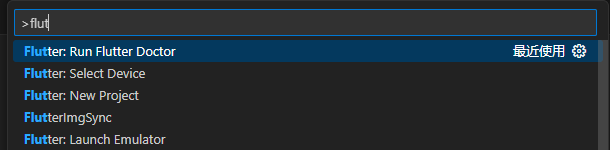

# 安装前准备

- 需要 Git for Windows](https://gitforwindows.org/) 2.27 或更高的版本
- Android Studio 2023.3.1 及以上
- 开发工具 Visual Studio Code 1.77，IntelliJ IDEA 2023.3，Android Studio 2023.3.1 三个选一个
- 安装 Flutter SDK

## Mac 版

### 安装 Fluter SDK

1. 下载 Flutter [SDK](https://flutter.dev/docs/get-started/install/macos)

2. 解压后放入用户目录 thell：/Users/thell/flutter

3. 打开终端，输入：

   ```bash
    vim ~/.zshrc
    source ~/.zshrc
    
    vim ~/.bash_profile
    source ~/.bash_profile
    
    vim ~/.zshenv
    source ~/.zshenv
   ```

4. 添加环境变量

   ```bash
   export PATH=/Users/rh/flutter/bin:$PATH
   source ~/.bash_profile
   ```

5. 查看配置是否成功

   ```bash
   flutter -h
   ```
   查看目录
   ```bash
   which flutter
   /Users/rh/flutter/flutterenv/flutter3.27.2/bin/flutter
   ```
6. 允许协议

   ```bash
   flutter doctor --android-licenses
   ```

7. 出现以下提示就是成功

   ```dart
   thell@hailongdeMacBook-Air ~ % flutter doctor
   Doctor summary (to see all details, run flutter doctor -v):
   [✓] Flutter (Channel stable, 2.2.3, on macOS 11.4 20F71 darwin-arm, locale zh-Hans-CN)
   [✓] Android toolchain - develop for Android devices (Android SDK version 29.0.2)
   [✓] Xcode - develop for iOS and macOS
   [✓] Chrome - develop for the web
   [✓] Android Studio (version 4.2)
   [✓] VS Code (version 1.58.2)
   [✓] Connected device (1 available)
   ```

### 安装 Android Studio 及 SDK，AVD

### 创建 Flutter 命令

```dart
flutter create xxxx(项目名称)
```

### Unable to locate adb

- 报错是 x 项目的 SDK 没有设置，能打开虚拟机，但是每次打开报错，在项目的 adv 也没有虚拟机打开选项
  1. 在 android studio File=>Project Structure=>Project=>Project SDK=>打开创建的虚拟机目录即可

错误信息

```bash
Android sdkmanager not found. Update to the latest Android SDK and ensure that the cmdline-tools are
```

在 SDK 安装 Tools 下安装

```bash
cmdline-tools
```

## Windows

### 安装 Flutter SDK

> 更新版本 Flutter3.29.2，android-studio 版本是：android-studio-2024.3.1.14-windows.exe

Windows[官网](https://flutter.dev/docs/development/tools/sdk/releases#windows)

Mac[官方](https://flutter.dev/docs/development/tools/sdk/releases#macos)

1. 获取 Flutter SDK

   Windows[官网](https://docs.flutter.dev/get-started/install/windows/mobile)

   Mac[官方](https://flutter.dev/docs/development/tools/sdk/releases#macos)

2. windows 环境变量添加

   window+R 输入：`sysdm.cpl`找到高级环境变量->系统变量->

   我的`flutter-SDK`放在`D:\flutter\bin`,换将变量添加如下命令->新建->添加复制的路径

```bash
D:\flutter\bin
```


### 安装 java SE

flutter开发打包android的gradle是使用的Android studio的java版本，可以不用装java SE

[下载地址](https://www.oracle.com/technetwork/java/javase/downloads/jdk8-downloads-2133151.html)

检测 java 是否安装，cmd 输入 java 出现以下提示表示安装成功

`C:\Users\Administrator>java`

```bash
用法: java [-options] class [args...]
           (执行类)
   或  java [-options] -jar jarfile [args...]
           (执行 jar 文件)
其中选项包括:
    -d32          使用 32 位数据模型 (如果可用)
    -d64          使用 64 位数据模型 (如果可用)
    -server       选择 "server" VM
                  默认 VM 是 server.

    -cp <目录和 zip/jar 文件的类搜索路径>
    -classpath <目录和 zip/jar 文件的类搜索路径>
                  用 ; 分隔的目录, JAR 档案
                  和 ZIP 档案列表, 用于搜索类文件。
    -D<名称>=<值>
                  设置系统属性
    -verbose:[class|gc|jni]
                  启用详细输出
    -version      输出产品版本并退出
    -version:<值>
                  警告: 此功能已过时, 将在
                  未来发行版中删除。
                  需要指定的版本才能运行
    -showversion  输出产品版本并继续
    -jre-restrict-search | -no-jre-restrict-search
                  警告: 此功能已过时, 将在
                  未来发行版中删除。
                  在版本搜索中包括/排除用户专用 JRE
    -? -help      输出此帮助消息
    -X            输出非标准选项的帮助
    -ea[:<packagename>...|:<classname>]
    -enableassertions[:<packagename>...|:<classname>]
                  按指定的粒度启用断言
    -da[:<packagename>...|:<classname>]
    -disableassertions[:<packagename>...|:<classname>]
                  禁用具有指定粒度的断言
    -esa | -enablesystemassertions
                  启用系统断言
    -dsa | -disablesystemassertions
                  禁用系统断言
    -agentlib:<libname>[=<选项>]
                  加载本机代理库 <libname>, 例如 -agentlib:hprof
                  另请参阅 -agentlib:jdwp=help 和 -agentlib:hprof=help
    -agentpath:<pathname>[=<选项>]
                  按完整路径名加载本机代理库
    -javaagent:<jarpath>[=<选项>]
                  加载 Java 编程语言代理, 请参阅 java.lang.instrument
    -splash:<imagepath>
                  使用指定的图像显示启动屏幕
有关详细信息, 请参阅 http://www.oracle.com/technetwork/java/javase/documentation/index.html。
```

## Windows 开发

[下载 C++环境](https://visualstudio.microsoft.com/zh-hans/downloads/)

#### 安装步骤

- 下载并运行 Visual Studio 安装程序。

- 在安装程序中，选择 **"Desktop development with C++"** 工作负载。

- 安装完成后，启动 Visual Studio。

- ### 确认 C++ 编译工具链

  确保你的系统上已经安装了适用于 Windows 的 C++ 编译工具链。在安装了“Desktop development with C++”工作负载之后，工具链应该已经配置好。你可以通过命令行检查 C++ 编译器是否可用：

  ```bash
  cl
  ```

  如果返回类似如下信息，则表示已正确安装 C++ 编译器：

  ```bash
  Microsoft (R) C/C++ Optimizing Compiler Version X.X.X for X86
  ```

# 安装 Android Studio

## [下载地址](https://developer.android.com/)

- 安装 SDK，安装前关闭所有杀毒软件，360 和管家，点击Show Package Details

  

  必装几个 sdk：

  1. Android16,安装后核对是否为 x64：
     1. Google APls Intel x86 Atom_64 System lmage

     2. Google Play Intel x86 Atom_64 System lmage
  2. Android15,安装后核对是否为 x64：
     1. Android SDK Platform 35

     2. Source for Android 35
  3. Android SDK Build-Tools 最新的
     1. 需要安装 35.0.0、35.0.0-rc4、30.0.3 才可以

  4. Android SDK Command-line Tools 最新的
  5.  Android Emulator
  6. Android Emulator hypervisor driver
  7. Android SDK Platform-Tools
  8. Google USB Driver

- 安装 flutter 插件

  

 

## 安装 Android 证书

在使用 Flutter 之前，按照指南安装所有必要的条件之后，再同意 Android SDK 平台的许可证。

```bash
flutter doctor --android-licenses #全部算则Y
```


## 进行 Flutter doctor 检测环境

- 按 windows 键+R，打开运行，输入: cmd 回车
  输入 flutter doctor

  > 注意:
  >
  > `Dart SDK已经在捆绑在Flutter里了，没有必要单独安装Dart。找到flutter存放路径flutter- > bin-> cache- > lockfile删除lockfile文件`

```bash
C:\Users\Administrator>flutter doctor
Doctor summary (to see all details, run flutter doctor -v):
[√] Flutter (Channel stable, 2.2.3, on Microsoft Windows [Version 10.0.19042.1110],
    locale zh-CN)
[√] Android toolchain - develop for Android devices (Android SDK version 31.0.0)
[√] Chrome - develop for the web
[!] Android Studio (not installed)
[√] VS Code (version 1.59.0)
[√] Connected device (3 available)

! Doctor found issues in 1 category.
```

## Vscode 运行 Flutter

1. 新建 bat 文件输入：

   `C:\Android\AndroidSDK\emulator\emulator.exe -netdelay none -netspeed full -avd Pixel4XLAPI30` `Pixel4XLAPI30`为`Andorid Studio`的`AVD`名称

2. Vscode 安装 Flutter 插件

3. 打开项目运行 Flutter run 即可在模拟器打开

4. 按 F5 实现热更新

## 设置模拟器

### error creating avd

重新安装以下两个


### 配置 sdk 路径

**添加 `ANDROID_HOME` 变量：**

- 在“系统变量”部分，点击“新建”按钮。
- 在“变量名”字段中输入 `ANDROID_HOME`。
- 在“变量值”字段中输入 `C:\Users\thell\AppData\Local\Android\Sdk`。
- 点击“确定”保存。

**更新 `PATH` 变量：**

- 在“系统变量”部分，找到并选择 `Path` 变量，然后点击“编辑”按钮。

- 在“编辑环境变量”窗口中，点击“新建”按钮，然后添加以下路径：

  ```
  perlCopy code%ANDROID_HOME%\platform-tools
  %ANDROID_HOME%\tools
  %ANDROID_HOME%\tools\bin
  ```

- 点击“确定”保存所有更改。

### 配置模拟器

打开 VS Code 的命令面板（按 `Ctrl + Shift + P`），输入 `Flutter: Launch Emulator` 并选择你刚刚创建的模拟器。

命令行配置

```ba
flutter emulators
flutter emulators --launch <emulator_id>
flutter devices
flutter run
```

## 完全卸载Android Studio

要完全删除 **Android Studio**，包括所有相关文件和设置，可以按照以下步骤操作：

首先，通过系统的控制面板卸载 Android Studio

Windows：

1. 打开 **控制面板**。
2. 点击 **程序** > **程序和功能**。
3. 找到 **Android Studio**，右键点击并选择 **卸载**。
4. 按照提示完成卸载过程。

macOS：

1. 打开 **Finder**。
2. 找到 **应用程序** 文件夹，找到 **Android Studio**。
3. 将 **Android Studio** 拖到 **废纸篓**。

### Windows：

1. 删除 Android Studio 配置文件：
   - 打开文件资源管理器，进入以下目录：
     - `C:\Users\%username%\.android`
     - `C:\Users\%username%\AppData\Local\Google\Android Studio`
     - `C:\Users\%username%\AppData\Roaming\Google\Android Studio`
   - 删除这些文件夹中的所有文件。
2. 删除 SDK 文件夹（如果你不再需要 Android SDK）：
   - 默认路径：`C:\Users\%username%\AppData\Local\Android\Sdk`
   - 如果你不再需要 SDK，可以直接删除这个文件夹。
3. 删除缓存：
   - `C:\Users\%username%\.gradle`

### macOS：

1. 删除 Android Studio 配置文件：

   - 打开终端，执行：

     ```
     bash复制编辑rm -rf ~/.android
     rm -rf ~/Library/Preferences/AndroidStudio*
     rm -rf ~/Library/Application\ Support/Google/AndroidStudio*
     rm -rf ~/Library/Caches/Google/AndroidStudio*
     rm -rf ~/Library/Logs/Google/AndroidStudio*
     ```

2. 删除 SDK 文件夹（如果不再需要）：

   - 默认路径：`~/Library/Android/sdk`

# 创建项目

命令行增加包名

```dart
flutter create projectname --org com.ronhai
```

打开 vscode 安装 Flutter 插件Flutter

打开 vscode 按 F1 输入 Flutter:New Project,创建新项目，等待下载完成创建



安装运行即可


## gradle 报错处理

```bash
Could not locate aapt. Please ensure you have the Android buildtools install
```

此问题需要安装

Android SDK Build-Tools 35、35.0.0-rc4、30.0.3 三个才可以

查看 android 下的 gradle/wrapper 中的`gradle-wrapper.properties`

```bash
distributionBase=GRADLE_USER_HOME
distributionPath=wrapper/dists
zipStoreBase=GRADLE_USER_HOME
zipStorePath=wrapper/dists
distributionUrl=https\://services.gradle.org/distributions/gradle-7.6.3-all.zip
```

### 手动配置gradle包

手动下载`https\://services.gradle.org/distributions/gradle-7.6.3-all.zip`，把\去掉直接输入到浏览器下载

在用户名下的.gradle 中找到 wrapper


下载好后解压到相应版本的目录下，我的目录是在`C:\Users\ronhai\.gradle\wrapper\dists\gradle-7.6.3-all\aocdy2d2z8kodnny3rsumj8i8`解压下载到直目录 

手动复制.zip.lck 文件更名为.zip.ok 重新运行项目即可，目录和文件保持以下结构


## 设置代理

运行 gradle 时会报错，需要配置代理,路径 `android/gradle.properties` 配置增加代理

```bash
org.gradle.jvmargs=-Xmx4G -XX:MaxMetaspaceSize=2G -XX:+HeapDumpOnOutOfMemoryError
android.useAndroidX=true
android.enableJetifier=true

systemProp.http.proxyHost=127.0.0.1
systemProp.http.proxyPort=7890
systemProp.https.proxyHost=127.0.0.1
systemProp.https.proxyPort=7890

mavenRepositoryUrl=https://maven.aliyun.com/nexus/content/groups/public/
```

`settings.gradle`配置代理 

```bash
  repositories {
        // google()
        // mavenCentral()
        // gradlePluginPortal()
        maven { url 'https://maven.aliyun.com/repository/google' }
        maven { url 'https://maven.aliyun.com/repository/public' }
        maven { url 'https://maven.aliyun.com/nexus/content/groups/public' }
        maven { url 'https://maven.aliyun.com/nexus/content/repositories/jcenter' }
        maven { url 'https://maven.aliyun.com/repository/gradle-plugin' }
    }
```

`build.gradle`配置代理

```bash
allprojects {
    repositories {
        // google()
        // mavenCentral()
               maven { url 'https://maven.aliyun.com/repository/public' }
        maven { url 'https://maven.aliyun.com/repository/google' }
        maven { url 'https://maven.aliyun.com/nexus/content/repositories/jcenter' }
        maven { url 'https://maven.aliyun.com/repository/gradle-plugin' }
    }
}
```

清除用户名下的`C:\Users\ronhai\.gradle\caches`和`C:\Users\ronhai\.gradle\wrapper`文件夹重新打包

## 更改gradle包

更改android下的`gradle-wrapper.properties`

```bash
distributionBase=GRADLE_USER_HOME
distributionPath=wrapper/dists
zipStoreBase=GRADLE_USER_HOME
zipStorePath=wrapper/dists
# distributionUrl=https\://services.gradle.org/distributions/gradle-7.6.3-all.zip
distributionUrl=https\://services.gradle.org/distributions/gradle-8.3-all.zip
```

## gradlew清除缓存

在android目录下执行以下命令，清除缓存，会重新下载gradle的包

```bash
./gradlew clean build --refresh-dependencies
```

## 报java版本错误

官方文档 ：https://docs.flutter.dev/release/breaking-changes/android-java-gradle-migration-guide

出现此错误的原因是 Android Studio Flamingo 将其捆绑的 Java SDK 从 11 更新到 17。Flutter 使用与 Android Studio 捆绑的 Java 版本来构建 Android 应用。使用 Java 17 时， [7.3 之前的](https://docs.gradle.org/current/userguide/compatibility.html#java)Gradle 版本无法运行。

错误类似于`Unsupported class file major version 65`，这表明您的 Java 版本比您正在运行的 Gradle 版本要新。AGP、Java 和 Gradle 之间存在一组不明显的依赖关系。

flutter运行跟自己电脑装的java版本没有关系，调用的是Android Studio的java来打包，版本是在Android Studio中控制，简单的方式是下载相对应的Android Studio版本，下载地址：https://developer.android.google.cn/studio/archive 切换为英文下载

查看运行的版本

```bash
flutter doctor -v
```

> [Android Studio的文档 说明](https://developer.android.com/build/jdks?hl=zh-cn#jdk-config-in-studio)


# 修改包名

## android/app/build.gradle

```dart
   defaultConfig {
        // TODO: Specify your own unique Application ID (https://developer.android.com/studio/build/application-id.html).
        applicationId = "com.example.oilie"
        // You can update the following values to match your application needs.
        // For more information, see: https://flutter.dev/to/review-gradle-config.
        minSdk = flutter.minSdkVersion
        targetSdk = flutter.targetSdkVersion
        versionCode = flutter.versionCode
        versionName = flutter.versionName
    }
```

改为

```dart
    defaultConfig {
        // TODO: Specify your own unique Application ID (https://developer.android.com/studio/build/application-id.html).
        applicationId = "com.rh.oilie"
        // You can update the following values to match your application needs.
        // For more information, see: https://flutter.dev/to/review-gradle-config.
        minSdk = flutter.minSdkVersion
        targetSdk = flutter.targetSdkVersion
        versionCode = flutter.versionCode
        versionName = flutter.versionName
    }
```

因为 Flutter 和较新版本的 Gradle 不再支持在 `AndroidManifest.xml` 中通过 `package` 属性设置命名空间，而是需要将命名空间配置移动到 `build.gradle` 文件中

```dart
android {
    namespace = "com.example.oilie"
    compileSdk = flutter.compileSdkVersion
    ndkVersion = flutter.ndkVersion
```

改为

```dart
android {
    namespace = "com.rh.oilie"
    compileSdk = flutter.compileSdkVersion
    ndkVersion = flutter.ndkVersion
```

设置了不设置 android/app/src/main/AndroidManifest.xml

## android/app/src/main/AndroidManifest.xml

老版本的设置此方式，新版本按以上的 android 设置即可，此方法不设置

```dart
<manifest xmlns:android="http://schemas.android.com/apk/res/android">
    <application
        android:label="oilie"
        android:name="${applicationName}"
        android:icon="@mipmap/ic_launcher">
```

改为

```dart
 <manifest xmlns:android="http://schemas.android.com/apk/res/android" package="com.rh.oilie">
    <application
        android:label="oilie"
        android:name="${applicationName}"
        android:icon="@mipmap/ic_launcher">
```

## android/app/src/debug/AndroidManifest.xml

```dart
<manifest xmlns:android="http://schemas.android.com/apk/res/android">
    <uses-permission android:name="android.permission.INTERNET"/>
</manifest>
```

改为

```dart
<manifest xmlns:android="http://schemas.android.com/apk/res/android" package="com.rh.oilie">
    <uses-permission android:name="android.permission.INTERNET"/>
</manifest>
```

## android/app/src/main/kotlin/com/example/oilie/MainActivity.kt

```dart
package com.example.oilie

import io.flutter.embedding.android.FlutterActivity

class MainActivity: FlutterActivity()
```

改为

```dart
package com.rh.oilie

import io.flutter.embedding.android.FlutterActivity

class MainActivity: FlutterActivity()
```

## kotlin/com 下的包名


改为


## 重新生成ios和安卓

更换了flutter的版本需要重新生成目录
### 生成android
移除android目录，重新创建指定语言的android目录
```bash
# 进入工程目录，删除android目录
rm -rf android
 
# 重新创建java语言的android目录
flutter create -a java .
 
# 重新创建kotlin语言的android目录
flutter create -a kotlin .
```

### 生成ios
移除ios目录，重新创建指定语言的ios目录
```bash
# 进入工程目录，删除ios
rm -rf ios 
 
# 重新创建指定swift语言的ios目录
flutter create -i swift .
 
# 重新创建指定objective-c 语言的ios目录
flutter create -i objc .  
```

# pub使用

## flutter pub cache clean

这个命令用于清理 Flutter 的包缓存。在使用 Flutter 进行开发时，会下载和缓存一些第三方依赖包，这些包会被保存在 Flutter 的包缓存中。flutter pub cache clean 命令可以清除这些缓存，当你需要清理缓存并重新下载依赖包时，可以使用这个命令

## flutter clean

这个命令用于清理 Flutter 项目的构建文件。当你在 Flutter 项目中进行构建时，会生成一些构建文件和输出目录，例如生成的 APK 文件、构建缓存等。flutter clean 命令可以清除这些构建文件，当你需要清理构建文件并重新构建项目时，可以使用这个命令

> 总结来说，flutter pub cache clean 主要用于清理 Flutter 包缓存，而 flutter clean 主要用于清理项目的构建文件。它们的使用场景和目的不同，根据具体的需求选择使用适当的命令。

使用flutter clean打开`pubspec.yaml`保存会自动下载依赖，

## flutter pub get

下载依赖

