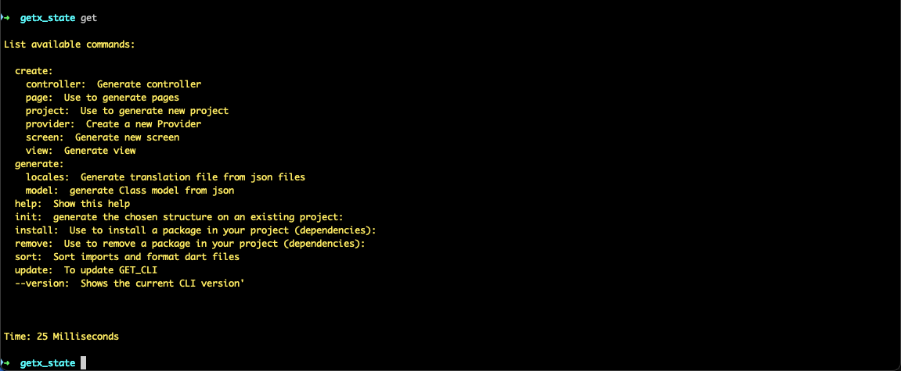
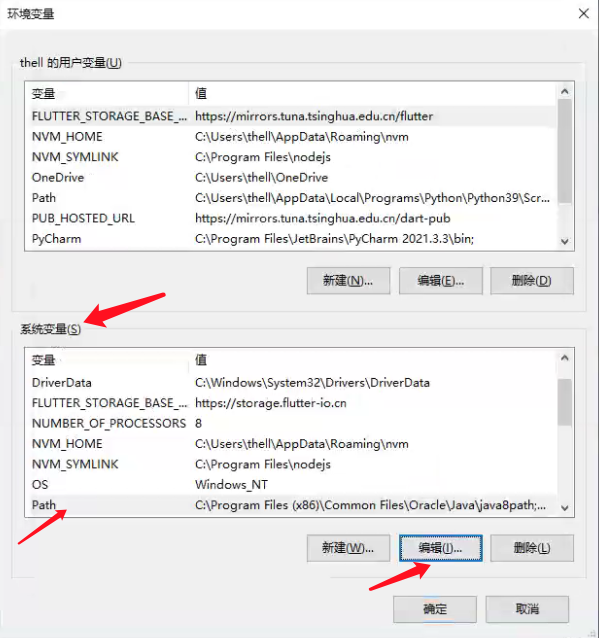
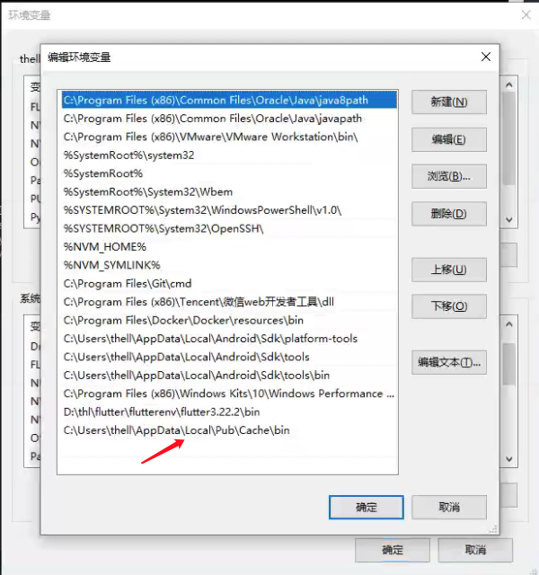
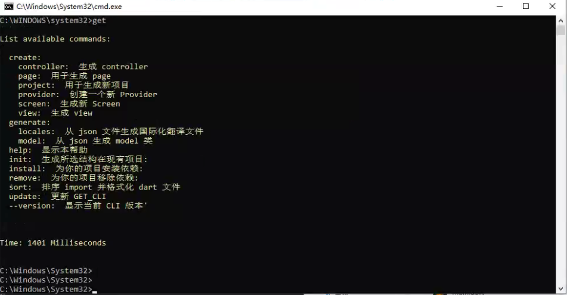
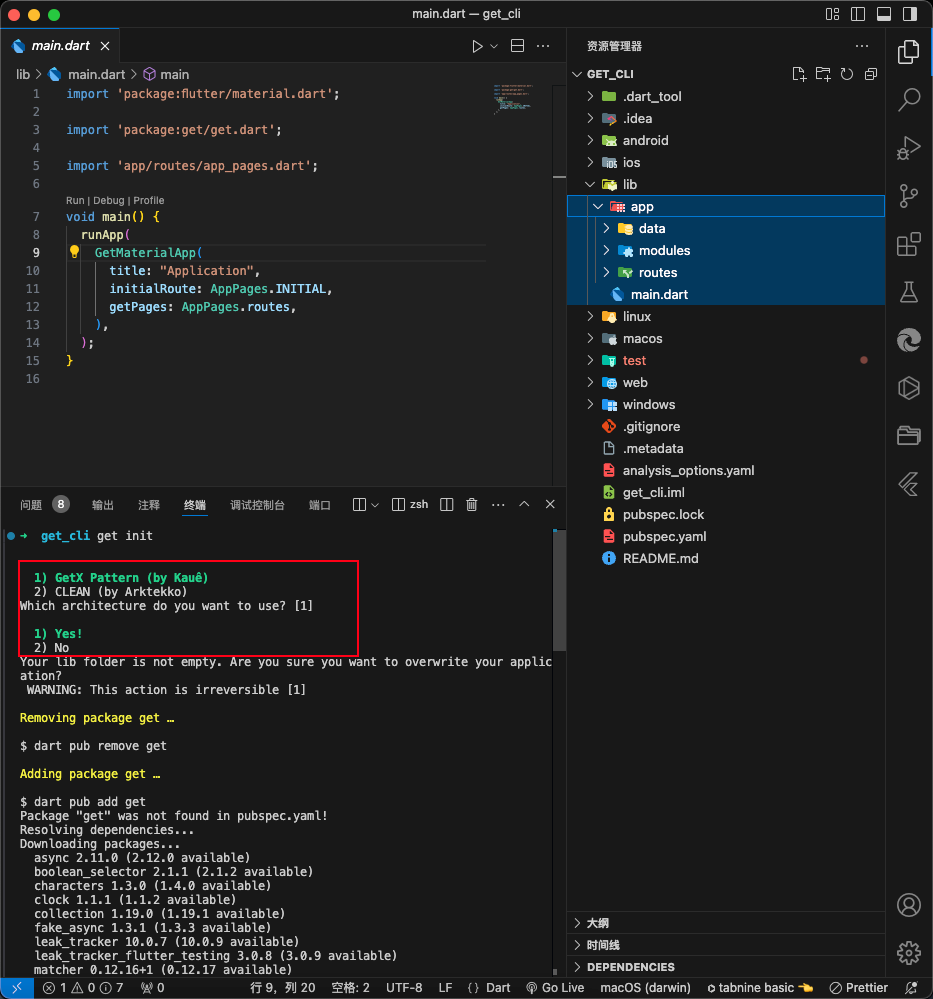

状态管理

当我们想在多个页面（组件/Widget）之间共享状态（数据），或者一个页面（组件/Widget）中的多个子组件之间共享状态（数据），这个时候我们就可以用Flutter中的状态管理来管理统一的状态（数据），实现不同组件之间的传值和数据共享。

现在Flutter的状态管理方案很多，redux、bloc、state、provider、Getx。

- provider是官方提供的状态管理解决方案，主要功能就是状态管理。
- Getx是第三方的状态管理插件，不仅具有状态管理的功能，还具有路由管理、主题管理、国际化多语言管理、Obx局部更新、网络请求、数据验证等功能，相比其他状态管理插件Getx 简单、功能强大并且高性能。

# Flutter Getx介绍 

GetX 是 Flutter 上的一个轻量且强大的解决方案，Getx为我们提供了高性能的状态管理、智能的依赖注入和便捷的路由管理。

GetX 有3个基本原则：

- 性能： GetX 专注于性能和最小资源消耗。GetX 打包后的apk占用大小和运行时的内存占用与其他状态管理插件不相上下。

- 效率： GetX 的语法非常简捷，并保持了极高的性能，能极大缩短你的开发时长。

- 结构： GetX 可以将界面、逻辑、依赖和路由完全解耦，用起来更清爽，逻辑更清晰，代码更容易维护

GetX 并不臃肿，却很轻量。如果你只使用状态管理，只有状态管理模块会被编译，其他没用到的东西都不会被编译到你的代码中。它拥有众多的功能，但这些功能都在独立的容器中，只有在使用后才会启动。

Getx有一个庞大的生态系统，能够在Android、iOS、Web、Mac、Linux、Windows和你的服务器上用同样的代码运行。 通过Get Server 可以在你的后端完全重用你在前端写的代码。

官网：https://pub.dev/packages/get

中文文档：https://github.com/jonataslaw/getx/blob/master/README.zh-cn.md


## Gext安装

将 Get 添加到你的 pubspec.yaml 文件中。

```yaml
dependencies:
  get: ^4.6.6
```

*在需要用到的文件中导入，它将被使用。*

```dart
import 'package:get/get.dart';
```

*设置应用程序入口*

```dart
import 'package:flutter/material.dart';
import 'package:get/get.dart';

void main() {
  runApp(const MyApp());
}
class MyApp extends StatelessWidget {
  const MyApp({super.key});
  @override
  Widget build(BuildContext context) {
    //顶层MaterialApp改为GetMaterialApp
    return GetMaterialApp(
      title: 'Flutter Demo',
      theme: ThemeData(
        primarySwatch: Colors.blue,
      ),
      home: const MyHomePage(),
    );
  }
}
class MyHomePage extends StatelessWidget {
  const MyHomePage({super.key});
    @override
  Widget build(BuildContext context) {
    ....
  }
}
```

# Getx使用Dialog

我们可以通过`Get.defaultDialog()` 来显示 `dialog`,如下所示

```dart
ElevatedButton(
  onPressed: () {
    Get.defaultDialog(
      title: "提示信息!",
      middleText: "您确定要删除吗?",
      confirm: ElevatedButton(
        onPressed: () {
          print("确定");
          // Navigator.of(context).pop();
          Get.back();
        },
        child: const Text("确定")),
      cancel: ElevatedButton(
        onPressed: () {
          print("取消");
          Get.back();
        },
        child: const Text("取消")));
  },
  child: const Text("Getx defaultDialog")),
```

## Dialog属性和说明

> 总共25个属性

| 字段               | 属性               | 描述                                         |
| ------------------ | ------------------ | -------------------------------------------- |
| title              | String             | 弹出的标题，默认（Alert)                     |
| titlePadding       | EdgeInsetsGeometry | 标题的内边距，默认（EdgeInsets.all(8)）      |
| titleStyle         | TextStyle          | 标题的样式                                   |
| middleText         | String             | 中间内容区域显示的文字                       |
| middleTextStyle    | TextStyle          | 中间内容区域显示的文字样式                   |
| content            | Widget             | 弹出的内容，该值设置后middleText将无效       |
| contentPadding     | EdgeInsetsGeometry | 内容的内边距，默认（EdgeInsets.all(8)）      |
| onConfirm          | VoidCallback       | 确认按钮回调                                 |
| onCancel           | VoidCallback       | 取消按钮回调                                 |
| onCustom           | VoidCallback       | 自定义按钮回调                               |
| cancelTextColor    | Color              | 取消按钮文字的颜色                           |
| confirmTextColor   | Color              | 确认按钮文字的颜色                           |
| textConfirm        | String             | 确认按钮的文字                               |
| textCancel         | String             | 取消按钮的文字                               |
| textCustom         | String             | 自定义按钮的文字                             |
| confirm            | Widget             | 确认按钮的组件                               |
| cancel             | Widget             | 取消按钮的组件                               |
| custom             | Widget             | 自定义按钮的组件                             |
| backgroundColor    | Color              | 弹出框的背景颜色                             |
| barrierDismissible | bool               | 是否可以通过点击背景关闭弹窗                 |
| buttonColor        | Color              | 按钮的文字颜色，根据按钮类型来设定不同的位置 |
| radius             | double             | 弹出框的圆角大小，默认20                     |
| actions            | List               | 增加额外的子组件                             |
| onWillPop          | WillPopCallback    | 拦截关闭之前做一些操作                       |
| navigatorKey       | GlobalKey          | 用于打开对话框的key                          |

# Getx snackbar提示信息

Snackbar和toast有点相似， 如果想在应用程序中触发某些特定的事件后，需要弹出快捷消息，那么使用Snackbar 则是最佳的选择。

```dart
ElevatedButton(
  onPressed: () {
    Get.snackbar("提示?", "您还有没有登录",
                 snackPosition: SnackPosition.TOP,
                 backgroundColor: Colors.amber,
                 colorText: Colors.black45); //显示位置
  },
  child: const Text("Getx snackbar")),
```

## Snackbar属性和说明

> 总共38个属性

| 字段                             | 属性                   | 描述                                                         |
| -------------------------------- | ---------------------- | ------------------------------------------------------------ |
| title                            | String                 | 弹出的标题文字                                               |
| message                          | String                 | 弹出的消息文字                                               |
| colorText                        | Color                  | title和message的文字颜色                                     |
| duration                         | Duration               | Snackbar弹出的持续时间（默认3秒）                            |
| instantInit                      | bool                   | 当false可以把snackbar 放在initState，默认true                |
| snackPosition                    | SnackPosition          | 弹出时的位置，有两个选项【TOP，BOTTOM】默认TOP               |
| titleText                        | Widget                 | 弹出标题的组件，设置该属性会导致title属性失效                |
| messageText                      | Widget                 | 弹出消息的组件，设置该属性会导致messageText属性失效          |
| icon                             | Widget                 | 弹出时图标，显示在title和message的左侧                       |
| shouldIconPulse                  | bool                   | 弹出时图标是否闪烁，默认false                                |
| maxWidth                         | double                 | Snackbar最大的宽度                                           |
| margin                           | EdgeInsets             | Snackbar外边距，默认zero                                     |
| padding                          | EdgeInsets             | Snackbar内边距，默认EdgeInsets.all(16)                       |
| borderRadius                     | double                 | 边框圆角大小，默认15                                         |
| borderColor                      | Color                  | 边框的颜色，必须设置borderWidth，否则无效果                  |
| borderWidth                      | double                 | 边框的线条宽度                                               |
| backgroundColor                  | Color                  | Snackbar背景颜色，默认Colors.grey.withOpacity(0.2)           |
| leftBarIndicatorColor            | Color                  | 左侧指示器的颜色                                             |
| boxShadows                       | List                   | Snackbar阴影颜色                                             |
| backgroundGradient               | Gradient               | 背景的线性颜色                                               |
| mainButton                       | TextButton             | 主要按钮，一般显示发送、确认按钮                             |
| onTap                            | OnTap                  | 点击Snackbar事件回调                                         |
| isDismissible                    | bool                   | 是否开启Snackbar手势关闭，可配合dismissDirection使用         |
| showProgressIndicator            | bool                   | 是否显示进度条指示器，默认false                              |
| dismissDirection                 | SnackDismissDirection  | Snackbar关闭的方向                                           |
| progressIndicatorController      | AnimationController    | 进度条指示器的动画控制器                                     |
| progressIndicatorBackgroundColor | Color                  | 进度条指示器的背景颜色                                       |
| progressIndicatorValueColor      | Animation              | 进度条指示器的背景颜色，Animation                            |
| snackStyle                       | SnackStyle             | Snackbar是否会附加到屏幕边缘                                 |
| forwardAnimationCurve            | Curve                  | Snackbar弹出的动画，默认Curves.easeOutCirc                   |
| reverseAnimationCurve            | Curve                  | Snackbar消失的动画，默认Curves.easeOutCirc                   |
| animationDuration                | Duration               | Snackbar弹出和小时的动画时长，默认1秒                        |
| barBlur                          | double                 | Snackbar背景的模糊度                                         |
| overlayBlur                      | double                 | 弹出时的毛玻璃效果值，默认0                                  |
| snackbarStatus                   | SnackbarStatusCallback | Snackbar弹出或消失时的事件回调（即将打开、已打开、即将关闭、已关闭） |
| overlayColor                     | Color                  | 弹出时的毛玻璃的背景颜色                                     |
| userInputForm                    | Form                   | 用户输入表单                                                 |

## BottomSheet改变主题

我们可以通过GetX 很轻松的调用bottomSheet() ，而且无需传入context ，下面我给出一个例子，使用GetX 弹出bottomSheet 并很轻松的实现切换主题 。我们可以通过Get.bottomSheet() 来显示 BottomSheet ，通过Get.back() 实现路由返回，通过Get.changeTheme(ThemeData.dark()) 切换皮肤主题，通过Get.isDarkMode判断主题样式。

```dart
ElevatedButton(
  onPressed: () {
    Get.bottomSheet(Container(
      color: Get.isDarkMode ? Colors.black26 : Colors.white,
      height: 200,
      child: Column(
        children: [
          ListTile(
            leading: Icon(Icons.wb_sunny_outlined,
                          color: Get.isDarkMode
                          ? Colors.white
                          : Colors.black87),
            onTap: () {
              //切换主题
              Get.changeTheme(ThemeData.light());
              Get.back();
            },
            title: Text(
              "白天模式",
              style: TextStyle(
                color: Get.isDarkMode
                ? Colors.white
                : Colors.black87),
            ),
          ),
          ListTile(
            leading: Icon(Icons.wb_sunny,
                          color: Get.isDarkMode
                          ? Colors.white
                          : Colors.black87),
            onTap: () {
              //切换主题
              Get.changeTheme(ThemeData.dark());
              Get.back();
            },
            title: Text(
              "夜晚模式",
              style: TextStyle(
                color: Get.isDarkMode
                ? Colors.white
                : Colors.black87),
            ),
          )
        ],
      ),
    ));
  },
  child: const Text("Getx bottomSheet切换主题"))
```

## BottomSheet属性和说明

| **字段**                 | **属性**      | **描述**                     |
| ------------------------ | ------------- | ---------------------------- |
| bottomsheet              | Widget        | 弹出的Widget组件             |
| backgroundColor          | Color         | bottomsheet的背景颜色        |
| elevation                | double        | bottomsheet的阴影            |
| persistent               | bool          | 是否添加到路由中             |
| shape                    | ShapeBorder   | 边框形状，一般用于圆角效果   |
| clipBehavior             | Clip          | 裁剪的方式                   |
| barrierColor             | Color         | 弹出层的背景颜色             |
| ignoreSafeArea           | bool          | 是否忽略安全适配             |
| isScrollControlled       | bool          | 是否支持全屏弹出，默认false  |
| useRootNavigator         | bool          | 是否使用根导航               |
| isDismissible            | bool          | 点击背景是否可关闭，默认ture |
| enableDrag               | bool          | 是否可以拖动关闭，默认true   |
| settings                 | RouteSettings | 路由设置                     |
| enterBottomSheetDuration | Duration      | bottomsheet进入时的动画时间  |
| exitBottomSheetDuration  | Duration      | bottomsheet退出时的动画时间  |

# Getx路由管理

Getx为我们封装了Navigation ，无需context 可进行跳转，使用Getx进行路由跳转非常的简单，只需要调用Get.to() 即可进行路由跳转， Getx路由跳转简化了跳转动画设置 、动画时长定义、动画曲线设置。

## Get.to()实现普通路由跳转

```dart
Get.to(Home());
```

## Get.toNamed()跳转到命名路由

原生路由跳转

```dart
Navigator.pushNamed(context, "/login");
```

使用Getx后

```dart
Get.toNamed("/login");
Get.toNamed("/shop",arguments: {
	"id":20
});
```

## Get.back();返回到上一级页面

原生路由跳转

```dart
Navigator.of(context).pop();
```

使用Getx后

```dart
Get.back();
```

## Get.offAll()返回到根

原生路由跳转

```dart
Navigator.of(context).pushAndRemoveUntil(
  MaterialPageRoute(builder: (BuildContext context) {
 	 return const Tabs(index: 4);
  })
, (route) => false);
```

使用Getx后

```dart
Get.offAll( const Tabs(index: 4)); //返回到导航页面
```

## Get.off(NextScreen())

进入下一个页面，但没有返回上一个页面的选项（用于闪屏页，登录页面等）

```dart
Get.off(NextScreen());
```

## Getx配置路由及动画

```dart
class MyApp extends StatelessWidget {
  const MyApp({Key? key}) : super(key: key);

  // This widget is the root of your application.
  @override
  Widget build(BuildContext context) {
    return GetMaterialApp(
      debugShowCheckedModeBanner: false,
      title: 'Flutter Demo',
      theme: ThemeData(
          primarySwatch: Colors.blue,
          appBarTheme: const AppBarTheme(
            centerTitle: true,
          )),
      initialRoute: "/",
      // onGenerateRoute: onGenerateRoute,
      defaultTransition: Transition.rightToLeft,//全局路由动画,rightToLeft是ios风格动画
      getPages:AppPage.routes,
    );
  }
}
```

某一页面动画

```dart
GetPage(
  name: "/registerFirst",
  page: () => const RegisterFirstPage(),
  transition: Transition.rightToLeft),
),
```

## 路由传参及收参

跳转传值

```dart
Get.toNamed("/shop",arguments: {
	"id":20
});
```

接受数据

```dart
print(Get.arguments);
```

# GetPage 中间件

GetPage现在有个新的参数可以把列表中的Get中间件按指定顺序执行。

**注意**: 当GetPage有中间件时，所有的子page会自动有相同的中间件。

参考文档:https://github.com/jonataslaw/getx/blob/master/README.zh-cn.md#redirect

## 优先级

设置中间件的优先级定义Get中间件的执行顺序。

```dart
final middlewares = [
  GetMiddleware(priority: 2),
  GetMiddleware(priority: 5),
  GetMiddleware(priority: 4),
  GetMiddleware(priority: -8),
];
```

这些中间件会按这个顺序执行 **-8 => 2 => 4 => 5**

## 中间件示例

新建/lib/middlewares/shopMiddleware.dart

```dart
import 'package:flutter/cupertino.dart';
import 'package:get/get.dart';

class ShopMiddleWare extends GetMiddleware {
  // 优先级越低越先执行
  // int? get priority => -1;
  @override
  RouteSettings? redirect(String? route) {
    return null; //路由不做任何处理
  }
  // @override
  // RouteSettings redirect(String? route) {
  //   return const RouteSettings(name: '/login');
  // }
}
```

路由配置

```dart
import 'package:get/get.dart';
import '../pages/tabs.dart';
import '../pages/shop.dart';
import '../pages/user/login.dart';
import '../pages/user/registerFirst.dart';
import '../pages/user/registerSecond.dart';
import '../pages/user/registerThird.dart';
import '../middlewares/shop.dart';

class AppPage {
  static final routes = [
    GetPage(name: "/", page: () => const Tabs()),
    GetPage(
        name: "/shop",
        page: () => const ShopPage(),
        middlewares: [ShopMiddleWare()]),
    GetPage(name: "/login", page: () => const LoginPage()),
    GetPage(
        name: "/registerFirst",
        page: () => const RegisterFirstPage(),
        transition: Transition.fade),
    GetPage(name: "/registerSecond", page: () => const RegisterSecondPage()),
    GetPage(name: "/registerThird", page: () => const RegisterThirdPage()),
  ];
}
```

# Getx状态管理

目前，Flutter有几种状态管理器。但是，它们中的大多数都涉及到使用ChangeNotifier来更新widget，这对于中大型应用的性能来说是一个很糟糕的方法。你可以在Flutter的官方文档中查看到，ChangeNotifier应该使用1个或最多2个监听器，这使得它们实际上无法用于任何中等或大型应用。

Get 并不是比任何其他状态管理器更好或更差，而是说你应该分析这些要点以及下面的要点来选择只用Get，还是与其他状态管理器结合使用。

Get不是其他状态管理器的敌人，因为Get是一个微框架，而不仅仅是一个状态管理器，既可以单独使用，也可以与其他状态管理器结合使用。

Get有两个不同的状态管理器：响应式状态管理器、简单的状态管理器。

## 响应式状态管理器

响应式编程可能会让很多人感到陌生，因为它很复杂，但是GetX将响应式编程变得非常简单。

- 你不需要创建StreamControllers

- 你不需要为每个变量创建一个StreamBuilder

- 你不需要为每个状态创建一个类

- 你不需要为一个初始值创建一个get。

  使用 Get 的响应式编程就像使用 setState 一样简单。

  让我们想象一下，你有一个名称变量，并且希望每次你改变它时，所有使用它的小组件都会自动刷新。

## 声明一个响应式变量三种方式

第一种 使用 Rx{Type}

```dart
final name = RxString('');
final isLogged = RxBool(false);
final count = RxInt(0);
final balance = RxDouble(0.0);
final items = RxList<String>([]);
final myMap = RxMap<String, int>({});
```

第二种是使用 Rx，规定泛型 Rx。

```dart
final name = Rx<String>('');
final isLogged = Rx<Bool>(false);
final count = Rx<Int>(0);
final balance = Rx<Double>(0.0);
final number = Rx<Num>(0)
final items = Rx<List<String>>([]);
final myMap = Rx<Map<String, int>>({});
自定义类 - 可以是任何类
final user = Rx<User>();
```

第三种 更实用、更简单、更可取的方法，只需添加 .obs 作为value的属性。(推荐)

```dart
final name = ''.obs;
final isLogged = false.obs;
final count = 0.obs;
final balance = 0.0.obs;
final number = 0.obs;
final items = <String>[].obs;
final myMap = <String, int>{}.obs;
自定义类 - 可以是任何类
final user = User().obs;
```

使用说明

```dart
//申明加.obs
 RxInt _counter = 0.obs;

//使用使用Obx函数包装
 Obx(() => Text( "${_counter.value}",  style: TextStyle(fontSize: 30), ))
```

### 简单示例

`animal.dart`

```dart
class Animal {
  String name;
  int age;
  Animal(this.name, this.age);
}
```

`person.dart`

```dart
import 'package:get/get.dart';

class Person {
  RxString username = 'rh'.obs;
  RxInt age = 18.obs;
}
```

完整示例:

```dart
import 'package:flutter/material.dart';
import 'package:get/get.dart';
import './person.dart';
import './animal.dart';

void main() {
  runApp(const MyApp());
}

class MyApp extends StatelessWidget {
  const MyApp({super.key});

  @override
  Widget build(BuildContext context) {
    return GetMaterialApp(
      title: 'Flutter Demo',
      theme: ThemeData(
        colorScheme: ColorScheme.fromSeed(seedColor: Colors.deepPurple),
        useMaterial3: true,
      ),
      home: MyHomepage(),
    );
  }
}

class MyHomepage extends StatelessWidget {
  final RxInt _counter = 0.obs;
  final RxMap _userInfo = {'name': '隆海', 'age': 20, 'gender': 1}.obs;
  var p = Person();
  var a = Animal('小花狗', 2).obs;
  MyHomepage({super.key});

  @override
  Widget build(BuildContext context) {
    return Scaffold(
      appBar: AppBar(
        title: const Text('Title'),
        centerTitle: true,
      ),
      body: Center(
        child: Column(
          mainAxisAlignment: MainAxisAlignment.center,
          children: [
            Obx(() => Text(
                  "${_counter.value}",
                  style: TextStyle(fontSize: 30),
                )),
            SizedBox(
              height: 10,
            ),
            Obx(() => Text("姓名:${_userInfo['name']}")),
            SizedBox(
              height: 10,
            ),
            Obx(() => Text("年龄:${_userInfo['age']}")),
            SizedBox(
              height: 10,
            ),
            Obx(() => Text("性别:${_userInfo['gender'] == 1 ? '男' : '女'}")),
            SizedBox(
              height: 10,
            ),
            Obx(
              () => Text("${p.username}"),
            ),
            SizedBox(
              height: 10,
            ),
            Obx(
              () => Text("${a.value.name}"),
            )
          ],
        ),
      ),
      floatingActionButton: FloatingActionButton(
        onPressed: () {
          _counter.value++;
          _userInfo['name'] = '大竹仔';
          p.username.value = p.username.toUpperCase();
          a.value.name = '小黑狗';
          a.value = a.value;
        },
        child: Icon(Icons.add),
      ),
    );
  }
}
```

## 多页面之间的数据共享

### Getx 依赖管理简介

Get有一个简单而强大的依赖管理器，它允许你只用1行代码就能检索到与你的Bloc或Controller相同的类，无需Provider context，无需inheritedWidget。

```dart
Controller controller = Get.put(Controller());
// 而不是 Controller controller = Controller();
```

想象一下，你已经浏览了无数条路由，现在你需要拿到一个被遗留在控制器中的数据，那你需要一个状态管理器与Provider或Get_it一起使用来拿到它，对吗？用Get则不然，Get会自动为你的控制器找到你想要的数据，而你甚至不需要任何额外的依赖关系。

```dart
Controller controller = Get.find();
//是的，它看起来像魔术，Get会找到你的控制器，并将其提供给你。你可以实例化100万个控制器，Get总会给你正确的控制器。
```

Flutter默认创建的 "计数器 "项目有100多行（含注释），为了展示Get的强大功能，我将使用 GetX 重写一个"计数器 Plus版"，实现：

- 每次点击都能改变状态
- 在不同页面之间切换
- 在不同页面之间共享状态
- 将业务逻辑与界面分离

### 声明绑定的控制器

此种页面共享的数据是全局共享,如果是页面共享需要结合binding

新建lib/controllers/counter.dart

```dart
import 'package:get/get.dart';

class CounterController extends GetxController {
  CounterController() {
    print('CounterController执行了');
  }
  RxInt counter = 0.obs;
  inc() {
    counter.value++;
  }

  dec() {
    counter.value--;
  }
}
```

### home.dart执行inc方法

```dart
import 'package:flutter/material.dart';
import 'package:get/get.dart';
import '../../controllers/counter.dart';

class HomePage extends StatefulWidget {
  const HomePage({super.key});
  @override
  State<HomePage> createState() => _HomePageState();
}

class _HomePageState extends State<HomePage> {
  CounterController counterController = Get.put(CounterController());
  @override
  Widget build(BuildContext context) {
    return Center(
      child: Column(
        mainAxisAlignment: MainAxisAlignment.center,
        children: [
          Obx(() => Text(
                "${counterController.counter}",
                style: Theme.of(context).textTheme.headlineLarge,
              )),
          SizedBox(
            height: 10,
          ),
          ElevatedButton(
              onPressed: () {
                counterController.inc();
              },
              child: Text('计数器+1')),
          SizedBox(
            height: 10,
          ),
        ],
      ),
    );
  }
}
```

### Category.dart执行dec方法

```dart
import 'package:flutter/material.dart';
import 'package:get/get.dart';
import '../../controllers/counter.dart';

class CategoryPage extends StatefulWidget {
  const CategoryPage({super.key});

  @override
  State<CategoryPage> createState() => _CategoryPageState();
}

class _CategoryPageState extends State<CategoryPage> {
  CounterController counterController = Get.find();
  @override
  Widget build(BuildContext context) {
    return Center(
      child: Column(
        mainAxisAlignment: MainAxisAlignment.center,
        children: [
          Obx(() => Text(
                "${counterController.counter}",
                style: Theme.of(context).textTheme.headlineLarge,
              )),
          SizedBox(
            height: 10,
          ),
          ElevatedButton(
              onPressed: () {
                counterController.dec();
              },
              child: Text('计数器-1')),
          SizedBox(
            height: 10,
          ),
        ],
      ),
    );
  }
}
```

### Controller绑定数据的几种方法

**方法一**

```dart
CountController countController = Get.put(CountController());
或者
final CountController countController = Get.find();

Obx(()=>Text("${countController.count}",style:
Theme.of(context).textTheme.headline1)),
```

**方法二**

只是绑定数据无需调用Get.put(CountController());

```dart
GetX<CountController>(
    init: CountController(),
    builder: (controller) {
        return Text(
        "${controller.count}",
        style: const TextStyle(color: Colors.green, fontSize: 30),
        );
    },
),
```

### GetxBinding

需求:所有页面都要使用状态管理

在我们使用GetX 状态管理器的时候，往往每次都是用需要手动实例化一个控制器，这样的话基本页面都需要实例化一次，这样就太麻烦了，而Binding 能解决上述问题，可以在项目初始化时把所有需要进行状态管理的控制器进行统一初始化，接下来看代码演示：

在前面的文章中，我们经常使用Get.put(MyController()) 来进行控制器实例的创建，这样我们就算不使用控制器实例也会被创建，其实Getx还提供很多创建实例的方法，可根据不同的业务来进行创建，接下来我们简单介绍一下几个最常用的

- Get.put()： 不使用控制器实例也会被创建
- Get.lazyPut()： 懒加载方式创建实例，只有在使用时才创建
- Get.putAsync()： Get.put() 的异步版版本
- Get.create()： 每次使用都会创建一个新的实例

### 声明需要进行的绑定控制器类

`/lib/controllers/counter.dart`

```dart
import 'package:get/get.dart';

class CounterController extends GetxController {
  CounterController() {
    print('CounterController执行了');
  }
  RxInt counter = 0.obs;
  inc() {
    counter.value++;
  }

  dec() {
    counter.value--;
  }
}
```

`/lib/controllers/list.dart`

```dart
import 'package:get/get.dart';

class ListController extends GetxController {
  ListController() {
    print('ListController执行了');
  }
  RxList list = ['大竹仔', '隆海', '我是降海'].obs;
  add(element) {
    list.add(element);
  }
}

```

在`/lib/binding/binding.dart`

```dart
import 'package:get/get.dart';
import '../controllers/counter.dart';
import '../controllers/list.dart';

class AllControllerBinding implements Bindings {
  @override
  void dependencies() {
    Get.lazyPut<CounterController>(() => CounterController());
    Get.lazyPut<ListController>(() => ListController());
  }
}
```

### 在项目启动时进行初始化绑定

```dart
import 'package:flutter/material.dart';
import 'package:get/get.dart';
import './routers/routers.dart';
import 'binding/binding.dart';

void main() {
  runApp(const MyApp());
}

class MyApp extends StatelessWidget {
  const MyApp({super.key});

  @override
  Widget build(BuildContext context) {
    return GetMaterialApp(
      debugShowCheckedModeBanner: false,
      title: 'Material App',
      initialBinding: AllControllerBinding(), //全局绑定Bindings
      theme: ThemeData(
          primarySwatch: Colors.pink,
          appBarTheme: const AppBarTheme(
            centerTitle: true,
          )),
      initialRoute: '/',
      defaultTransition: Transition.rightToLeft, //全局路由动画,rightToLeft是ios风格动画
      // onGenerateRoute: onGenerateRoute,
      getPages: AppPage.routes,
    );
  }
}
```

### 在页面中使用状态管理器

`setting.dart`

```dart
import 'package:flutter/material.dart';
import 'package:get/get.dart';
import '../../controllers/list.dart';

class SettingPage extends StatefulWidget {
  const SettingPage({super.key});

  @override
  State<SettingPage> createState() => _SettingPageState();
}

class _SettingPageState extends State<SettingPage> {
  ListController listController = Get.find<ListController>();
  @override
  Widget build(BuildContext context) {
    return Center(
      child: ListView(
        children: listController.list.map((item) {
          return ListTile(
            title: Text("${item}"),
          );
        }).toList(),
      ),
    );
  }
}
```

`home.dart`

```dart
import 'package:flutter/material.dart';
import 'package:get/get.dart';
import '../../controllers/counter.dart';
import '../../controllers/list.dart';

class HomePage extends StatefulWidget {
  const HomePage({super.key});
  @override
  State<HomePage> createState() => _HomePageState();
}

class _HomePageState extends State<HomePage> {
  CounterController counterController = Get.find();
  ListController listController = Get.find();
  @override
  Widget build(BuildContext context) {
    return Center(
      child: Column(
        mainAxisAlignment: MainAxisAlignment.center,
        children: [
          Obx(() => Text(
                "${counterController.counter}",
                style: Theme.of(context).textTheme.headlineLarge,
              )),
          SizedBox(
            height: 10,
          ),
          ElevatedButton(
              onPressed: () {
                counterController.inc();
                listController.list.add('增加一外名称');
              },
              child: Text('计数器+1')),
          SizedBox(
            height: 10,
          ),
          ElevatedButton(
              onPressed: () {
                Get.toNamed('/shop');
              },
              child: Text('shop页面')),
        ],
      ),
    );
  }
}
```

`category.dart`

```dart
import 'package:flutter/material.dart';
import 'package:get/get.dart';
import '../../controllers/counter.dart';

class CategoryPage extends StatefulWidget {
  const CategoryPage({super.key});

  @override
  State<CategoryPage> createState() => _CategoryPageState();
}

class _CategoryPageState extends State<CategoryPage> {
  CounterController counterController = Get.find();
  @override
  Widget build(BuildContext context) {
    return Center(
      child: Column(
        mainAxisAlignment: MainAxisAlignment.center,
        children: [
          Obx(() => Text(
                "${counterController.counter}",
                style: Theme.of(context).textTheme.headlineLarge,
              )),
          SizedBox(
            height: 10,
          ),
          ElevatedButton(
              onPressed: () {
                counterController.dec();
              },
              child: Text('计数器-1')),
          SizedBox(
            height: 10,
          ),
        ],
      ),
    );
  }
}
```

# GetView介绍 GetxController生命周期

GetView 只是对已注册的Controller 有一个名为controller 的getter的const Stateless 的Widget，如果我们只有单个控制器作为依赖项，那我们就可以使用GetView ，而不是使用StatelessWidget ，并且避免了写Get.Find() 。GetView如何使用GetView的使用方法非常简单，只是要将你的视图层继承自GetView 并传入需要注册的控制器并Get.put() 即可，我们来看下代码演示

## GetView结合GetxController使用

定义一个CountController

```dart
import 'package:get/get.dart';

class ShopController extends GetxController {
  ShopController() {
    print('ShopController');
  }
  RxList list = ['大竹仔', '隆海', '我是降海'].obs;
  add(element) {
    list.add(element);
  }
}
```

定义一个shop Binding

```dart
import 'package:get/get.dart';

import '../controllers/shop.dart';

class ShopControllerBinding implements Bindings {
  @override
  void dependencies() {
    Get.lazyPut(() => ShopController());
  }
}
```

路由配置

```dart
import 'package:get/get.dart';
import '../middlewares/shop.dart';
import '../binding/shop.dart';

class AppPage {
  static final routes = [
    GetPage(name: "/", page: () => const Tabs()),
    GetPage(
        name: "/shop",
        page: () => const ShopPage(),
        binding: ShopControllerBinding(),
        middlewares: [ShopMiddleWare()]),
  ];
}
```

页面配置

```dart
import 'package:flutter/material.dart';
import 'package:get/get.dart';
import '../controllers/shop.dart';

class ShopPage extends GetView<ShopController> {
  const ShopPage({super.key});

  @override
  Widget build(BuildContext context) {
    // Get.put(ShopController());
    return Scaffold(
      appBar: AppBar(
        title: const Text('Title'),
      ),
      body: Center(
        child: Column(
          children: controller.list.map((item) {
            return ListTile(
              title: Text("${item}"),
            );
          }).toList(),
        ),
      ),
    );
  }
}
```

## GetxController生命周期

这个类就像一个 GetxController ，它共享相同的生命周期onInit() 、onReady() 、onClose() 。但里面没有 “逻辑”。它只是通知GetX的依赖注入系统，这个子类不能从内存中删除。所以如果你需要在你的应用程序的生命周期内对一个类实例进行绝对的持久化，那么就可以使用GetxService 。

所以这对保持你的 "服务 "总是可以被Get.find() 获取到并保持运行是超级有用的。比如ApiService, StorageService, CacheService 。

```dart
import 'package:get/get.dart';

class ShopController extends GetxController {
  ShopController() {
    print('ShopController');
  }
  RxList list = ['大竹仔', '隆海', '我是降海'].obs;
  add(element) {
    list.add(element);
  }

  @override
  void onInit() {
    super.onInit();
  }

  @override
  void onReady() {
    super.onReady();
  }

  @override
  void onClose() {
    super.onClose();
  }
}
```

# Getx自定义语言包 国际化配置

在我们使用系统自带MaterialApp 来实现国际化配置，需要进行很多配置，而且还需要手动去依赖第三方组件，而使用GetX 来实现国际化配置，你只需要一行代码即可实现切换，接下来我们看一下具体实现。

## 定义一个语言包

```dart
import 'package:get/get.dart';

class Messages extends Translations {
  @override
  Map<String, Map<String, String>> get keys => {
        'zh_CN': {'hello': '你好 世界', 'title': '标题'},
        'de_DE': {
          'hello': 'Hallo Welt',
          'title': 'title',
        }
      };
}
```

## 应用程序入口配置

- translations： 国际化配置文件
- locale： 设置默认语言，不设置的话为系统当前语言
- fallbackLocale：添加一个回调语言选项，以备上面指定的语言翻译不存在

```dart
return GetMaterialApp(
    translations: Messages(), // 你的翻译
    locale: Locale('zh', 'CN'), // 将会按照此处指定的语言翻译
    fallbackLocale: Locale('en', 'US'), // 添加一个回调语言选项，以备上面指定的语言翻译不存在
);
```

## 调用语言包

```dart
import 'package:flutter/material.dart';
import 'package:get/get.dart';
import './language.dart';

void main() => runApp(const MyApp());

class MyApp extends StatelessWidget {
  const MyApp({super.key});

  @override
  Widget build(BuildContext context) {
    return GetMaterialApp(
      title: 'Material App',
      translations: Messages(), // 你的翻译
      locale: Locale('zh', 'CN'), // 将会按照此处指定的语言翻译
      fallbackLocale: Locale('en', 'US'), // 添加一个回调语言选项，以备上面指定的语言翻译不存在
      home: Scaffold(
        appBar: AppBar(
          title: const Text('Material App Bar'),
        ),
        body: Center(
          child: Column(
            mainAxisAlignment: MainAxisAlignment.center,
            children: [
              Text("title".tr),
              const SizedBox(
                height: 10,
              ),
              ElevatedButton(
                  onPressed: () {
                    var locale = Locale('zh', 'CN');
                    Get.updateLocale(locale);
                  },
                  child: Text('切换到中文')),
              const SizedBox(
                height: 10,
              ),
              ElevatedButton(
                  onPressed: () {
                    var locale = Locale('en', 'US');
                    Get.updateLocale(locale);
                  },
                  child: Text('切换到英文'))
            ],
          ),
        ),
      ),
    );
  }
}
```

## 改变语言

调用`Get.updateLocale(locale)`来更新语言环境。然后翻译会自动使用新的locale。

```dart
var locale = Locale('en', 'US');
Get.updateLocale(locale);
```

## 系统语言

要读取系统语言，可以使用`window.locale`。

```dart
import 'dart:ui' as ui;

return GetMaterialApp(
    locale: ui.window.locale,
);
```

# Getx GetUtils类

```dart
// 给出当前页面的args。
Get.arguments

//给出以前的路由名称
Get.previousRoute

// 给出要访问的原始路由，例如，rawRoute.isFirst()
Get.rawRoute

// 允许从GetObserver访问Rounting API。
Get.routing

// 检查 snackbar 是否打开
Get.isSnackbarOpen

// 检查 dialog 是否打开
Get.isDialogOpen

// 检查 bottomsheet 是否打开
Get.isBottomSheetOpen

// 删除一个路由。
Get.removeRoute()

//反复返回，直到表达式返回真。
Get.until()

// 转到下一条路由，并删除所有之前的路由，直到表达式返回true。
Get.offUntil()

// 转到下一个命名的路由，并删除所有之前的路由，直到表达式返回true。
Get.offNamedUntil()

//检查应用程序在哪个平台上运行。
GetPlatform.isAndroid
GetPlatform.isIOS
GetPlatform.isMacOS
GetPlatform.isWindows
GetPlatform.isLinux
GetPlatform.isFuchsia

//检查设备类型
GetPlatform.isMobile
GetPlatform.isDesktop
//所有平台都是独立支持web的!
//你可以知道你是否在浏览器内运行。
//在Windows、iOS、OSX、Android等系统上。
GetPlatform.isWeb


// 相当于.MediaQuery.of(context).size.height,
//但不可改变。
Get.height
Get.width

// 提供当前上下文。
Get.context

// 在你的代码中的任何地方，在前台提供 snackbar/dialog/bottomsheet 的上下文。
Get.contextOverlay

// 注意：以下方法是对上下文的扩展。
// 因为在你的UI的任何地方都可以访问上下文，你可以在UI代码的任何地方使用它。

// 如果你需要一个可改变的高度/宽度（如桌面或浏览器窗口可以缩放），你将需要使用上下文。
context.width
context.height

// 让您可以定义一半的页面、三分之一的页面等。
// 对响应式应用很有用。
// 参数： dividedBy (double) 可选 - 默认值：1
// 参数： reducedBy (double) 可选 - 默认值：0。
context.heightTransformer()
context.widthTransformer()

/// 类似于 MediaQuery.of(context).size。
context.mediaQuerySize()

/// 类似于 MediaQuery.of(context).padding。
context.mediaQueryPadding()

/// 类似于 MediaQuery.of(context).viewPadding。
context.mediaQueryViewPadding()

/// 类似于 MediaQuery.of(context).viewInsets。
context.mediaQueryViewInsets()

/// 类似于 MediaQuery.of(context).orientation;
context.orientation()

///检查设备是否处于横向模式
context.isLandscape()

///检查设备是否处于纵向模式。
context.isPortrait()

///类似于MediaQuery.of(context).devicePixelRatio。
context.devicePixelRatio()

///类似于MediaQuery.of(context).textScaleFactor。
context.textScaleFactor()

///查询设备最短边。
context.mediaQueryShortestSide()

///如果宽度大于800，则为真。
context.showNavbar()

///如果最短边小于600p，则为真。
context.isPhone()

///如果最短边大于600p，则为真。
context.isSmallTablet()

///如果最短边大于720p，则为真。
context.isLargeTablet()

///如果当前设备是平板电脑，则为真
context.isTablet()

///根据页面大小返回一个值<T>。
///可以给值为：
///watch：如果最短边小于300
///mobile：如果最短边小于600
///tablet：如果最短边（shortestSide）小于1200
///desktop：如果宽度大于1200
context.responsiveValue<T>()
```

# get_cli的使用

## 安装

**提示**：电脑上面需要安装git

```bash
flutter pub global activate get_cli
flutter pub global activate -s git https://github.com/jonataslaw/get_cli
```

参考:https://github.com/jonataslaw/get_cli/issues/243

安装完成后配置环境变量

- mac

  vim ~/.zshrc添加以下信息,安装完成后可以看到环境变量提示

  ```dart
  # Flutter的get-cli配置
  export PATH="$PATH":"$HOME/.pub-cache/bin"
  export PATH=/Users/aishengwanwu/flutter_mac/flutter/bin:$PATH
  export PUB_HOSTED_URL=https://pub.flutter-io.cn
  export FLUTTER_STORAGE_BASE_URL=https://storage.flutter-io.cn
  export PATH="$PATH":"$HOME/flutter/flutterenv/flutter/.pub-cache/bin"
  ```

## 让配置生效

```dart
ofile
source ~/.zshrc
```

## 验证get_cli是否安装配置成功

终端输入get或getx看到下图为安装成功



- windows

  开发菜单输入cmd右键管理员运行,输入到

  ```bash
  flutter pub global activate get_cli
  flutter pub global activate -s git https://github.com/jonataslaw/get_cli
  ```
  

安装完成后提示环境变量

win+r输入sysdm.cpl打开系统属性找到高级的环境变量设置





关闭命令行窗口重新打开,你输入get或者getx查看是否安装成功



## 使用get_cli命令行

### 初始化项目

在创建好的flutter项目的目录中运行

```bash
get init 
```



###  创建页面

```bash
get create page:search
get create page:cart
get create page:user
get create page:category
```

### 创建控制器

```bash
get create controller:counter
在指定目录里面创建控制器
get create controller:counter on home
```

### 创建view

只会生成一个继承GetView的dart文件,相当于创建一个组件

```bash
get create view:dialogview on home
```

### 创建provider

生成一个继承GetConnect的类，用于请求数据，GetConnect可以便捷的通过http或websockets进行前后台通信

```ba
get create provider:user on home
```

### 生成国际化文件

在 assets/locales 目录创建 json 格式的语言文件

新建文件`zh_CN.json`

```json
{
    "buttons": {
    "login": "登录",
    "sign_in": "注册",
    "logout": "注销",
    "sign_in_fb": "用 Facebook 登录",
    "sign_in_google": "用 Google 登录",
    "sign_in_apple": "用 Apple 登录"
    }
}
```

新建文件`en_US.json`

```bash
{
    "buttons": {
    "login": "Login",
    "sign_in": "Sign-in",
    "logout": "Logout",
    "sign_in_fb": "Sign-in with Facebook",
    "sign_in_google": "Sign-in with Google",
    "sign_in_apple": "Sign-in with Apple"
    }
}
```

运行 :

```bash
get generate locales assets/locales
```

会在项目下新增文件`lib/generated/locales.g.dart`,生成以下代码

```dart
// DO NOT EDIT. This is code generated via package:get_cli/get_cli.dart

// ignore_for_file: lines_longer_than_80_chars
// ignore: avoid_classes_with_only_static_members
class AppTranslation {
  static Map<String, Map<String, String>> translations = {
    'zh_CN': Locales.zh_CN,
    'en_US': Locales.en_US,
  };
}

class LocaleKeys {
  LocaleKeys._();
  static const buttons_login = 'buttons_login';
  static const buttons_sign_in = 'buttons_sign_in';
  static const buttons_logout = 'buttons_logout';
  static const buttons_sign_in_fb = 'buttons_sign_in_fb';
  static const buttons_sign_in_google = 'buttons_sign_in_google';
  static const buttons_sign_in_apple = 'buttons_sign_in_apple';
}

class Locales {
  static const zh_CN = {
    'buttons_login': '登录',
    'buttons_sign_in': '注册',
    'buttons_logout': '注销',
    'buttons_sign_in_fb': '用 Facebook 登录',
    'buttons_sign_in_google': '用 Google 登录',
    'buttons_sign_in_apple': '用 Apple 登录',
  };
  static const en_US = {
    'buttons_login': 'Login',
    'buttons_sign_in': 'Sign-in',
    'buttons_logout': 'Logout',
    'buttons_sign_in_fb': 'Sign-in with Facebook',
    'buttons_sign_in_google': 'Sign-in with Google',
    'buttons_sign_in_apple': 'Sign-in with Apple',
  };
}
```

现在只需要在 GetMaterialApp 中加入

```bash
GetMaterialApp(
    ...
    translationsKeys: AppTranslation.translations,
    locale:const Locale('zh', 'CN'), // 将会按照此处指定的语言翻译
    fallbackLocale:const Locale('en', 'US'), // 添加一个回调语言选项，以备上面指定的语言翻译不存在
    ...
)
```

### 生成model

在实际项目中我们需要把服务器返回的map对象转换成model类，这个时候就可以使用get中的generate model 生成model

```bash
get generate model on models from "https://jdmall.ronhai.com/api/focus"
```

#### 工具生成

https://github.com/whitecodel/jsontodart

#### get-cli get generate model报错

Flutter中使用get-cli get generate model 生成模型类提示 Null check operator used on a null value

报错如下:

```bash
Unhandled exception:
Null check operator used on a null value
#0      PubspecUtils.nullSafeSupport (package:get_cli/common/utils/pubspec/pubspec_utils.dart:146:76)
#1      new TypeDefinition (package:get_cli/common/utils/json_serialize/sintaxe.dart:81:22)
#2      new TypeDefinition.fromDynamic (package:get_cli/common/utils/json_serialize/sintaxe.dart:65:14)
#3      ModelGenerator._generateClassDefinition (package:get_cli/common/utils/json_serialize/model_generator.dart:68:36)
#4      ModelGenerator.generateUnsafeDart (package:get_cli/common/utils/json_serialize/model_generator.dart:148:9)
#5      ModelGenerator.generateDartClasses (package:get_cli/common/utils/json_serialize/model_generator.dart:181:28)
#6      GenerateModelCommand.execute (package:get_cli/commands/impl/generate/model/model.dart:41:35)
<asynchronous suspension>
#7      main.<anonymous closure> (file:///Users/rh/.pub-cache/hosted/pub.dev/get_cli-1.9.1/bin/get.dart:18:38)
<asynchronous suspension>
#8      main (file:///Users/rh/.pub-cache/hosted/pub.dev/get_cli-1.9.1/bin/get.dart:18:9)
<asynchronous suspension>
```

执行以下代码:

```dart
dart pub global deactivate get_cli

dart pub global activate -s git https://github.com/knottx/get_cli.git --git-ref fix-generate-model
```

