# Flutter 布局组件

## ListView 列表组件

列表布局是我们项目开发中最常用的一种布局方式。Flutter 中我们可以通过 ListView 来定义列表项，支持垂直和水平方向展示。通过一个属性就可以控制列表的显示方向。列表有以下分类

- 垂直列表
- 垂直图文列表
- 水平列表
- 动态列表

**列表组件常用参数**

| **名称**        | **类型**           | **说明**                                        |
| --------------- | ------------------ | ----------------------------------------------- |
| scrollDirection | Axis               | Axis.horizontal 水平列表 Axis.vertical 垂直列表 |
| padding         | EdgeInsetsGeometry | 内边距                                          |
| resolve         | bool               | 组件反向排序                                    |
| children        | List               | 列表元素                                        |

Divider 横线, ListTile 一行内容

### 垂直列表

```dart
class MyApp extends StatelessWidget {
  const MyApp({super.key});
  List<Widget> _initListData() {
    List<Widget> list = [];
    for (var i = 0; i < 20; i++) {
      list.add(
        ListTile(
          leading: Image.network("https://ronhai.com/media/images/article/homebrew.png"),
          title: Text('华北黄淮高温雨今起强势登场${i + 1}'),
          subtitle: const Text("中国天气网讯 21日开始，华北黄淮高温雨今起强势登场"),
          trailing:
              Image.network("https://ronhai.com/media/images/article/homebrew.png"),
        ),
      );
    }
    return list;
  }

  @override
  Widget build(BuildContext context) {
    return ListView(
      children: _initListData(),
    );
  }
}
```

### 垂直图文列表

```dart
class MyApp extends StatelessWidget {
  const MyApp({super.key});
  List<Widget> _initListData() {
    List<Widget> list = [];
    for (var i = 0; i < 20; i++) {
      list.add(
        Image.network('https://ronhai.com/media/images/article/homebrew.png'),
      );
      list.add(Container(
        height: 40,
        padding: EdgeInsets.fromLTRB(0, 10, 0, 10),
        child: Text(
          '我是一个标题${i}',
          textAlign: TextAlign.center,
          style: TextStyle(fontSize: 16, fontWeight: FontWeight.bold),
        ),
      ));
    }
    return list;
  }

  @override
  Widget build(BuildContext context) {
    return ListView(
      children: _initListData(),
    );
  }
}
```

### 水平列表

可以左右滑动

```dart
class MyApp extends StatelessWidget {
  const MyApp({super.key});

  @override
  Widget build(BuildContext context) {
    return SizedBox(
      height: 200,
      child: ListView(
        scrollDirection: Axis.horizontal,
        children: [
          Container(
            width: 160.0,
            color: Colors.red,
            padding: const EdgeInsets.all(8.0),
          ),
          const SizedBox(width: 10),
          SizedBox(
            width: 160.0,
            child: Column(
              children: [
                SizedBox(
                  width: double.infinity,
                  height: 160,
                  child: Image.network(
                    'https://ronhai.com/media/images/article/homebrew.png',
                    fit: BoxFit.cover,
                  ),
                ),
                const SizedBox(
                  height: 8,
                ),
                const Text('World'),
              ],
            ),
          ),
          const SizedBox(width: 10),
          Container(
            width: 160.0,
            color: Colors.blue,
          ),
          const SizedBox(width: 10),
          Container(
            width: 160.0,
            color: Colors.green,
          ),
          const SizedBox(width: 10),
          Container(
            width: 160.0,
            color: Colors.yellow,
          ),
          const SizedBox(width: 10),
          Container(
            width: 160.0,
            color: Colors.orange,
          ),
        ],
      ),
    );
  }
}
```

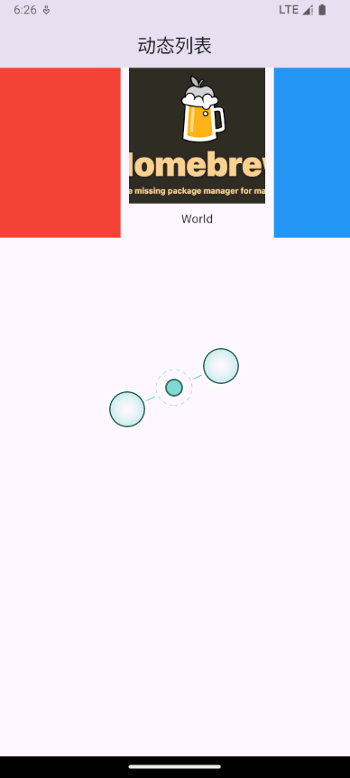

### ListView.builder

动态实现列表

```dart
import 'package:flutter/material.dart';

void main(List<String> args) {
  runApp(
    MaterialApp(
      debugShowCheckedModeBanner: false,
      home: Scaffold(
          appBar: AppBar(
            centerTitle: true,
            title: const Text(
              '动态列表',
            ),
          ),
          body: MyApp()),
    ),
  );
}

class MyApp extends StatelessWidget {
  final List list = [];

  MyApp({super.key}) {
    for (var i = 0; i < 10; i++) {
      list.add("我是一个列表--$i");
    }
  }

  @override
  Widget build(BuildContext context) {
    return ListView.builder(
      itemCount: list.length,
      itemBuilder: (context, index) {
        return ListTile(
          title: Text(list[index]),
        );
      },
    );
  }
}
```

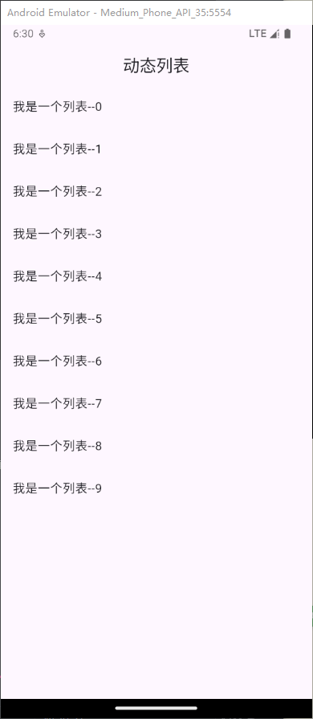

## GridView 网格布局组件

GridView 网格布局在实际项目中用的也是非常多的，当我们想让可以滚动的元素使用矩阵方式排列的时候。此时我们可以用网格列表组件 GridView 实现布局。

GridView 创建网格列表主要有下面三种方式

- 可以通过 GridView.count 实现网格布局
- 可以通过 GridView.extent 实现网格布局
- 通过 GridView.builder 实现动态网格布局

**常用属性**

| **名称**           | **类型**                                                     | **说明**                               |
| ------------------ | ------------------------------------------------------------ | -------------------------------------- |
| scrollDirection    | Axis                                                         | 滚动方法                               |
| padding            | EdgeInsetsGeometry                                           | 内边距                                 |
| resolve            | bool                                                         | 组件反向排序                           |
| crossAxisSpacing   | double                                                       | 水平子 Widget 之间间距                 |
| mainAxisSpacing    | double                                                       | 垂直子 Widget 之间间距                 |
| crossAxisCount     | int 用在 GridView.count                                      | 一行的 Widget 数量                     |
| maxCrossAxisExtent | double 用在 GridView.extent                                  | 横轴子元素的最大长度                   |
| childAspectRatio   | double                                                       | 子 Widget 宽高比例                     |
| children           |                                                              | [ ]                                    |
| gridDelegate       | SliverGridDelegateWithFixedCrossAxisCount SliverGridDelegateWithMaxCrossAxisExtent | 控制布局主要用在 GridView.builder 里面 |

### 实现网格布局

GridView.count 构造函数内部使用了 SliverGridDelegateWithFixedCrossAxisCount，我们通过它可以快速的创建横轴固定数量子元素的 GridView

```dart
import 'package:flutter/material.dart';

void main(List<String> args) {
  runApp(MyApp());
}

class MyApp extends StatelessWidget {
  @override
  Widget build(BuildContext context) {
    return MaterialApp(
      debugShowCheckedModeBanner: false,
      home: Scaffold(
          appBar: AppBar(
            leading: const Icon(Icons.more_horiz),
            centerTitle: true,
            title: const Text('网格布局'),
            actions: const [
              Icon(Icons.add),
            ],
          ),
          body: MyHomePage()),
    );
  }
}

class MyHomePage extends StatelessWidget {
  const MyHomePage({super.key});

  @override
  Widget build(BuildContext context) {
    return GridView.count(
      crossAxisCount: 5, //一行的Widget数量
      childAspectRatio: 2, //子Widget宽高比例
      crossAxisSpacing: 10,
      mainAxisSpacing: 10,
      children: const [
        Icon(Icons.home),
        Icon(Icons.ac_unit),
        Icon(Icons.search),
        Icon(Icons.settings),
        Icon(Icons.airport_shuttle),
        Icon(Icons.all_inclusive),
        Icon(Icons.beach_access),
        Icon(Icons.cake),
        Icon(Icons.circle),
        Icon(Icons.dashboard),
      ],
    );
  }
}
```

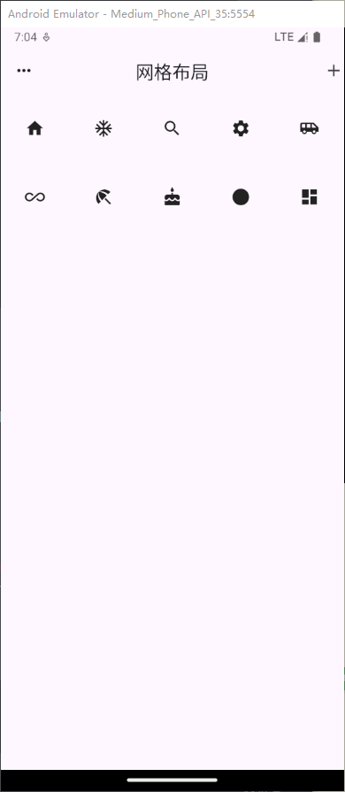

### 实现网格布局

GridView.extent 构造函数内部使用了 SliverGridDelegateWithMaxCrossAxisExtent，我们通过它可以快速的创建横轴子元素为固定最大长度的的 GridView。

```dart
class MyHomePage extends StatelessWidget {
  const MyHomePage({super.key});

  @override
  Widget build(BuildContext context) {
    return GridView.extent(
      maxCrossAxisExtent: 50, //横轴子元素的最大宽度
      childAspectRatio: 1, //子Widget高比例
      children: const [
        Icon(Icons.home),
        Icon(Icons.ac_unit),
        Icon(Icons.search),
        Icon(Icons.settings),
        Icon(Icons.airport_shuttle),
        Icon(Icons.all_inclusive),
        Icon(Icons.beach_access),
        Icon(Icons.cake),
        Icon(Icons.circle),
        Icon(Icons.dashboard),
      ],
    );
  }
}
```

### GridView.builder

- SliverGridDelegateWithFixedCrossAxisCount 实现 count 功能

- SliverGridDelegateWithMaxCrossAxisExtent 实现 extent 功能

  设置同 count 和 extent 一样，gridDelegate 的类型选择哪种类型渲染

```dart
import 'package:flutter/material.dart';

void main(List<String> args) {
  runApp(MyApp());
}

class MyApp extends StatelessWidget {
  @override
  Widget build(BuildContext context) {
    return MaterialApp(
      debugShowCheckedModeBanner: false,
      home: Scaffold(
          appBar: AppBar(
            leading: const Icon(Icons.more_horiz),
            centerTitle: true,
            title: const Text('网格布局'),
            actions: const [
              Icon(Icons.add),
            ],
          ),
          body: MyHomePage()),
    );
  }
}

class MyHomePage extends StatelessWidget {
  const MyHomePage({super.key});

  @override
  Widget build(BuildContext context) {
    return Padding(
      padding: const EdgeInsets.all(8.0),
      child: GridView.builder(
        gridDelegate: const SliverGridDelegateWithFixedCrossAxisCount(
          crossAxisCount: 3,
          crossAxisSpacing: 10,
          mainAxisSpacing: 10,
        ),
        itemBuilder: (context, index) {
          return Container(
            color: Colors.blue,
            child: Center(
              child: Text(
                'Item ${index + 1}',
                style: const TextStyle(color: Colors.white),
              ),
            ),
          );
        },
        itemCount: 15, //数量
      ),
    );
  }
}
```

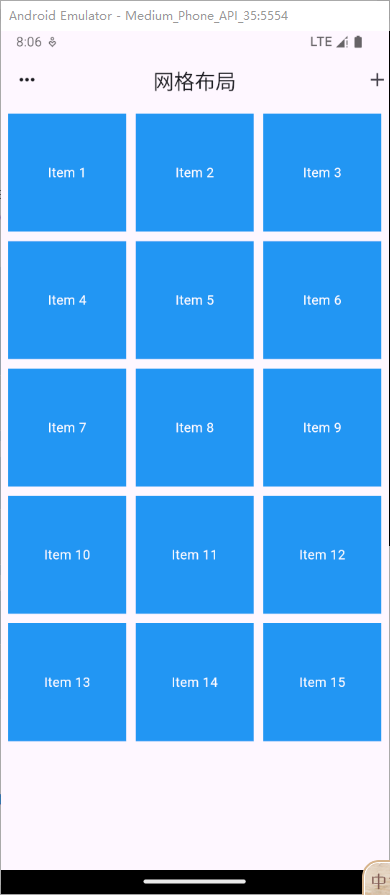

## Flex Expanded 弹性布局

Flex 组件可以沿着水平或垂直方向排列子组件，如果你知道主轴方向，使用 Row 或 Column 会方便一些，**因为** Row **和** Column **都继承自** Flex ，参数基本相同，所以能使用 Flex 的地方基本上都可以使用 Row 或 Column 。 Flex 本身功能是很强大的，它也可以和 Expanded 组件配合实现弹性布局 。Row 和 Column 是继承 flex 布局，使用 Expanded 必需在这三个组件中，具有 flex 的容器中

### 水平弹性布局

```dart
class MyHomePage extends StatelessWidget {
  const MyHomePage({super.key});

  @override
  Widget build(BuildContext context) {
    return Flex(
      direction: Axis.horizontal,
      children: [
        Expanded(
            flex: 1,
            child: Image.network(
                'https://ronhai.com/media/images/article/flutter.png')),
        Expanded(
            flex: 1,
            child: Image.network(
                'https://ronhai.com/media/images/article/flutter.png')),
        const Expanded(
          flex: 2,
          child: Text('Hello World'),
        )
      ],
    );
  }
}
```

### 垂直弹性布局

```dart
class MyHomePage extends StatelessWidget {
  const MyHomePage({super.key});

  @override
  Widget build(BuildContext context) {
    return Flex(
      direction: Axis.vertical,
      children: [
        Expanded(
            flex: 1,
            child: Container(
              color: Colors.red,
              child: const Center(child: Text('1')),
            )),
        Expanded(
            flex: 2,
            child: Container(
              color: Colors.pink,
              child: const Center(child: Text('2')),
            )),
        Expanded(
            flex: 1,
            child: Container(
                alignment: Alignment.center,
                width: double.infinity,
                color: Colors.blue,
                child: const Text(
                  '222',
                  style: TextStyle(color: Colors.white),
                )))
      ],
    );
  }
}
```

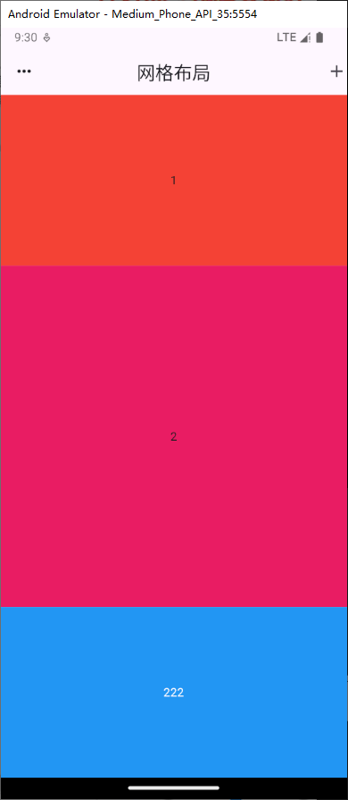

## Row 和 Column 线性布局

### Row 水平布局组件

| **属性**           | **说明**       |
| ------------------ | -------------- |
| mainAxisAlignment  | 主轴的排序方式 |
| crossAxisAlignment | 次轴的排序方式 |
| children           | 组件子元素     |

### Column 垂直布局组件

| **属性**           | **说明**       |
| ------------------ | -------------- |
| mainAxisAlignment  | 主轴的排序方式 |
| crossAxisAlignment | 次轴的排序方式 |
| children           | 组件子元素     |

### double

double.infinity 和 double.maxFinite 可以让当前元素的 width 或者 height 达到父元素的尺寸

### 元素铺满

```dart
class MyHomePage extends StatelessWidget {
  const MyHomePage({super.key});

  @override
  Widget build(BuildContext context) {
    return Container(
      width: double.infinity,
      height: double.infinity,
      color: Colors.grey[200],
      child: const Column(
        crossAxisAlignment: CrossAxisAlignment.stretch, //交叉轴对齐方式
        mainAxisAlignment: MainAxisAlignment.spaceEvenly, //主轴对齐方式
        children: [
          Icon(Icons.volunteer_activism),
          Icon(Icons.volunteer_activism),
          Icon(Icons.volunteer_activism),
          Icon(Icons.volunteer_activism),
          Icon(Icons.volunteer_activism),
          Icon(Icons.volunteer_activism),
          Icon(Icons.volunteer_activism),
          Icon(Icons.volunteer_activism),
          Icon(Icons.volunteer_activism),
          Icon(Icons.volunteer_activism),
        ],
      ),
    );
  }
}
```

## Paddiing 组件

在 html 中常见的布局标签都有 padding 属性，但是 Flutter 中很多 Widget 是没有 padding 属性。这个时候我们可以用 Padding 组件处理容器与子元素之间的间距。

| **属性** | **说明**                             |
| -------- | ------------------------------------ |
| padding  | padding 值, EdgeInsetss 设置填充的值 |
| child    | 子组件                               |

## Stack、Align、Positioned 层叠布局

Alignment 的参数

```dart
  /// The top left corner.
  static const Alignment topLeft = Alignment(-1.0, -1.0);

  /// The center point along the top edge.
  static const Alignment topCenter = Alignment(0.0, -1.0);

  /// The top right corner.
  static const Alignment topRight = Alignment(1.0, -1.0);

  /// The center point along the left edge.
  static const Alignment centerLeft = Alignment(-1.0, 0.0);

  /// The center point, both horizontally and vertically.
  static const Alignment center = Alignment(0.0, 0.0);

  /// The center point along the right edge.
  static const Alignment centerRight = Alignment(1.0, 0.0);

  /// The bottom left corner.
  static const Alignment bottomLeft = Alignment(-1.0, 1.0);

  /// The center point along the bottom edge.
  static const Alignment bottomCenter = Alignment(0.0, 1.0);

  /// The bottom right corner.
  static const Alignment bottomRight = Alignment(1.0, 1.0);
```

### Stack 组件

Stack 表示堆的意思，我们可以用 Stack 或者 Stack 结合 Align 或者 Stack 结合 Positiond 来实现页面的定位布局

| **属性**  | **说明**                 |
| --------- | ------------------------ |
| alignment | 配置所有子元素的显示位置 |
| children  | 子组件                   |

### Stack Align

Align 组件可以调整子组件的位置 , Stack 组件中结合 Align 组件也可以控制每个子元素的显示位置

| **属性**  | **说明**                 |
| --------- | ------------------------ |
| alignment | 配置所有子元素的显示位置 |
| child     | 子组件                   |

```dart
class MyHomePage extends StatelessWidget {
  const MyHomePage({super.key});

  @override
  Widget build(BuildContext context) {
    return Center(
      child: Container(
          width: 300,
          height: 400,
          color: Colors.green,
          child: const Stack(
            // alignment: Alignment.center,
            children: [
              Align(
                alignment: Alignment(1, 1),
                child: Icon(Icons.home, size: 40, color: Colors.white),
              ),
              Align(
                alignment: Alignment.center,
                child: Icon(Icons.search, size: 30, color: Colors.white),
              ),
              Align(
                alignment: Alignment.bottomRight,
                child: Icon(Icons.settings_applications,
                    size: 30, color: Colors.white),
              )
            ],
          )),
    );
  }
}
```

### Stack Positioned

Stack 组件中结合 Positioned 组件也可以控制每个子元素的显示位置,Positione 必须是 Stack 的直接组件才有效果

| **属性** | **说明**                                                     |
| -------- | ------------------------------------------------------------ |
| top      | 子元素距离顶部的距离                                         |
| bottom   | 子元素距离底部的距离                                         |
| left     | 子元素距离左侧距离                                           |
| right    | 子元素距离右侧距离                                           |
| child    | 子组件                                                       |
| width    | 组件的高度 （注意：宽度和高度必须是固定值，没法使用 double.infinity） |
| height   | 子组件的高度                                                 |

### 获取屏幕

FlutterMediaQuery 获取屏幕宽度和高度

```dart
final size =MediaQuery.of(context).size;
```

组件的 build 方法中可以通过，=MediaQuery.of(context).size;

```dart
Widget build(BuildContext context) {
  final size =MediaQuery.of(context).size;
  final width =size.width;
  final height =size.height;
}
```

实战定位布局

```dart
import 'package:flutter/material.dart';

void main(List<String> args) {
  runApp(const MyApp());
}

class MyApp extends StatelessWidget {
  const MyApp({super.key});

  @override
  Widget build(BuildContext context) {
    return MaterialApp(
      debugShowCheckedModeBanner: false,
      theme: ThemeData(
        primarySwatch: Colors.blue,
      ),
      home: const MyHomePage(),
    );
  }
}

class MyHomePage extends StatelessWidget {
  const MyHomePage({super.key});
  List<Widget> _TitleList() {
    List<Widget> list = [];
    for (int i = 0; i < 30; i++) {
      list.add(ListTile(
        title: Text("这是一个标题${i + 1} "),
      ));
    }
    return list;
  }

  @override
  Widget build(BuildContext context) {
    final size = MediaQuery.of(context).size;
    return Scaffold(
        appBar: AppBar(
          centerTitle: true,
          title: const Text('页面布局'),
        ),
        body: Stack(
          children: [
            ListView(
              children: _TitleList(),
            ),
            Positioned(
                left: 0,
                top: 0,
                width: size.width,
                height: 50,
                child: Container(
                    alignment: Alignment.center,
                    color: Colors.red,
                    child: const Text(
                      '我是标题头',
                      style: TextStyle(
                        color: Colors.white,
                      ),
                    )))
          ],
        ));
  }
}
```


## AspectRatio

AspectRatio 的作用是根据设置调整子元素 child 的宽高比。AspectRatio 首先会在布局限制条件允许的范围内尽可能的扩展，widget 的高度是由宽度和比率决定的，类似于 BoxFit 中的 contain，按照固定比率去尽量占满区域。如果在满足所有限制条件过后无法找到一个可行的尺寸，AspectRatio 最终将会去优先适应布局限制条件，而忽略所设置的比率。

| **属性**    | **说明**                                                     |
| ----------- | ------------------------------------------------------------ |
| aspectRatio | 宽高比，最终可能不会根据这个值去布局，具体则要看综合因素，外层是否允许按照这种比率进行布局，这只是一个参考值 |
| child       | 子组件                                                       |

```dart
class MyHomePage extends StatelessWidget {
  const MyHomePage({super.key});

  @override
  Widget build(BuildContext context) {
    return Center(
        child: Container(
            width: 300,
            // height: 300,
            color: Colors.green,
            child: AspectRatio(
              aspectRatio: 1.0 / 2.5,
              child: Container(
                color: Colors.red,
              ),
            )));
  }
}
```

## Card 组件

Card 是卡片组件块，内容可以由大多数类型的 Widget 构成，Card 具有圆角和阴影，这让它看起来有立体感。

| **属性**     | **说明**                                                     |
| ------------ | ------------------------------------------------------------ |
| margin       | 外边距                                                       |
| child        | 子组件                                                       |
| elevation    | 阴影值的深度                                                 |
| color        | 背景颜色                                                     |
| shadowColor  | 阴影颜色                                                     |
| margin       | 外边距                                                       |
| clipBehavior | clipBehavior 内容溢出的剪切方式 Clip.none 不剪切 Clip.hardEdge 裁剪但不应用抗锯齿 Clip.antiAlias 裁剪而且抗锯齿 Clip.antiAliasWithSaveLayer 带有抗锯齿的剪辑，并在剪辑之后立即保存 saveLayer |
| Shape        | Card 的阴影效果，默认的阴影效果为圆角的长方形边。 shape: const RoundedRectangleBorder( borderRadius: BorderRadius.all(Radius.circular(10)) ), |

```dart
class MyHomePage extends StatelessWidget {
  const MyHomePage({super.key});

  @override
  Widget build(BuildContext context) {
    return ListView(
      children: const [
        Card(
          child: ListTile(
            leading: Icon(Icons.account_circle),
            title: Text('我是隆海'),
            subtitle: Text('官网地址：ronhai.com'),
          ),
        ),
        Card(
          child: ListTile(
            leading: Icon(Icons.account_circle),
            title: Text('我是隆海'),
            subtitle: Text('官网地址：ronhai.com'),
          ),
        ),
        Card(
          child: ListTile(
            leading: Icon(Icons.account_circle),
            title: Text('我是隆海'),
            subtitle: Text('官网地址：ronhai.com'),
          ),
        ),
      ],
    );
  }
}
```

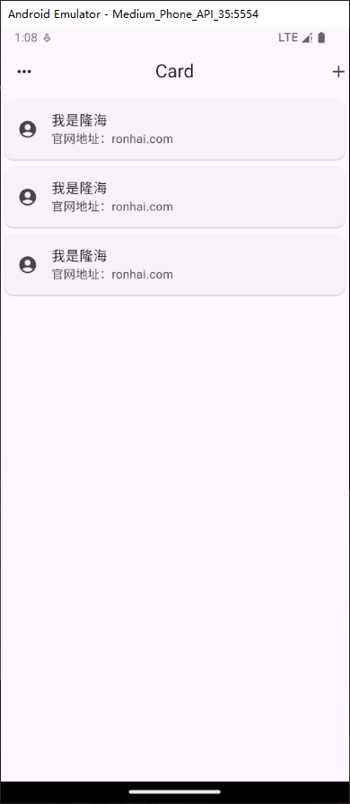

```dart
class MyHomePage extends StatelessWidget {
  const MyHomePage({super.key});

  @override
  Widget build(BuildContext context) {
    return ListView(
      children: const [
        Card(
          shape: const RoundedRectangleBorder(
              borderRadius: BorderRadius.all(Radius.circular(10))),
          // color: Colors.red,
          elevation: 20,
          margin: const EdgeInsets.all(10),
          child: Column(
            children: const <Widget>[
              ListTile(
                title: Text("小帮", style: TextStyle(fontSize: 28)),
                subtitle: Text("高级软件工程师"),
              ),
              Divider(),
              ListTile(
                title: Text("1234567890123"),
              ),
              ListTile(title: Text("四川成都"))
            ],
          ),
        ),
        Card(
          shape: const RoundedRectangleBorder(
              borderRadius: BorderRadius.all(Radius.circular(10))),
          // color: Colors.red,
          elevation: 20,
          margin: const EdgeInsets.all(10),
          child: Column(
            children: const <Widget>[
              ListTile(
                title: Text("小帮", style: TextStyle(fontSize: 28)),
                subtitle: Text("高级软件工程师"),
              ),
              Divider(),
              ListTile(
                title: Text("1234567890123"),
              ),
              ListTile(title: Text("四川成都"))
            ],
          ),
        )
      ],
    );
  }
}
```

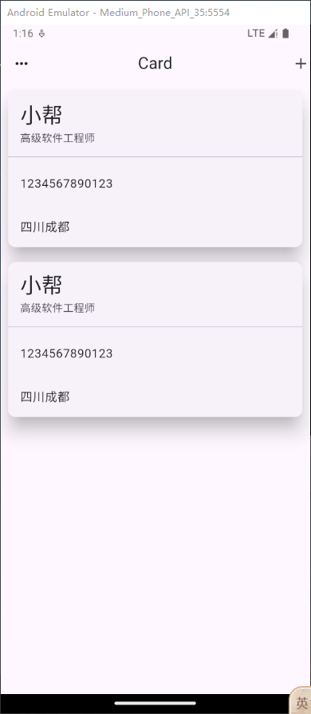

```dart
class MyHomePage extends StatelessWidget {
  const MyHomePage({super.key});

  @override
  Widget build(BuildContext context) {
    return ListView(
      children: [
        Card(
          elevation: 10,
          margin: const EdgeInsets.all(10),
          child: Column(
            children: [
              AspectRatio(
                aspectRatio: 20 / 9,
                child: Image.asset(
                  'images/bannar.jpg',
                  fit: BoxFit.cover,
                ),
              ),
              const ListTile(
                leading: Icon(Icons.home),
                title: Text('Ronhai'),
                subtitle: Text('ronhai.com'),
              ),
            ],
          ),
        ),
        Card(
          elevation: 10,
          margin: const EdgeInsets.all(10),
          child: Column(
            children: [
              AspectRatio(
                aspectRatio: 20 / 9,
                child: Image.asset(
                  'images/bannar.jpg',
                  fit: BoxFit.cover,
                ),
              ),
              const ListTile(
                leading: Icon(Icons.home),
                title: Text('Ronhai'),
                subtitle: Text('ronhai.com'),
              ),
            ],
          ),
        ),
      ],
    );
  }
}
```

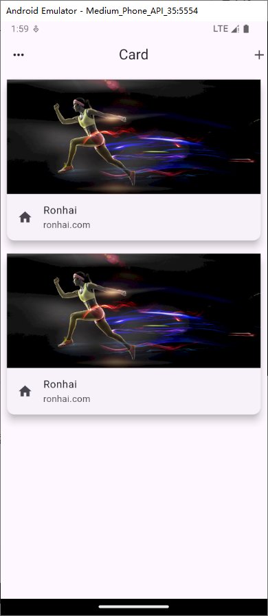

## Wrap 组件

Wrap 可以实现流布局，单行的 Wrap 跟 Row 表现几乎一致，单列的 Wrap 则跟 Column 表现几乎一致。但 Row 与 Column 都是单行单列的，Wrap 则突破了这个限制，mainAxis 上空间不足时，则向 crossAxis 上去扩展显示

| **属性**          | **说明**                                                     |
| ----------------- | ------------------------------------------------------------ |
| direction         | 主轴的方向，默认水平                                         |
| **alignment**     | 主轴的对其方式                                               |
| **spacing**       | 主轴方向上的间距                                             |
| **textDirection** | 文本方向                                                     |
| verticalDirection | 定义了 children 摆放顺序，默认是 down，见 Flex 相关属性介绍。 |
| runAlignment      | run 的对齐方式。run 可以理解为新的行或者列，如果是水平方向布局的话， run 可以理解为新的一行 |
| **runSpacing**    | 垂直间距                                                     |
|                   |                                                              |

自定义 Button 按钮

```dart
class MyButton extends StatelessWidget {
  // 自定义按钮
  final text;
  final void Function()? onPressed;
  const MyButton(this.text, {super.key, required this.onPressed});

  @override
  Widget build(BuildContext context) {
    return ElevatedButton(
        onPressed: onPressed,
        style: ButtonStyle(
            backgroundColor: WidgetStateProperty.all(Colors.black26),
            foregroundColor: WidgetStateProperty.all(Colors.white)),
        child: Text(text));
  }
}
```

用 Wrap 使用 Button

```dart
class MyHomePage extends StatelessWidget {
  const MyHomePage({super.key});
  List<Widget> _initButton() {
    List<Widget> list = [];
    for (var i = 0; i < 30; i++) {
      list.add(MyButton('第${i}集', onPressed: () {}));
    }
    return list;
  }

  @override
  Widget build(BuildContext context) {
    return Padding(
        padding: EdgeInsets.all(10),
        child: Wrap(
          spacing: 10, // 水平间距
          runSpacing: 20, // 垂直间距
          // textDirection: TextDirection.ltr, //文本方向
          // direction: Axis.vertical, //主轴的对其方式
          alignment: WrapAlignment.start,
          children: _initButton(),
        ));
  }
}
```

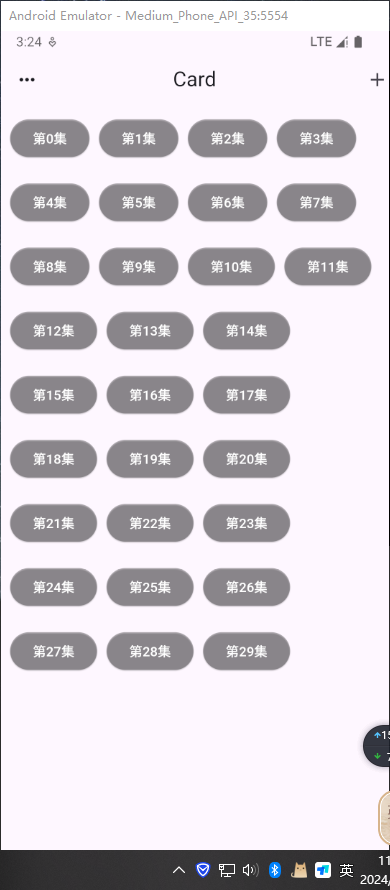

做一个搜索页面

```dart
import 'package:flutter/material.dart';

void main(List<String> args) {
  runApp(MyApp());
}

class MyApp extends StatelessWidget {
  @override
  Widget build(BuildContext context) {
    return MaterialApp(
      debugShowCheckedModeBanner: false,
      theme: ThemeData(primarySwatch: Colors.blue),
      home: Scaffold(
          appBar: AppBar(
            leading: const Icon(Icons.chevron_left_outlined),
            centerTitle: true,
            title: const Text('搜索页面'),
            actions: const [
              const Icon(Icons.more_horiz),
            ],
          ),
          body: const LayoutDemo()),
    );
  }
}

class Button extends StatelessWidget {
  // 自定义按钮
  final text;
  final void Function()? onPressed;
  const Button(this.text, {super.key, required this.onPressed});

  @override
  Widget build(BuildContext context) {
    return ElevatedButton(
        onPressed: onPressed,
        style: ButtonStyle(
            backgroundColor: WidgetStateProperty.all(Colors.black26),
            foregroundColor: WidgetStateProperty.all(Colors.white)),
        child: Text(text));
  }
}

class LayoutDemo extends StatelessWidget {
  const LayoutDemo({super.key});

  @override
  Widget build(BuildContext context) {
    return Padding(
        padding: const EdgeInsets.all(10),
        child: ListView(
          children: [
            Text(
              '热搜',
              style: Theme.of(context).textTheme.headlineSmall,
            ),
            const Divider(),
            Wrap(
              spacing: 8.0, // 主轴(水平)方向间距
              runSpacing: 4.0, // 纵轴（垂直）方向间距
              children: [
                Button("女装", onPressed: () {}),
                Button("笔记本", onPressed: () {}),
                Button("玩具", onPressed: () {}),
                Button("文学", onPressed: () {}),
                Button("女装", onPressed: () {}),
                Button("时尚", onPressed: () {}),
                Button("女装", onPressed: () {}),
                Button("女装", onPressed: () {}),
              ],
            ),
            const SizedBox(
              height: 10,
            ),
            const Row(
              children: [
                Text('历史记录',
                    style:
                        TextStyle(fontSize: 16, fontWeight: FontWeight.bold)),
              ],
            ),
            const Divider(),
            const SizedBox(
              height: 10,
            ),
            const Column(
              children: [
                ListTile(
                  title: Text('女装'),
                ),
                Divider(),
                ListTile(
                  title: Text('笔记本'),
                ),
                Divider(),
              ],
            ),
            const SizedBox(
              height: 10,
            ),
            Padding(
              padding: const EdgeInsets.all(10.0),
              child: OutlinedButton.icon(
                  onPressed: () {},
                  label: const Text('清空历史记录'),
                  icon: const Icon(Icons.delete)),
            )
          ],
        ));
  }
}
```

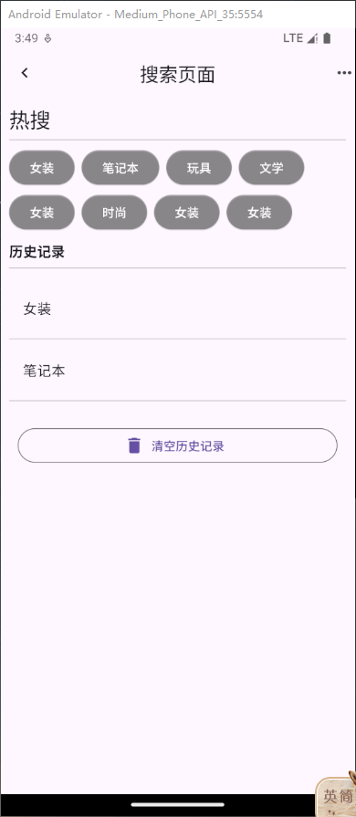

## PageView

Flutter中的轮动图以及抖音上下滑页切换视频功能等等，这些都可以通过 PageView 轻松实现

*常见属性：*

| **属性**               | **描述**                                        |
| ---------------------- | ----------------------------------------------- |
| scrollDirection        | Axis.horizonta水平方向 Axis.vertical锤子方向    |
| children               | 配置子元素                                      |
| allowImplicitScrolling | 缓存当前页面的前后两页                          |
| onPageChanged          | page改变的时候触发                              |
| physics                | const NeverScrollableScrollPhysics() //禁止滑动 |

### 基本使用

```dart
import 'package:flutter/material.dart';

void main() => runApp(const MyApp());

class MyApp extends StatelessWidget {
  const MyApp({super.key});

  @override
  Widget build(BuildContext context) {
    return const MaterialApp(
      debugShowCheckedModeBanner: false,
      title: 'AppBar App',
      home: PageViewPage(),
    );
  }
}

class PageViewPage extends StatefulWidget {
  const PageViewPage({super.key});

  @override
  State<PageViewPage> createState() => _PageViewPageState();
}

class _PageViewPageState extends State<PageViewPage> {
  int count = 10;
  @override
  Widget build(BuildContext context) {
    return Scaffold(
      appBar: AppBar(
        title: const Text('PageView demo'),
      ),
      body: PageView(
        scrollDirection: Axis.vertical,
        children: [
          Center(
            child:
                Text('Page 1', style: Theme.of(context).textTheme.displayLarge),
          ),
          Center(
            child:
                Text('Page 2', style: Theme.of(context).textTheme.displayLarge),
          ),
          Center(
            child:
                Text('Page 3', style: Theme.of(context).textTheme.displayLarge),
          ),
          Center(
            child:
                Text('Page 4', style: Theme.of(context).textTheme.displayLarge),
          ),
          Center(
            child:
                Text('Page 5', style: Theme.of(context).textTheme.displayLarge),
          ),
        ],
      ),
    );
  }
}

class MyPage extends StatelessWidget {
  final String text;
  const MyPage({required this.text, super.key});

  @override
  Widget build(BuildContext context) {
    return Center(
      child:
          Text('Page $text', style: Theme.of(context).textTheme.displayLarge),
    );
  }
}
```

### PageView.builder

```dart
import 'package:flutter/material.dart';

void main() => runApp(const MyApp());

class MyApp extends StatelessWidget {
  const MyApp({super.key});

  @override
  Widget build(BuildContext context) {
    return const MaterialApp(
      debugShowCheckedModeBanner: false,
      title: 'AppBar App',
      home: PageViewPage(),
    );
  }
}

class PageViewPage extends StatefulWidget {
  const PageViewPage({super.key});

  @override
  State<PageViewPage> createState() => _PageViewPageState();
}

class _PageViewPageState extends State<PageViewPage> {
  int count = 10;
  @override
  Widget build(BuildContext context) {
    return Scaffold(
      appBar: AppBar(
        title: const Text('PageView demo'),
      ),
      //builder实现
      body: PageView.builder(
        scrollDirection: Axis.vertical,
        itemBuilder: (BuildContext context, int index) {
          return MyPage(text: "${index + 1}");
        },
        itemCount: count,
      ),
    );
  }
}

class MyPage extends StatelessWidget {
  final String text;
  const MyPage({required this.text, super.key});

  @override
  Widget build(BuildContext context) {
    return Center(
      child:
          Text('Page $text', style: Theme.of(context).textTheme.displayLarge),
    );
  }
}
```

### 上拉无限加载的实现思路

```dart
import 'package:flutter/material.dart';

void main() => runApp(const MyApp());

class MyApp extends StatelessWidget {
  const MyApp({super.key});

  @override
  Widget build(BuildContext context) {
    return const MaterialApp(
      debugShowCheckedModeBanner: false,
      title: 'AppBar App',
      home: PageViewPage(),
    );
  }
}

class PageViewPage extends StatefulWidget {
  const PageViewPage({super.key});

  @override
  State<PageViewPage> createState() => _PageViewPageState();
}

class _PageViewPageState extends State<PageViewPage> {
  final List<Widget> _list = [];
  @override
  void initState() {
    super.initState();
    for (var i = 0; i < 10; i++) {
      _list.add(MyPage(text: "$i"));
    }
  }

  @override
  Widget build(BuildContext context) {
    return Scaffold(
        appBar: AppBar(
          title: const Text('pageview演示'),
        ),

        //builder实现
        body: PageView(
          scrollDirection: Axis.vertical, // 滑动方向为垂直方向
          onPageChanged: (index) {
            print(index);
            print(_list.length);
            if (index + 2 == _list.length) {
              setState(() {
                for (var i = 0; i < 10; i++) {
                  _list.add(MyPage(text: "${i + 1}"));
                }
              });
            }
          },
          children: _list,
        ));
  }
}

class MyPage extends StatefulWidget {
  final String text;
  const MyPage({super.key, required this.text});

  @override
  State<MyPage> createState() => _MyPageState();
}

class _MyPageState extends State<MyPage> {
  @override
  Widget build(BuildContext context) {
    return Center(
      child: Text(widget.text, style: Theme.of(context).textTheme.displayLarge),
    );
  }
}
```

### 无限轮播图

```dart
import 'package:flutter/material.dart';
import 'dart:async'; // 引入 Timer

void main() => runApp(const MyApp());

class MyApp extends StatelessWidget {
  const MyApp({super.key});

  @override
  Widget build(BuildContext context) {
    return const MaterialApp(
      debugShowCheckedModeBanner: false,
      title: 'AppBar App',
      home: PageViewPage(),
    );
  }
}

class PageViewPage extends StatefulWidget {
  const PageViewPage({super.key});

  @override
  State<PageViewPage> createState() => _PageViewPageState();
}

class _PageViewPageState extends State<PageViewPage> {
  final List<Widget> pageList = [];
  @override
  void initState() {
    super.initState();
    List listData = [
      {
        "imageUrl": 'https://ronhai.com/media/images/article/flutter.png',
      },
      {
        "imageUrl": 'https://ronhai.com/media/images/article/wmvare.jpg',
      },
      {
        "imageUrl": 'https://ronhai.com/media/images/article/nginx.jpg',
      },
      {
        "imageUrl": 'https://ronhai.com/media/images/article/zsh.png',
      }
    ];
    for (var i = 0; i < listData.length; i++) {
      pageList.add(PicturePage(
        url: listData[i]["imageUrl"],
      ));
    }
  }

  @override
  Widget build(BuildContext context) {
    return Scaffold(
        appBar: AppBar(
          title: const Text('pageview演示'),
        ),

        //builder实现
        body: ListView(
          children: [Swiper(pageList: pageList)],
        ));
  }
}

//Swiper组件
class Swiper extends StatefulWidget {
  final double width;
  final double height;
  final List<Widget> pageList;
  const Swiper(
      {super.key,
      this.width = double.infinity,
      this.height = 200,
      required this.pageList});
  @override
  State<Swiper> createState() => _SwiperState();
}

class _SwiperState extends State<Swiper> {
  int _currentPageIndex = 0;
  late Timer _timer;
  final PageController _pageController = PageController();
  static const timeout = Duration(seconds: 5); // 定时器周期
  @override
  void initState() {
    super.initState();
    // 定时器，设置每3秒钟切换一次页面
    _timer = Timer.periodic(timeout, (timer) {
      if (_pageController.hasClients) {
        int nextPage = (_currentPageIndex + 1) % widget.pageList.length;
        _pageController.animateToPage(
          nextPage,
          duration: const Duration(milliseconds: 500), // 增加过渡动画时间
          curve: Curves.easeInOut, // 使用平滑的曲线
        );
        setState(() {
          _currentPageIndex = nextPage;
        });
      }
    });
  }

  @override
  void dispose() {
    // 确保定时器在组件销毁时被取消，避免内存泄漏
    _timer.cancel();
    super.dispose();
  }

  @override
  Widget build(BuildContext context) {
    return Stack(
      children: [
        SizedBox(
          width: double.infinity,
          height: 200,
          child: PageView.builder(
              controller: _pageController, // 使用 PageController 控制页面
              onPageChanged: (int index) {
                setState(() {
                  _currentPageIndex = index % (widget.pageList.length);
                });
              },
              itemCount: 10000,
              itemBuilder: (context, index) {
                // return widget.pageList[index % (widget.pageList.length)];
                return AnimatedOpacity(
                  opacity: _currentPageIndex == index % widget.pageList.length
                      ? 1.0
                      : 0.0,
                  duration: const Duration(milliseconds: 500), // 设置透明度过渡时间
                  curve: Curves.easeInOut, // 使用平滑的曲线
                  child: widget.pageList[index % (widget.pageList.length)],
                );
              }),
        ),
        Positioned(
          bottom: 10,
          left: 0,
          right: 0,
          child: Row(
            mainAxisAlignment: MainAxisAlignment.center,
            children: List.generate(widget.pageList.length, (i) {
              return Container(
                margin: const EdgeInsets.fromLTRB(2, 0, 2, 0),
                width: 10,
                height: 10,
                decoration: BoxDecoration(
                    shape: BoxShape.circle,
                    color: _currentPageIndex == i ? Colors.blue : Colors.grey),
              );
            }).toList(),
          ),
        ),
      ],
    );
  }
}

//PicturePage 图片页面
class PicturePage extends StatefulWidget {
  final String url;
  final double width;
  final double height;
  const PicturePage(
      {super.key,
      required this.url,
      this.width = double.infinity,
      this.height = 200});
  @override
  State<PicturePage> createState() => _PicturePageState();
}

class _PicturePageState extends State<PicturePage> {
  @override
  Widget build(BuildContext context) {
    print(widget.url);
    return SizedBox(
      width: widget.width,
      height: widget.height,
      child: Image.network(widget.url, fit: BoxFit.cover),
    );
  }
}
```

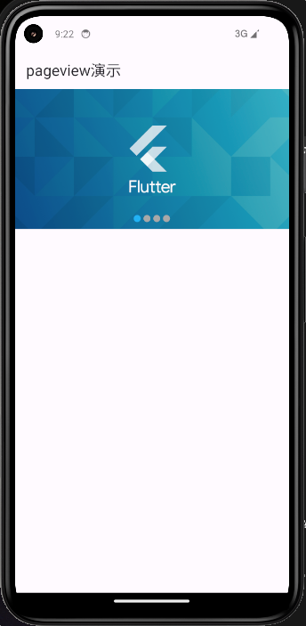

### 缓存页面

新建``/lib/app/service/keepAliveWrappr.dart`

```dart
import 'package:flutter/material.dart';

class KeepAliveWrapper extends StatefulWidget {
  const KeepAliveWrapper(
      {Key? key, @required this.child, this.keepAlive = true})
      : super(key: key);
  final Widget? child;
  final bool keepAlive;
  @override
  State<KeepAliveWrapper> createState() => _KeepAliveWrapperState();
}

class _KeepAliveWrapperState extends State<KeepAliveWrapper>
    with AutomaticKeepAliveClientMixin {
  @override
  Widget build(BuildContext context) {
    return widget.child!;
  }

  @override
  bool get wantKeepAlive => widget.keepAlive;
  @override
  void didUpdateWidget(covariant KeepAliveWrapper oldWidget) {
    if (oldWidget.keepAlive != widget.keepAlive) {
      // keepAlive 状态需要更新，实现在 AutomaticKeepAliveClientMixin 中
      updateKeepAlive();
    }
    super.didUpdateWidget(oldWidget);
  }
}
```

使用时,包裹tabbarview和pageview中页面

```dart
import 'package:flutter/material.dart';

import 'package:get/get.dart';

import '../controllers/home_controller.dart';
import '../../../service/keepAliveWrapper.dart';

class HomeView extends GetView<HomeController> {
  const HomeView({super.key});
  @override
  Widget build(BuildContext context) {
    return KeepAliveWrapper(
        child: Scaffold(
      appBar: AppBar(
        title: const Text('HomeView'),
        centerTitle: true,
      ),
      body: ListView(
        children: [
          ListTile(
            title: Text('111'),
          ),
          ListTile(
            title: Text('111232'),
          ),
          ListTile(
            title: Text('11321'),
          ),
          ListTile(
            title: Text('11321'),
          ),
          ListTile(
            title: Text('111'),
          ),
          ListTile(
            title: Text('13211'),
          ),
          ListTile(
            title: Text('111'),
          ),
          ListTile(
            title: Text('111'),
          ),
          ListTile(
            title: Text('111'),
          ),
          ListTile(
            title: Text('1123121'),
          ),
          ListTile(
            title: Text('111'),
          ),
          ListTile(
            title: Text('111'),
          ),
          ListTile(
            title: Text('1fsda11'),
          ),
          ListTile(
            title: Text('111'),
          ),
          ListTile(
            title: Text('11cvc1'),
          ),
          ListTile(
            title: Text('1fd11'),
          ),
          ListTile(
            title: Text('11sf1'),
          ),
          ListTile(
            title: Text('111'),
          ),
          ListTile(
            title: Text('1afd11'),
          ),
          ListTile(
            title: Text('111sf'),
          ),
          ListTile(
            title: Text('1fsd11'),
          ),
          ListTile(
            title: Text('111'),
          ),
          ListTile(
            title: Text('111'),
          ),
          ListTile(
            title: Text('11cv1'),
          ),
          ListTile(
            title: Text('111'),
          ),
          ListTile(
            title: Text('111'),
          ),
          ListTile(
            title: Text('111'),
          ),
          ListTile(
            title: Text('11cvc1'),
          ),
          ListTile(
            title: Text('111'),
          ),
          ListTile(
            title: Text('111'),
          ),
          ListTile(
            title: Text('11cvz1'),
          ),
        ],
      ),
    ));
  }
}
```

