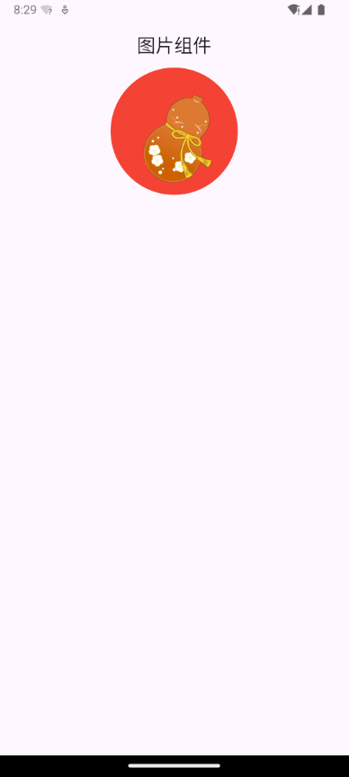
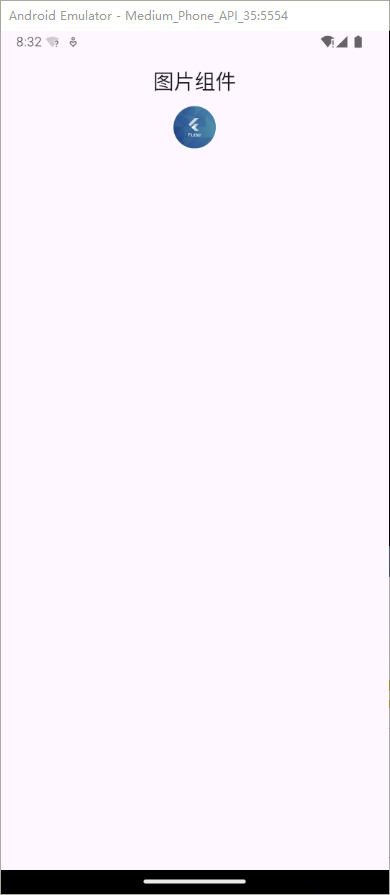
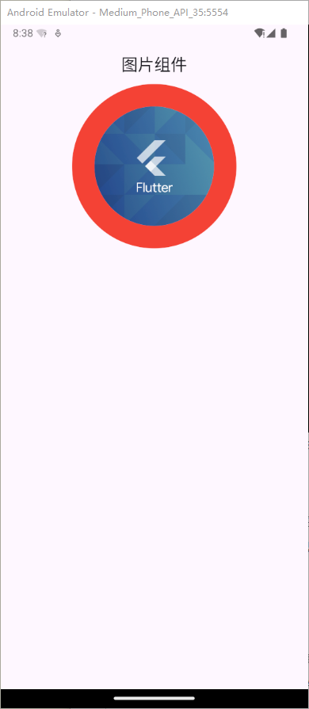
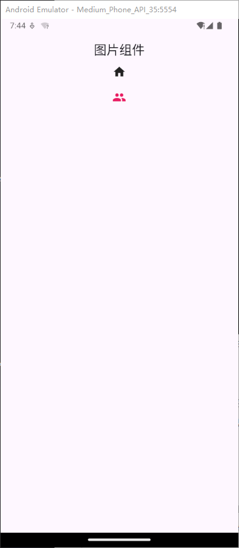
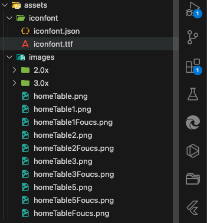
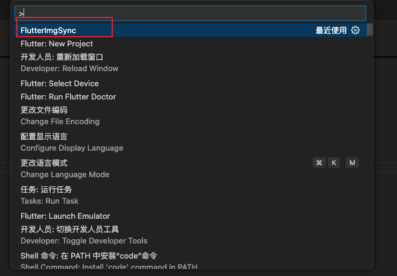
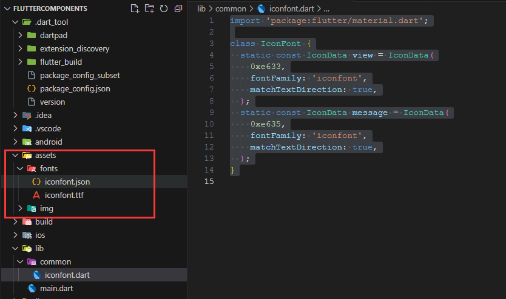
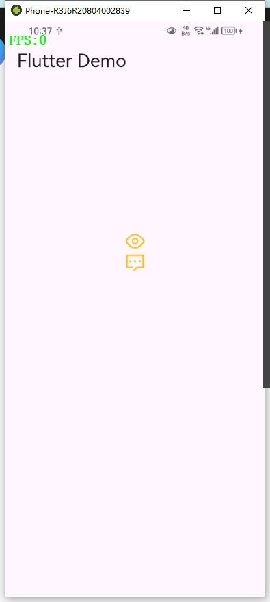

# Image 图片组件

Flutter 中，我们可以通过 Image 组件来加载并显示图片 Image 的数据源可以是 asset、文件、内存以及网络

- Image.asset， 本地图片
- Image.network 远程图片

### Image 常用属性

| **名称**                | **类型**  | **说明**                                                     |
| ----------------------- | --------- | ------------------------------------------------------------ |
| alignment               | Alignment | 图片的对齐方式                                               |
| color 和 colorBlendMode |           | 设置图片的背景颜色，通常和 colorBlendMode 配合一起使用，这样可以是图片颜色和背景色混合。上面的图片就是进行了颜色的混合，绿色背景和图片红色的混合 |
| fit                      | BoxFit    | fit 属性用来控制图片的拉伸和挤压，这都是根据父容器来 的。 BoxFit.fill:全图显示，图片会被拉伸，并充满父容器。 BoxFit.contain:全图显示，显示原比例，可能会有空隙。 BoxFit.cover：显示可能拉伸，可能裁切，充满（图片要充满整个容器，还不变形）。 BoxFit.fitWidth：宽度充满（横向充满），显示可能拉伸，可能裁切。 BoxFit.fitHeight ：高度充满（竖向充满）,显示可能拉伸，可能裁切。 BoxFit.scaleDown：效果和 contain 差不多，但是此属性不允许显示超过源图片大小，可小不可大。 |
| repeat                  | 平铺      | ImageRepeat.repeat : 横向和纵向都进行重复，直到铺满整个画布。ImageRepeat.repeatX: 横向重复，纵向不重复。 ImageRepeat.repeatY：纵向重复，横向不重复。 |
| width                   |           | 宽度 一般结合 ClipOval 才能看到效果                          |
| height                  |           | 高度 一般结合 ClipOval 才能看到效果                          |

### 加载远程图片

```dart
class MyApp extends StatelessWidget {
  const MyApp({super.key});

  @override
  Widget build(BuildContext context) {
    return Center(
      child: Column(
        // mainAxisAlignment: MainAxisAlignment.center,
        children: [
          // 网络图片
          Container(
            alignment: Alignment.center,
            width: 150,
            height: 150,
            margin: const EdgeInsets.fromLTRB(0, 20, 0, 0),
            decoration: const BoxDecoration(
              color: Colors.yellow,
              borderRadius: BorderRadius.all(Radius.circular(75)),
            ),
            child: ClipOval(
              child: Image.network(
                "https://doc.ronhai.com/bg.png",
                fit: BoxFit.cover,
                width: 150,
                height: 150,
              ),
            ),
          ),
          // Container实现圆形图片
          const SizedBox(
            height: 20,
          ),
        ],
      ),
    );
  }
}
```


### Container 实现圆形图片

```dart
class MyApp extends StatelessWidget {
  const MyApp({super.key});

  @override
  Widget build(BuildContext context) {
    return Center(
      child: Column(
        children: [
          Container(
            width: 150,
            height: 150,
            decoration: BoxDecoration(
                color: Colors.red,
                borderRadius: BorderRadius.circular(75),
                image: const DecorationImage(
                    image: NetworkImage('https://doc.ronhai.com/bg.png'),
                    fit: BoxFit.cover)),
          )
        ],
      ),
    );
  }
}
```



### ClipOval 实现圆形图片

```dart
class MyApp extends StatelessWidget {
  const MyApp({super.key});

  @override
  Widget build(BuildContext context) {
    return Center(
      child: Column(
        children: [
          ClipOval(
              child: Image.network(
            'https://www.ronhai.com/media/images/article/flutter.png',
            fit: BoxFit.cover,
            width: 45,
            height: 45,
          )),
        ],
      ),
    );
  }
}
```



### CircleAvatar 实现圆形图片

```dart
class MyApp extends StatelessWidget {
  const MyApp({super.key});

  @override
  Widget build(BuildContext context) {
    return const Center(
      child: Column(
        children: [
          CircleAvatar(
            radius: 100,
            backgroundImage: NetworkImage(
                'https://www.ronhai.com/media/images/article/flutter.png'),
          )
        ],
      ),
    );
  }
}
```

基本上，CircleAvatar 不提供设置边框的属性。但是，可以将其包裹在具有更大半径和不同背景颜色的
不同 CircleAvatar 中，以创建类似于边框的内容

```dart
class MyApp extends StatelessWidget {
  const MyApp({super.key});

  @override
  Widget build(BuildContext context) {
    return const Center(
      child: Column(
        children: [
          CircleAvatar(
            radius: 110,
            backgroundColor: Colors.red,
            child: CircleAvatar(
              radius: 80,
              backgroundImage: NetworkImage(
                  'https://www.ronhai.com/media/images/article/flutter.png'),
            ),
          )
        ],
      ),
    );
  }
}
```



### 加载本地图片

在项目的根目录新建 images 放入本地图片，设置`pubspec.yaml`的`assets`

```yaml
name: flutter_image
description: "A new Flutter project."

publish_to: "none" # Remove this line if you wish to publish to pub.dev
version: 1.0.0+1

environment:
  sdk: ^3.5.4
dependencies:
  flutter:
    sdk: flutter
  cupertino_icons: ^1.0.8

dev_dependencies:
  flutter_test:
    sdk: flutter
  flutter_lints: ^4.0.0

flutter:
  uses-material-design: true
  #本地图片设置
  assets:
    - images/2.jpg
    - images/avatar.jpg
    - images/bannar.jpg
    - images/travel.jpg
    - images/web.jpg
```

使用

```dart
class MyApp extends StatelessWidget {
  const MyApp({super.key});

  @override
  Widget build(BuildContext context) {
    return const Center(
      child: Column(
        children: [
          //  本地图片
          Icon(Icons.home),
          SizedBox(
            height: 20,
          ),
          Icon(
            Icons.people,
            color: Colors.pink,
          ),
        ],
      ),
    );
  }
}
```



### flutter-img-sync插件自动写本地图片

vscode安装flutter-img-sync插件

插件地址:https://marketplace.visualstudio.com/items?itemName=Lihaha.flutter-img-sync

在asssets下新建Images目录,放入相应的图片



`pubspec.yaml`配置,找到assets配置如下

```yaml
  assets:
    # assets-generator-begin
    # assets/images/*
    # assets-generator-end
```

F1输入命令FlutterimgSync



全在`pubspec.yaml`自动配置图片

```yaml
  assets:
    # assets-generator-begin
    # assets/images/*
    - assets/images/homeTable.png
    - assets/images/homeTable1.png
    - assets/images/homeTable1Foucs.png
    - assets/images/homeTable2.png
    - assets/images/homeTable2Foucs.png
    - assets/images/homeTable3.png
    - assets/images/homeTable3Foucs.png
    - assets/images/homeTable5.png
    - assets/images/homeTable5Foucs.png
    - assets/images/homeTableFoucs.png
    # assets-generator-end
```

# 图标组件

### 使用 Flutter 官方 Icons 图标

Material Design 所有图标可以在其官网查看：https://material.io/tools/icons/

### 阿里巴巴图标库

Flutter 中借助阿里巴巴图标库自定义字体图标

我们也可以使用自定义字体图标。阿里巴巴图标库官网 iconfont.cn 上有很多字体图标素材，我们可以选择自己需要的图标打包下载后，会生成一些不同格式的字体文件，在 Flutter 中，我们使用 ttf 格式即可。

假设我们项目中需要使用一套图标，我们打包下载后导入



也可以配置多个字体文件

```dart
  fonts:
    - family: iconfont
      fonts:
        - asset: assets/fonts/iconfont.ttf
   - family: myicon
      fonts:
        - asset: assets/fonts/myicon.ttf
```

为了使用方便，我们定义一个 MyIcons 类，功能和 Icons 类一样：将字体文件中的所有图标都定义成静态变量

```dart
import 'package:flutter/material.dart';

class IconFont {
  static const IconData view = IconData(
    0xe633,
    fontFamily: 'iconfont',
    matchTextDirection: true,
  );
  static const IconData message = IconData(
    0xe635,
    fontFamily: 'iconfont',
    matchTextDirection: true,
  );
}
```

使用

```dart
import 'package:flutter/material.dart';
import 'common/iconfont.dart';

void main() {
  runApp(const MyApp());
}

class MyApp extends StatelessWidget {
  const MyApp({super.key});

  @override
  Widget build(BuildContext context) {
    return MaterialApp(
      debugShowCheckedModeBanner: false,
      home: Scaffold(
          appBar: AppBar(
            title: const Text('Flutter Demo'),
          ),
          body: Center(
            child: Container(
                alignment: Alignment.center,
                width: 300,
                height: 300,
                child: const Column(
                  children: [
                    Icon(
                      IconFont.view,
                      size: 30,
                      color: Colors.amber,
                    ),
                    Icon(
                      IconFont.message,
                      size: 30,
                      color: Colors.amber,
                    )
                  ],
                )),
          )),
    );
  }
}
```



### 脚本生成静态图标类

新建`generate_icons_static.dart`文件放入 `/lib/service/`文件夹中,用于固定的图标使用，动态的有下面的map类

脚本如下，使用`Code Runner`运行脚本即可：

```dart
import 'dart:convert';
import 'dart:io';

String toCamelCase(String name) {
  List<String> parts = name.split(RegExp(r'[-_]'));
  String camelCaseName = parts[0];
  for (int i = 1; i < parts.length; i++) {
    camelCaseName += parts[i][0].toUpperCase() + parts[i].substring(1);
  }
  return camelCaseName;
}

void generateIconFontClass(String jsonFilePath, String outputFilePath) {
  File jsonFile = File(jsonFilePath);
  if (!jsonFile.existsSync()) {
    print('JSON file not found: $jsonFilePath');
    return;
  }

  String jsonString = jsonFile.readAsStringSync();
  Map<String, dynamic> jsonData = jsonDecode(jsonString);

  StringBuffer buffer = StringBuffer();
  buffer.writeln("import 'package:flutter/material.dart';\n");
  buffer.writeln("class IconFont {");

  if (jsonData.containsKey('glyphs')) {
    List<dynamic> glyphs = jsonData['glyphs'];
    glyphs.forEach((glyph) {
      if (glyph.containsKey('unicode_decimal') && glyph.containsKey('name')) {
        String name = glyph['name'];
        int unicode = glyph['unicode_decimal'];
        // String fontClass = glyph['font_class'];

        String fieldName = toCamelCase(name);
        print(fieldName);

        buffer.writeln("  static const IconData a_$fieldName = IconData(");
        buffer.writeln("    0x${unicode.toRadixString(16)},");
        buffer.writeln("    fontFamily: 'iconfont',");
        buffer.writeln("    matchTextDirection: true,");
        buffer.writeln("  );");
      }
    });
  }

  buffer.writeln("}");

  File outputFile = File(outputFilePath);
  outputFile.writeAsStringSync(buffer.toString());

  print('IconFont class generated successfully at: $outputFilePath');
}

void main() {
  String jsonFilePath = 'lib/assets/iconfont/iconfont.json';
  String outputFilePath = 'lib/service/iconfont_static.dart';
  generateIconFontClass(jsonFilePath, outputFilePath);
}
```

引用

```dart
import '../../service/iconfont_static.dart';
Icon(
     IconFont.a_15,
     color: Colors.red,
     size: 30,

 )
```

### 脚本生成动态图标类

生成map类，用于动态取图标

新建`generate_icons_map.dart`文件放入 `/lib/service/`文件夹中,增加以下内容：

```dart
import 'dart:convert';
import 'dart:io';

String toCamelCase(String name) {
  List<String> parts = name.split(RegExp(r'[-_]'));
  String camelCaseName = parts[0];
  for (int i = 1; i < parts.length; i++) {
    camelCaseName += parts[i][0].toUpperCase() + parts[i].substring(1);
  }
  return camelCaseName;
}

void generateIconFontClass(String jsonFilePath, String outputFilePath) {
  File jsonFile = File(jsonFilePath);
  if (!jsonFile.existsSync()) {
    print('JSON file not found: $jsonFilePath');
    return;
  }

  String jsonString = jsonFile.readAsStringSync();
  Map<String, dynamic> jsonData = jsonDecode(jsonString);

  StringBuffer buffer = StringBuffer();
  buffer.writeln("import 'package:flutter/material.dart';\n");

  buffer.writeln("class IconFontMap {");
  buffer.writeln("  static const Map<String, IconData> iconMap = {");

  if (jsonData.containsKey('glyphs')) {
    List<dynamic> glyphs = jsonData['glyphs'];
    int index = 1; // 用于生成 'a1', 'a2', 'a3' 等键名

    glyphs.forEach((glyph) {
      if (glyph.containsKey('unicode_decimal') && glyph.containsKey('name')) {
        String name = glyph['name'];
        print('name${name}');
        int unicode = glyph['unicode_decimal'];

        // 生成 Map 的键名（如 'a1', 'a2' 等）
        String fieldName = 'a$name';

        // 输出 Map 内容
        buffer.writeln(
            "    '$fieldName': IconData(0x${unicode.toRadixString(16)}, fontFamily: 'iconfont', matchTextDirection: true),");

        index++;
      }
    });
  }

  buffer.writeln("  };");
  buffer.writeln("}");

  // 将代码输出到指定文件
  File outputFile = File(outputFilePath);
  outputFile.writeAsStringSync(buffer.toString());

  print('IconFontMap class generated successfully at: $outputFilePath');
}

void main() {
  String jsonFilePath = 'lib/assets/iconfont/iconfont.json'; // 输入 JSON 文件的路径
  String outputFilePath = 'lib/service/iconfont_map.dart'; // 输出文件路径

  generateIconFontClass(jsonFilePath, outputFilePath);
}
```

使用

```dart
import '../../service/my_color.dart';
import '../../service/iconfont_map.dart';
Padding(
            padding: EdgeInsets.all(ScreenAdapter.width(30)),
            child: GridView.builder(
              shrinkWrap: true, // 使 ListView 高度自适应
              physics: const NeverScrollableScrollPhysics(), // 禁止内部滚动
              gridDelegate: const SliverGridDelegateWithFixedCrossAxisCount(
                crossAxisCount: 2,
                crossAxisSpacing: 16,
                mainAxisSpacing: 16,
              ),
              itemBuilder: (context, index) {
                String iconName = 'a63';

                IconData icon =
                    IconFontMap.iconMap[iconName] ?? Icons.help_outline;

                return Container(
                  width: ScreenAdapter.width(333),
                  height: ScreenAdapter.height(160),
                  // color: Colors.blue,
                  child: Column(
                    children: [
                      Row(
                        children: [
                          Icon(
                            icon,
                            color: Colors.red,
                            size: 30,
                          )
                        ],
                      ),
                      Text(
                        "个人/团体/场馆/训练",
                        style: TextStyle(color: HexColor('8897AE')),
                      )
                    ],
                  ),
                );
              },
              itemCount: 15, // 数量
            ),
          )
```


# 自定义颜色

设计图一般用的是16进制的颜色色号,在flutter中不能直接使用,需要转义后可用,下面定义一个类处理色号

新建一个文件`my_color.dart`

```dart
import 'package:flutter/material.dart';

class HexColor extends Color {
  static int _getColorFromHex(String hexColor) {
    hexColor = hexColor.toUpperCase().replaceAll("#", "");

    if (hexColor.length == 6) {
      hexColor = "FF" + hexColor;
    }
    return int.parse(hexColor, radix: 16);
  }

  HexColor(final String hexColor) : super(_getColorFromHex(hexColor));
}
```

## 使用

```dart
import '../../../service/my_color.dart';
Container(
    width: ScreenAdapter.width(620),
    height: ScreenAdapter.height(96),
    decoration: BoxDecoration(
      color: HexColor('#493D9E'),
      borderRadius: BorderRadius.circular(30),
    ),
  );
Color color1 = HexColor("b74093");
Color color2 = HexColor("#b74093");
Color color3 = HexColor("#88b74093");
```


