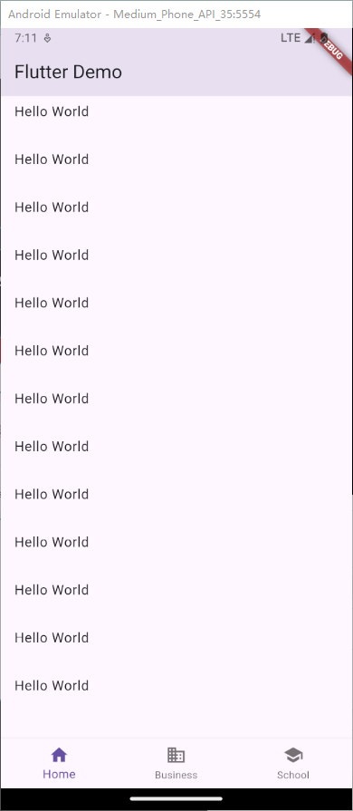
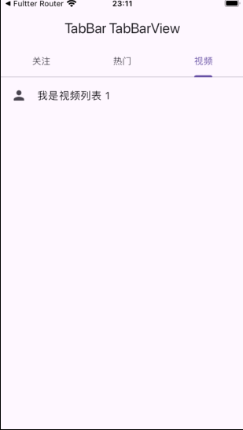

---

title: Flutter Scaffold组件
published: 2024-01-04
description: "Flutter Scaffold组件"
tags: ["Flutter"]
category: Flutter
draft: false

---

# BottomNavigationBar

BottomNavigationBar 是底部导航条，可以让我们定义底部 Tab 切换，bottomNavigationBar 是Scaffold 组件的参数。

| **属性名**   | **说明**                                                     |
| ------------ | ------------------------------------------------------------ |
| items        | List 底部导航条按钮集合                                      |
| iconSize     | icon                                                         |
| currentIndex | 默认选中第几个                                               |
| onTap        | 选中变化回调函数                                             |
| fixedColor    | 选中的颜色                                                   |
| type         | BottomNavigationBarType.fixed BottomNavigationBarType.shifting |

```dart
import 'package:flutter/material.dart';

void main(List<String> args) {
  runApp(MyApp());
}

class MyApp extends StatelessWidget {
  const MyApp({super.key});

  @override
  Widget build(BuildContext context) {
    return MaterialApp(
      title: 'Flutter Demo',
      theme: ThemeData(
        primarySwatch: Colors.blue,
      ),
      home: Scaffold(
        appBar: AppBar(
          title: const Text('Flutter Demo'),
        ),
        body: const MyHomePage(),
        bottomNavigationBar: BottomNavigationBar(
          items: const [
            BottomNavigationBarItem(
              icon: Icon(Icons.home),
              label: 'Home',
            ),
            BottomNavigationBarItem(
              icon: Icon(Icons.business),
              label: 'Business',
            ),
            BottomNavigationBarItem(
              icon: Icon(Icons.school),
              label: 'School',
            ),
          ],
        ),
      ),
    );
  }
}

class MyHomePage extends StatefulWidget {
  const MyHomePage({super.key});

  @override
  State<MyHomePage> createState() => _MyHomePageState();
}

class _MyHomePageState extends State<MyHomePage> {
  List<String> list = [];
  @override
  Widget build(BuildContext context) {
    return ListView(children: [
      Column(
        children: list.map((value) {
          return ListTile(
            title: Text('$value'),
          );
        }).toList(),
      ),
      const SizedBox(height: 20),
      Padding(
        padding: const EdgeInsets.all(40),
        child: ElevatedButton(
            onPressed: () {
              setState(() {
                list.add('Hello World');
              });
            },
            child: const Text('增加')),
      )
    ]);
  }
}

```



## 实现页面切换

在 lib 目录下新建 pages 和 pages/tabs,tabs 下新建 home.dart，search.dart，profile.dart。pages 下新建 tabs.dart

`main.dart`

```dart
import 'package:flutter/material.dart';
import './pages/tabs.dart';

void main(List<String> args) {
  runApp(MyApp());
}

class MyApp extends StatelessWidget {
  const MyApp({super.key});

  @override
  Widget build(BuildContext context) {
    return MaterialApp(
      title: 'Flutter Tabs',
      theme: ThemeData(
        primarySwatch: Colors.blue,
      ),
      home: const Tabs(),
    );
  }
}
```

`tabs.dart`

```dart
import 'package:flutter/material.dart';
import './tabs/home.dart';
import './tabs/search.dart';
import './tabs/profile.dart';
import './tabs/user.dart';

class Tabs extends StatefulWidget {
  const Tabs({super.key});

  @override
  State<Tabs> createState() => _TabsState();
}

class _TabsState extends State<Tabs> {
  int _currentIndex = 0;
  final List<Widget> _tabs = [
    const HomePage(),
    const SearchPage(),
    const ProfilePage(),
    const UserPage(),
  ];
  @override
  Widget build(BuildContext context) {
    return Scaffold(
      appBar: AppBar(
        title: const Text('Flutter Tabs'),
      ),
      body: _tabs[_currentIndex],
      bottomNavigationBar: BottomNavigationBar(
          items: const [
            BottomNavigationBarItem(icon: Icon(Icons.home), label: 'Home'),
            BottomNavigationBarItem(icon: Icon(Icons.search), label: 'Search'),
            BottomNavigationBarItem(icon: Icon(Icons.person), label: 'Profile'),
            BottomNavigationBarItem(icon: Icon(Icons.people), label: 'User'),
          ],
          selectedItemColor: Colors.red,
          currentIndex: _currentIndex,
          type: BottomNavigationBarType.fixed, //超过三个tab时，需要设置type为fixed
          onTap: (index) {
            setState(() {
              _currentIndex = index;
            });
          }),
    );
  }
}
```

`home.dart`

```dart
import 'package:flutter/material.dart';

class HomePage extends StatefulWidget {
  const HomePage({super.key});

  @override
  State<HomePage> createState() => _HomePageState();
}

class _HomePageState extends State<HomePage> {
  @override
  Widget build(BuildContext context) {
    return const Center(
      child: Text('HomePage'),
    );
  }
}
```

`search.dart`

```dart
import 'package:flutter/material.dart';

class SearchPage extends StatefulWidget {
  const SearchPage({super.key});

  @override
  State<SearchPage> createState() => _SearchPageState();
}

class _SearchPageState extends State<SearchPage> {
  @override
  Widget build(BuildContext context) {
    return Center(
      child: Text('SearchPage'),
    );
  }
}
```

`profile.dart`

```dart
import 'package:flutter/material.dart';

class ProfilePage extends StatefulWidget {
  const ProfilePage({super.key});

  @override
  State<ProfilePage> createState() => _ProfilePageState();
}

class _ProfilePageState extends State<ProfilePage> {
  @override
  Widget build(BuildContext context) {
    return Center(
      child: const Text('ProfilePage'),
    );
  }
}

```

`user.dart`

```dart
import 'package:flutter/material.dart';

class UserPage extends StatefulWidget {
  const UserPage({super.key});

  @override
  State<UserPage> createState() => _UserPageState();
}

class _UserPageState extends State<UserPage> {
  @override
  Widget build(BuildContext context) {
    return const Center(
      child: Text('UserPage'),
    );
  }
}
```

## FloatingActionButton

FloatingActionButton 简称 FAB ,可以实现浮动按钮，也可以实现类似闲鱼 app 的底部凸起导航

常用属性

| **属性名称**       | **属性值**                         |
| ------------------ | ---------------------------------- |
| child              | 子视图，一般为Icon，不推荐使用文字 |
| tooltip            | FAB被长按时显示，也是无障碍功能    |
| backgroundColor    | 背景颜色                           |
| elevation          | 未点击的时候的阴影                 |
| hignlightElevation | 点击时阴影值，默认12.0             |
| onPressed          | 点击事件回调                       |
| shape              | 可以定义FAB的形状等                |
| mini               | 是否是mini类型默认false            |

咸鱼按钮效果

```dart
import 'package:flutter/material.dart';
import './tabs/home.dart';
import './tabs/search.dart';
import './tabs/profile.dart';
import './tabs/user.dart';
import './tabs/settings.dart';

class Tabs extends StatefulWidget {
  const Tabs({super.key});

  @override
  State<Tabs> createState() => _TabsState();
}

class _TabsState extends State<Tabs> {
  int _currentIndex = 0;
  final List<Widget> _tabs = [
    const HomePage(),
    const SearchPage(),
    const SettingsPage(),
    const ProfilePage(),
    const UserPage(),
  ];
  @override
  Widget build(BuildContext context) {
    return Scaffold(
      appBar: AppBar(
        title: const Text('Flutter Tabs'),
      ),
      body: _tabs[_currentIndex],
      bottomNavigationBar: BottomNavigationBar(
          items: const [
            BottomNavigationBarItem(icon: Icon(Icons.home), label: '首页'),
            BottomNavigationBarItem(icon: Icon(Icons.search), label: '搜索'),
            BottomNavigationBarItem(icon: Icon(Icons.settings), label: '设置'),
            BottomNavigationBarItem(icon: Icon(Icons.person), label: '轮廓'),
            BottomNavigationBarItem(icon: Icon(Icons.people), label: '用户'),
          ],
          selectedItemColor: Colors.red,
          currentIndex: _currentIndex,
          type: BottomNavigationBarType.fixed, //超过三个tab时，需要设置type为fixed
          onTap: (index) {
            setState(() {
              _currentIndex = index;
            });
          }),
      floatingActionButton: Container(
        height: 60,
        width: 60,
        padding: const EdgeInsets.all(4),
        margin: const EdgeInsets.only(top: 4),
        decoration: BoxDecoration(
          borderRadius: BorderRadius.circular(30),
          color: Colors.white,
        ),
        child: FloatingActionButton(
          onPressed: () {
            setState(() {
              _currentIndex = 2;
            });
          },
          backgroundColor: _currentIndex == 2 ? Colors.red : Colors.white,
          child: Icon(Icons.add,
              color: _currentIndex == 2 ? Colors.white : Colors.black38),
        ),
      ),
      floatingActionButtonLocation: FloatingActionButtonLocation.centerDocked,
    );
  }
}
```


# Drawer

在 Scaffold 组件里面传入 drawer 参数可以定义左侧边栏，传入 endDrawer 可以定义右侧边栏。侧边栏默
认是隐藏的，我们可以通过手指滑动显示侧边栏，也可以通过点击按钮显示侧边栏。

## DrawerHeader

常见属性

| **属性**   | **描述**         |
| ---------- | ---------------- |
| decoration | 设置顶部背景颜色 |
| child      | 配置子元素       |
| padding    | 内边距           |
| margin     | 外边距           |

## UserAccountsDrawerHeader

常见属性

| **属性**              | **描述**                     |
| --------------------- | ---------------------------- |
| decoration            | 设置顶部背景颜色             |
| accountName           | 账户名称                     |
| accountEmail          | 账户邮箱                     |
| currentAccountPicture | 用户头像                     |
| otherAccountsPictures | 用来设置当前账户其他账户头像 |

# AppBar

AppBar 自定义顶部按钮图标、颜色

| **属性**                  | **描述**                                                     |
| ------------------------- | ------------------------------------------------------------ |
| leading                   | 在标题前面显示的一个控件，在首页通常显示应用的 logo；在其他界面通常显示为返回按钮 |
| title                     | 标题，通常显示为当前界面的标题文字，可以放组件               |
| actions                   | 通常使用 IconButton 来表示，可以放按钮组                     |
| bottom                    | 通常放tabBar，标题下面显示一个 Tab 导航栏                    |
| backgroundColor           | 导航背景颜色                                                 |
| iconTheme                 | 图标样式                                                     |
| centerTitle               | 标题是否居中显示                                             |
| automaticallyImplyLeading | false, 不显示默认返回按钮 ,true:默认路由栈返回按钮           |

## TabBar

TabBar 常见属性

| **属性**             | **描述**                                                     |
| -------------------- | ------------------------------------------------------------ |
| tabs                 | 显示的标签内容，一般使用Tab对象,也可以是其他的Widget         |
| controller           | TabController对象                                            |
| isScrollable         | 是否可滚动                                                   |
| indicatorColor       | 指示器颜色                                                   |
| indicatorWeight      | 指示器高度                                                   |
| indicatorPadding     | 底部指示器的Padding                                          |
| indicator            | 指示器decoration，例如边框等                                 |
| indicatorSize        | 指示器大小计算方式，TabBarIndicatorSize.label跟文字等宽,TabBarIndicatorSize.tab跟每个tab等宽 |
| labelColor           | 选中label颜色                                                |
| labelStyle           | 选中label的Style                                             |
| labelPadding         | 每个label的padding值                                         |
| unselectedLabelColor | 未选中label颜色                                              |
| unselectedLabelStyle | 未选中label的Style                                           |

## Tabbar TabBarView

实现类似头条顶部导航

1. 混入SingleTickerProviderStateMixin

```dart
class _HomePageState extends State<HomePage> with SingleTickerProviderStateMixin{
  @override
  Widget build(BuildContext context) {
   return Scaffold(
      appBar: AppBar(
        title: const Text('TabBar TabBarView'),
      ),
      body: const Text('头条滑动导航'),
    );
  }
}
```

2. 定义TabController

```dart
class _HomePageState extends State<HomePage>
    with SingleTickerProviderStateMixin {
  late TabController _tabController;
  @override
  void initState() {
    super.initState();
    _tabController = TabController(length: 3, vsync: this);
  }

  @override
  Widget build(BuildContext context) {
    return Scaffold(
      appBar: AppBar(
        title: const Text('TabBar TabBarView'),
      ),
      body: const Text('头条滑动导航'),
    );
  }
}
```

3. 配置TabBar和TabBarView

```dart
class _HomePageState extends State<HomePage>
    with SingleTickerProviderStateMixin {
  late TabController _tabController;
  @override
  void initState() {
    super.initState();
    _tabController = TabController(length: 3, vsync: this);
  }

  @override
  Widget build(BuildContext context) {
    return Scaffold(
      appBar: AppBar(
        title: const Text('TabBar TabBarView'),
        bottom: TabBar(controller: _tabController, tabs: const [
          Tab(
            child: Text('关注'),
          ),
          Tab(
            child: Text('热门'),
          ),
          Tab(
            child: Text('视频'),
          ),
        ]),
      ),
      body: TabBarView(controller: _tabController, children: [
        ListView(
          children: [
            ListTile(
              leading: Icon(Icons.person),
              title: Text('我是关注列表'),
              onTap: () {},
            ),
          ],
        ),
        ListView(
          children: [
            ListTile(
              leading: Icon(Icons.person),
              title: Text('我是热门列表 1'),
              onTap: () {},
            ),
          ],
        ),
        ListView(
          children: [
            ListTile(
              leading: Icon(Icons.person),
              title: Text('我是视频列表 1'),
              onTap: () {},
            ),
          ],
        )
      ]),
    );
  }
}
```



