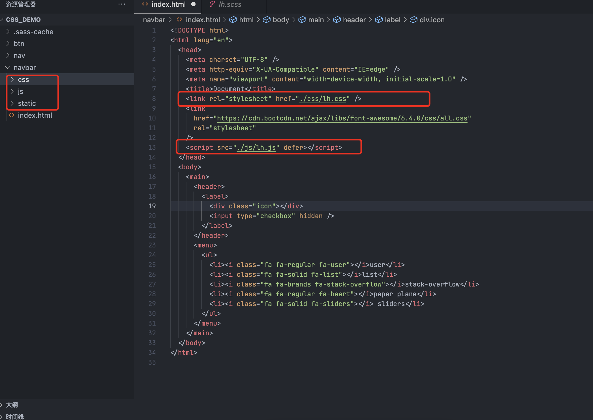

# 基础知识

## 前端三剑客之 HTML

- HTML：负责网页的架构
- CSS：负责网页的样式，美化
- JavaScript（JS）：负责网页的行为

## 开发环境

- HTML 学习不需要安装执行环境，电脑上的浏览器都可以，推荐 Google 浏览器、火狐浏览器调试
- 开发工具：Vscode、webstorm、sublime text 推荐：Vscode
- 官方下载地址：
  - google:http://www.google.cn/intl/zh-CN/chrome/
  - 火狐：http://www.firefox.com.cn/
  - webstorm：https://www.jetbrains.com.cn/webstorm/
  - Vscode：https://code.visualstudio.com/
  - sublime text：http://www.sublimetext.com/

> vscode 国内下载会比较慢，推荐使用以下方法下载，速度飞起来：
>
> https://blog.csdn.net/thlchina/article/details/113940283

## 基础知识

HTML 不是一种编程语言，而是一种标记语言 (markup language)，是网页制作所必备的。用于按不同标签声明网页中的内容。

### 文件命名

- 使用小写字线命名文件，不要出现中文字符
- 扩展名标准是.html，当然也可以使用.htm
- 多个单词可以使用`-` 或 `_` 连接，建议使用`-` 字符如`user-create.html`

### URL

统一资源定位符，用于表示资源在网络上的地址，每个部分以`/`进行分隔。

### 访问路径

**绝对路径**

Windows:从 C 盘或其它盘一直到里面文件夹后面的某个文件

Mac/linux:从根目录/到某个文件夹中的文件

```bash
#mac/linux
/Users/wslh/hldoc/index.html
#windows
C:\Program Files\wslh\index.html
```

**相对路径**

从当前打开命令行窗口为起点上层找是../是一层如果有多层就是../../....,下层是./

在项目 hldoc 目录下的 static 目录找 index.html,需要加到 hldoc 目录下找相应文件

下图 html 引入 lh.js 和 lh.css 就是在当前文件夹往下./css/lh.css 或./js/lh.js

如果是 css 引入 sttic 的图片,就是../回到 navbar 根目录后找到 static 下的背景图片 ../static/bg.png



```bash
# 相对路径
#mac/linux
../index.html
#windows
../index.html
```

### 注释

分为单行注释和多选注释 用<!-- 内容 -->包裹，常用开发工具一般使用快捷键`ctrl+/`

```html
<!-- 单行注释 -->
<body>
  <!-- 头部 -->
  <footer></footer>
</body>

<!-- 多行注释 -->
<!-- <ul>
<li><a href="">1</a></li>
<li><a href="">2</a></li>
<li><a href="">3</a></li>
<li><a href="">4</a></li>
<li><a href="">5</a></li>
<li><a href="">6</a></li>
</ul> -->
```