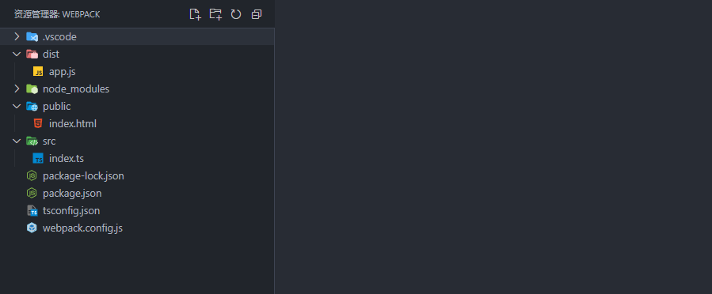
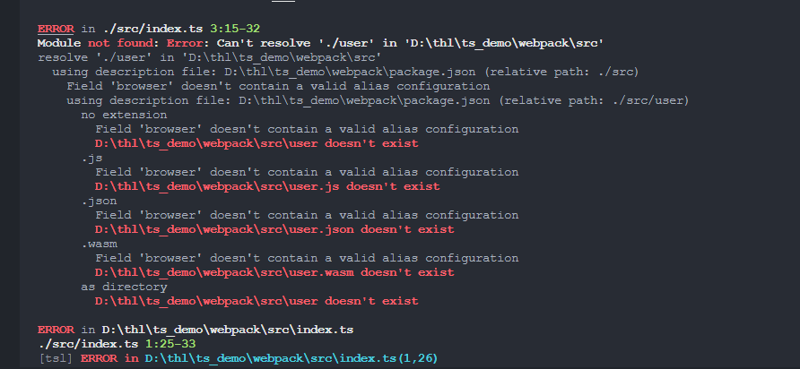
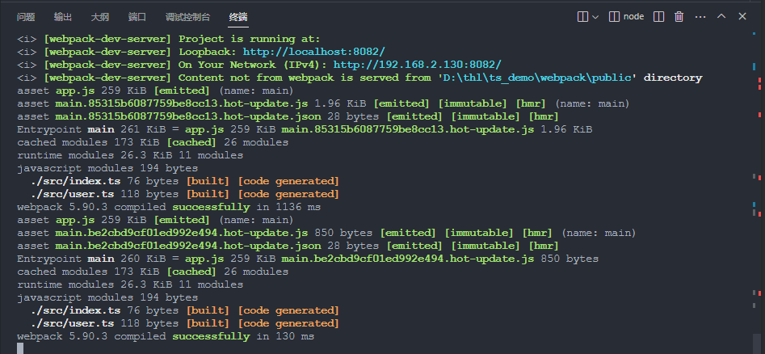

# Webpack使用

## 为什么需要 Webpack

1. 随着前端需要处理的内容越来越多，同时也为了解决 JS 全局标识符污染问题，模块化开发成为了主流，但是浏览器却不能识别模块化。
2. 随着新时代语法的更新，让开发更有效率，维护更方便。但是依然会有大量的新语法在很多浏览器上不太支持，开发和生成出现了问题，如 ES6 的语法。
3. 为了提升开发效率，出现了大量的预编译语言，如 less,scss,但是这些语言不能被浏览器直接识别。那么就需要生产时提前编译，如果项目中用到了很多预编译语言，那么所有预编译语言的编译就是一一个繁琐的工作。
4. 以前对于小图片请求性能的考虑，大多是做成精灵图，但是就算做成精灵图也是需要一次请求， 有的时候就是处于性能的考虑需要将图片编程 base64 的编码，因此也是需要一个编码的工具。
5. 框架的出现和大量的使用，需要在开发时能够实时了解开发结果。
6. 总之，随着技术的发展，就需要一一个工具来提升代码的开发效率，优化代码的编译。将浏览器不能识别的语法自动处理为浏览器能够识别的语法。

## 其他构建工具 Grunt/Gulp

1. Grunt 是一个任务执行者，有大量现成的插件封装了常见的任务，也能管理任务之间的依赖关系，自动化的执行依赖的任务，每个任务的具体执行代码和依赖关系都写在配置文件
   Gruntfile.js 里

2. Gulp 是一个基于流的自动化构建工具.

3. 简单的说:就是你定义了很多任务,让 Grunt/Gulp 自动去执行这些任务

## Grunt/GulpSWebpackXtk

1. Grunt/Gulp 更强调流程自动化,模块化不是核心
2. Webpack 更强调模块化开发管理，而文件的压缩合并预处理功能都是附带的
3. Webpack 的优点使得 Webpack 在很多场景下可以替代 Gulp/Grunt 类的工具。

## Webpack 是什么

webpack 是一个用于现代 JavaScript 应用程序的静态模块打包工具。当 webpack 处理应用程序时，它会在内部构建一个依赖图(dependency graph),此依赖图对应映射到项目所需的每个模块，并生成一个或多个 bundle。

## 模块打包器

1. 随着开发的复杂度越来越高，以前的开发方式已经难以满足我们的需要，为了更快更好的开发程序会大量的使用到模块化开发，以及一些优秀的预处理器(如 less, scss),
2. 但这些模块化工具，浏览器不能够直接识别，所以我们就需要将开发的的代码转为大部分浏览器能识别的代码，所以我们需要一个工具，将我们的模块进行处理，这个处理的过程就是打包。
3. 所以 webpack 就是前端模块化打包工具

## Webpack 核心概念

### 入口(entry)

1. 入口起点(entry point)指示 webpack 应该使用哪个模块(文件)，作为构建其内部依赖图的开始

2. 说明:
   在 webpack 构建时会先找到入口文件，然后在入口文件中无找到需要直接或间接依赖的模块 webpack 将每个依赖进行处理，最后出入构建后的结果

3. 例如:

   ```javascript
   module.exports = {
   entry: 'index.js'
   ```

### 出口(output)

1. Output:输出指示，告诉 Webpack 打包好的资源 bundles 输出到哪里去,以及如何命名输出的文件

2. 例如:

   ```javascript
   module.exports = {
   entry : 'index.js',
   output: {
       filename: 'handle.js', //配置导出的文件名
       path: resolve(_ dirname,'dist') // 将打包后的文件放在哪
       个文件夹中
       }
   }
   ```

### Loader 处理文件

1. Webpack 核心只能处理 JavaScript 已经 JSON 资源文件,非 JS 文件 Webpack 只能交给 Loader 处理

2. 通过来说就是通过 loader 将 webpack 不能是被的文件转成 webpack 能识别的模块

   ```javascript
   module.exports = {
   module: { // module
     rules:[ // 规则
       {
         //正则匹配
         test: N.css$/,
         //使用css-loader,将css转成js能识别的模块
         use: 'css-loader'
         }
       ]
   	}
   }
   ```

### Plugin 插件

1. Plugin 插件,可以用于执行范围更广的任务.插件的范围包括从打包优化,压缩到重新定义环境变量.

2. 通俗的来了解,插件就是对于 webpack 功能的扩展

3. 例如:

   ```javascript
   const HtmlWebpackPlugin = require(' html-webpack plugin');
   module.exports = {
   plugins: [
   new
   HtmlWebpackPlugin();
   }
   ```

Mode 模式

1. Mode 模式，用来告诉 Webpack 在不同的模式下使用不同的配置主要有开发模式和生产模式

2. Mode 模式用于指定 Webpack 打包使用相应模式的配置

## Webpack 安装

### 1.全局安装

`npm install -g webpack webpack-cli`

### 2.局部安装

注意局部安装将 webpack 安装到开发依赖中

`npm install webpack webpack-cli --save-dev`

### Webpack 和 Webpack-cli 介绍

- webpack4.0 以后，执行方式就发生了改变，不再是 webpack 一波流，而是多了一个 webpack-cli.所以安装时两个都需要安装
- webpack 是 webpack 的核心代码
- webpack-cli 是提供 webpack 命令
  `npm install -g webpack webpack-cli`

### Webpack 打包命令

- 语法使用
  `webpack <entry> <output>`
- 例子:
  `webpack index.js bundle.js`
- 命令的意思，是将 index.js 作为打包的入口开始打包，打包后的文件叫做 bundle.js

- 定义模块

- 通过 webpack 命令打包

- 打包后的结果

- 嵌入 html 运行

- 打包 css

- 打包 css 结果，会出现以下错误

### 总结

- webpack 只能处理 js/json 资源,不能处理 img/css 等其他资源
- 生产环境和开发环境将模块化编译成浏览器能识别的模块化
- 生产环境比开发环境多一个压缩 js 带代码的功能

## Webpack 配置

- webpack 零配置不需要您使用配置文件。但是，它将假定项目的入口点是 src/index ,并将结果输出为经过精简和优化的 dist/main.js 以供生产使用。
- webpack 配置文件名称固定为 webpack.config.js
- 处理好配置文件以后，在打包时只需要在命令行输入 webpack 命令就可以打包了，
- 因为 webpack 在打包时会自动查找到 webpack.config.js 进行解析
- webpack.config.js 的作用就是告诉 webpack 接下来要做哪些工作

### 配置文件选项

- 所有的构建 I 具都是基于 node 环境的，因此，在 webpack.config.js 中默认使用 commonjs 模块化规范

- 配置文件代码:

  ```javascript
  const {resolve } = require( path' )
  //导出webpack配置
  module.exports = {
  // webpack打包的入口文件(起点)
  entry:" ./src/indexjs",
  output:{
  filename:" bundle.js",
  //出口文件
  path:resolve( dirname," build") // 出口文件所在的目录
  },
  module:{
  // rules规则，详细的loader配置，
  //不同的loader处理不同的文件
  rules:[
  },
  plugins:[
  // 详细的plugins插件的配置
  ],
  mode:" development", // " production"产品模式
  ```

### 打包 css 样式文件

- 打包 css 是需要通过 css-loader 将样式文件处理为 webpack 识别的模块

- webpack 将样式文件当成模块打包到出口的 js 文件中

- 通过 style-loader 在 html 文件中创建 style 标签，并将 js 中内容抽出插入到 style 中

- 下载所需要的 loader 包

- 将 loader 安装到开发依赖，项目打包上线以后,就不需要这些 loader 了

  `npm install style-loader css-loader--save-dev`

- 配置处理样式文件的 loader

  ```javascript
  module:{
  // rules规则，详细的loader配置,
  //不同的loader处理不同的文件
  rules:[
  // rules规则是一个数组，里面可以配置多个规则,一个规则就是一个对象
  {
  //正则，匹配所有后缀名为css的文件并使用下面的loader处理
  test: A.css$/,
  // use使用使用那些loader处理匹配成功的文件
  use:[
  //在将js中的样式资源插入到style标签中，并添加要页面的head中
  "style-loader",
  // css-loader会将css文件处理为commonjs模块并加载到js中
  css-loader"
  ```

- 打包

  `npx webpack`

### 打包 less 样式文件

- 打包 less 样式文件,我们就需要有能够将 less 转为 css 文件的 loader

- 下载处理 less 文件的 loader
  `npm install less less-loader --save-dev`

- 配置 less 样式文件的 loader

  ```javascript
  module:{
  rules:[
  //配置处理less文件的规则
  {
  test: A\.les$/,
  use:[
  "style-loader",
  'css-loader",
  //将less文件编译为css文件再用处理css文件的loader处理后续
  "less-loader"
  }
  ```

- 配置完毕以后就可以在命令行使用 webpack 命令进行打包了

### 打包 scss 样式文件

- 打包 scss 样式文件，我们就需要有能够将 scss 转为 css 文件的 loader

- 下载处理 scss 文件的 loader
  `npm install node-sass sass-loader --save-dev`

- 配置 scss 样式文件的 loader

  ```javascript
  module:{
    rules:[
    //配置处理scss文件的规则
    {
      test: A\.scss$/,
      use:[
      "style-loader",
      css-loader" ,
      //将scss文件编译为css文件再用处理css文件的loader处理后续
      'sass-loader"
  			]
  		}
  ]
  ```

- 配置完毕以后就可以在命令行使用 webpack 命令进行打包了

## 打包资源

### 打包 html 资源

- webpack 打包 html 文件资源，不是使用 loader 而是使用插件使用 html-webpack plugin 插件自动生成 html 文件

- 下载插件
  `npm install html-webpack-plugin --save-dev`

- 在 webpack.config.js 中配置插件说明

  引入下载好的插件
  ​ 在 plugins 中配置插件

  ```javascript
  const HtmlWebpackPlugin = require("html-webpack- plugin")
  const (resolve) = require(" path");
  module.exports =l
  plugins:[
  new
  HtmlWebpackPlugin(f
  //配置html打包模板
  template:"./src/main.html"
  1)
  ```

### 应用

- src 文件夹是开发文件夹，在这个文件夹中开发 html 文件内容
- html-webpack-plugin 会在打包的 dist 目录中生成新的 html 文件
- 开发的 html 文件中的内容插入到 plugin 生成的 html 文件中
- 并在新生成得 html 文件中插入打包后的 js 文件

- 运行结果

### 配置脚本命令

- 配置脚本命令使用 webpack 打包说明

- 在所有的终端里使用 webpack 命令,默认都是全局安装的 webpack

- 项目为了保证统一需要使用项目本地 webpack 进行打包

- 脚本中运行的 webpack 是使用本地 webpack 命令

- 在 package.json 中配置脚本命令

  ```javascript
  "scripts": l
  "test": "echo 1" Error: no test specified" && exit 1",
  "build": "npx webpack"
  ],
  ```

- 配置完成以后，在命令行运行 npm run build 命令来使用本地 webpack 了

### 打包图片资源

- 处理图片资源说明

- 需要使用到 url-loader 处理图片

- 注意 url-loader 依赖于 file-loader,因此安装时注意.两个都要安装
  `npm install url-loader file-loader --save - dev`

- 样式中引入图片就是通过 background 属性来引入背景图片

- 接来下我们以在 Css 文件中为例了解 webpack 如何打包图片资源

  ```javascript
  .box[
  width: 200px;
  height: 112px;
  background: url(img/logo.png) no-repeat;
  ```

### 图片打包配置

- 打包后，发现所有的图片都会打包成为 base64 图片

- base64 图片的优点:减少服务请求次数减轻服务器压力

- base64 图片的缺点:图片的体积会变大，文件的加载速度会变慢

- 因此我们要综合考虑体积比较小的图片打包为 base64,图片太大的图片，就不打包为 base64

- 低于设置大小的图片打包为 base64 图片，超过设置大小的图片不打包为 base64 图片

  ```javascript
  module.exports = {
  //..
  module:{
  rules:[
  test: A.(jpglpng|gif)$/,
  //使用一个loader处理，用loader配置
  loader: "url-loader",
  options:{
  //配置图片打包loader
  //图片大小低于8kb的会打包为base64格式，
  //超过的处理为文件格式
  limit: 8 * 1024
  ]
  },
  // ....
  ```

### html 图片打包

- html 文件时使用 http-webpack plugin 插件将内容插入到打包后的 html 文件中

- 在 html 文件中引入的图片路径在处理后不会发生改变

- 打包后 html 文件就找不到图片，所以显示不了图片

- 安装:
  `npm install html-loader --save-dev`

- loader 配置

  ```javascript
  module.exports =l
  11...
  module:(
  rules:[
  11..
  test: /.htmI$/,
  11 html-loaderkhtml145I
  11 html-loaderet imgHlimg,url-loader
  loader:"html-loader",
  //默认情况下，html-loader 生成使用ES modules语法的JS模块
  options: l
  esModule: false
  ],
  11...
  ```

### 打包其他资源

- 打包除了 html,css,js 外的其他资源

- 利用 exclude 来排除已经配置处理文件，处理所有不是 exclude 排除的文件

- 利用 file-loader 来处理其他资源文件

- 以字体图标为例:

  ```html
  <span class="iconfont icon-weixin"> </span>
  <span class="iconfont icon-ziyuan"> </span>
  <span class="iconfont icon-wodejianying"> </span>
  <span class="iconfont icon-shouyejianying"> </span>
  ```

- 字体图标的打包配置

  ```javascript
  module.exports ={
  //
  ...
  module:{
  rules:[
  {
  test: A\.css$/,
  use:["style-loader"," css-loader"]
  },
  //打包其他资源
  // exclude排除，除了html,css,js文件外所有文件
  //都是用file-loader来处理，包括字体图标
  exclude: A\.(html|(cssljs)$/,
  loader:" file-loader"
  }
  },
  //
  ...
  ```

### webpack-dev-server

- webpack- dev-server 是 webpack 官方提供的一个小型 Express 服务器。使用它可以为 webpack 打包生成的资源文件提供 web 服务。

- webpack- dev-server 主要提供两个功能:

- 1.为静态文件提供 web 服务

- 2.自动刷新和热替换(HMR)

- 安装
  `npm install --save-dev webpack-dev-serve`

- 配置 webpack.config.js 文件

  ```javascript
  devServer: l
  host: '127.0.0.1',
  port: 8080,
  progress: true
  index:'index.html',
  contentBase:path.resolve( dirname, 'dist')
  ],
  ```

- 运行 webpack- dev-server
  `npx webpck-dev-server`

## 性能优化

### 提取 CSS 到单独文件

- mini-css- extract plugin 可以将打包的 css 提取到一个单独的文件中

- 安装
  `npm install --save-dev mini-css-extract- plugin`

- 打包配置

  ```javascript
  module.exports = l
  module:(
  rules:[
  test: /.css$/,
  use:[MiniCssExtractPlugin.loader," css-loader"]
  ]
  plugins: [
  new
  MiniCssExtractPlugin(l
  filename: 'css/style.css' //tJE68S
  ))
  11..
  ```

- 结果

### Postcss

- 是一个用 JavaScript 工具和插件转换 CSS 代码的工具，将最新的 CSS 语法转换成大多数浏览器都能理解的语法是一个用 JavaScript 工具和插件转换 CSS 代码的工具

- 安装
  `npm install--save-dev postcss-loader postcss`

- 在入口文件引入 css

  `improt "file.css";`

- 配置

  ```css
  test: .css$/,
  use:[
  //'style-loader',
  MiniCssExtractPlugin.loader,
  'css-loader',
  loader: 'postcss-loader',
  options: l
  postcssOptions: l
  plugins: ['postcss-preset-env']
  ```

- 在 package.json 设置支持哪些浏览器，必须设置支持的
  浏览器才会自动添加浏览器兼容

  ```javascript
  "browserslist": (
  'development": [
  "notie <= 8",
  "last 2 versions",
  '>1%"
  "iOS >= 7",
  ' Android >= 4.0"
  production": [
  not ie <= 8"
  "last 2 versions"
  "> 1%",
  "iOS >= 7",
  "Android >= 4.0"
  ```

### 压缩 css

- csS-minimizer-webpack plugin 插件可以实现对 css 的压缩

- 安装
  `npm install csS-minimizer-webpack plugin --save-dev`

- 配置

  ```javascript
  module.exports = [
  module: f
  loaders: [
  test: /.css$/,
  use:
  [MiniCssExtractPlugin.loader, 'css-loader']
  ],
  ],
  ],
  plugins: [
  new
  MiniCssExtractPlugin(l
  filename: 'css/build.css'
  1),
  new CssMinimizerPlugin)
  ],
  );
  ```

### babel

- 虽然 webpack 可以打包 js 文件，但是一些高级语法是无法识别的，因此需要使用第三方工具 babel-loader,高级，js 语言变成低级语言

- 安装
  `npm install --save-dev babel-loader @babel/core @babel/ preset-env`

- 配置

  ```javascript
  module: l
  rules:[
  test: /.js$/,
  exclude: /node modules/,
  use: 1
  loader: 'babel-loader',
  options: l
  presets: [' @babel/preset-env']
  ]
  ```

### HMR(热替换)

- HMR 即模块热替换(hot module replacement)的简称，它可以在应用运行的时候，不需要刷新页面，就可以直接替换

- 启用热替换，只需要在 webpack dev-server 添加以下配置

  ```javascript
  devServer: 1
  contentBase: './dist',
  hot: true,
  ],
  ```

### SourceMap

- SourceMap 是一种映射关系。当项目运行后，如果出现错误，错误信息只能定位到打包后文件中错误的位置。如果想查看在源文件中错误的位置,则需要使用映射系，找到对应的位置

  ```javascript
  module.exports = [
  devtool: 'none', 11 SourceMap
  entry: './src/index.js',
  output: [
  filename: 'bundle.js',
  path: path.resolve( dirname, 'dist') 1/ X143
  ```

### SourceMap 参数

- source-map
- 会生成 map 格式的文件，里面包含映射关系的错误代码准确信息和源代码的错误位置
  `devtool: 'source-map'`
- inline-source-map
- 不会生成 map 格式的文件，包含映射关系的错误代码准确信息和源代码的错误位置
  `devtool: 'inline-source-map'`
- inline-cheap-source-map
- 不生成 map 格式的文件，会映射错误代码准确信息和源代码的错误位置,只能精确的行
  `devtool: 'inline-cheap-source-map'`
- inline-cheap-module-source-map
- module 会映射 loader 和第三方库
  `devtool: 'inline cheap-module- source-map'`

### 多入口文件

- 当打包的过程中如果需要有多个入口文件，可以写为

  ```javascript
  entry: l
  app: './src/app.js',
  search: './src/search.js',
  ],
  output: l
  filename: '[name].js',
  path: dirname + '/dist',
  ],
  ```

- 在 html 中引入的时候，可以每个 html 文件引入其中的一个

  ```javascript
  new HtmlWebpackPlugin(f
  template: './src/index.html',
  filename: 'app.html',
  chunks: ['app']
  ]),
  new
  HtmlWebpackPlugin(l
  template: './src/index.html',
  filename: 'search.html',
  chunks: ['search']
  1),
  ```

### HMR(模块热替换)

- 模块热替换(Hot Module Replacement 或 HMR)是 webpack 提供的最有用的功能之- ,它允许在运行时更新各种模块，而无需进行完全刷新。
- 例如入口文件引入了 print.js,现在修改 print.js 里面的内容，使用 HMR 就可以只更新 print.js 里面的内容而不用重新加在整个页面。

### 启用 HMR

- 启用这个功能很简答，只需要修改一下配置文件， 使用 webpack 内置启的 HMR 插件就可以了

- 并给 webpack- dev-server 添加 hot 为 true 即可

  ```javascript
  1/5I webpack
  const webpack = require('webpack');
  1/68 webpack PTÉ HMRJ314
  new webpack.HotModuleReplacementPlugin0
  devServer:(
  hot: true I/FEHMR
  ]
  ```

### 启动 HMR

- 注意:从 webpack5 开始，需要添加属性
  `target: 'web'`

### watch

- webpack 可以监听文件变化，当它们修改后会重新编译。这个页面介绍了如何启用这个功能，以及当 watch 无法正常运行的时候你可以做的一些调整。

  ```javascript
  watch: true,
  watchOptions: i
  aggregateTimeout: 200,
  poll: 1000,
  ],
  ```

### 缓存

- 使用 webpack 来打包我们的模块化后的应用程序,webpack 会生成一个可部署的/dist 目录，然后把打包后的内容放置在此目录中。只要/dist 目录中的内容部署到 server.上，client (通常是浏览器)就能够访问此 server 的网站及其资源。而最后一步获取资源是比较耗费时间的，这就是为什么浏览器使用一种名为缓存的技术。可以通过命中缓存，以降低网络流量，使网站加载速度更快

- webpack 提供了-种使用称为 substitution(可替换模板字符串)的方式，
  通过带括号字符串来模板化文件名。其中，[contenthash] substitution
  将根据资源内容创建出唯- - hash.当资源内容发生变化时，
  [contenthash]也会发生变化。

  ```javascript
  output:(
  filename: '[name].[contenthash].js',
  path: path.resolve( dirname, 'dist'),
  clean: true,
  ```

### Tree shaking

- tree shaking 是一个术语，通常用于描述移除 JavaScript 上下文中的未引用代码(dead-code)。它依赖于 ES2015 模块语法的静态结构特性，例如 import 和 export。必须使用 ES6 的模块化，同时开启生产环境。
- 在项目的 package.json 文件中，添加"sideEffects"属性
- 如果所有代码都不包含 side effect,我们就可以简单地将该属性标记为 false,来告知 webpack,它可以安全地删除未用到的 export。

### 跨域

- 通过 webpack- dev-server 可以设置跨域的问题

- 使用 express 创建 web 服务器，并添加路由

- ```javascript
  const express=require( express')
  const app = express();
  app.get('/api/user' ,(req,res)=>[
  res.json([name: 'itpEfLtx'));
  ]);
  app.listen(8080);
  ```

- 配置跨域

  ```javascript
  devServer: l
  proxy: i
  '/api': i
  target: 'http://127.0.0.1:8080',
  ],
  ```

- 入口文件发送请求

  ```javascript
  const xhr = new XMLHttpRequest();
  xhr.open('get','/api/users',true);
  xhr.onload = function() [
  console.log(xhr.response);
  ]
  xhr.send();
  ```

### dlI 动态资源库

- 在用 Webpack 打包的时候，对于一-些不经常更新的第三方库，比如 jquery, vue, vuex,我们希望能和自己的代码分离开。

- 对于这种方式优化的项目，一般有两个配置文件，分别是:

- webpack.config.js

- webpack dll.config.js

- 新建 webpack.dll.config.js

  ```javascript
  module.exports = {
  entry:{
  jquery: [jquery']
  output: {
  filename: '[name]js',
  path: path.resolve( dirname,'ll),
  library: '[name]_ [hash]'//打包后往外暴 露的内容名字
  plugins: [
  //打包生成一个manifest.json, 提供和jquery映射
  new webpack.DllPlugin({
  name:
  '[name]_ [hash]', //映射库的暴露的内容名字
  path: path.resolve( _dirname, *dll/manifest.json") //输出的文件路径
  })
  ]
  ```

- 运行打包命令 npx webpack.dll.configjs

- 会生成 dIl 目录，并出现打包后的文件

  ```javascript
  webpack.config.jst, #iwebpackp5J, AJE
  new webpack.DllReferencePlugin(f
  manifest: path.resolve(_ dirname, dl/manifest.json')
  ))
  ```

- 当在入口 l 文件中引入文件，就会自动寻找打包后的资源

  ```
  import $ from 'jquery'
  console.log($);
  ```

## 打包 vue

### 搭建 vue 开发环境

- 使用 webpack 搭建 vue 开发环境

- 安装所需要的包
  `npm install vue-loader vue-template-compiler --save-dev`
  `npm install vue --save`

- 配置文件

  ```javascript
  const VueLoaderPlugin = require('vue-loader/lib/plugin');
  module.exports =l
  11...
  module:(
  rules:[
  11 ...
  test: /.vue$/,
  loader: 'vue-loader'
  ],
  ),
  plugins: [
  new
  HtmlWebpackPlugin(l
  template: './src/index.html',
  filename: 'index.html'
  1),
  new
  VueLoaderPlugin0 //new-↑T19J
  ```

- 入口文件引入 vue，创建 vue 实例

  ```javascript
  import Vue from 'vue';
  import App from './App.vue';
  new
  Vue(l
  el: '#app'
  render:h => h(App)
  ```

### 处理 CSS

- vue-style-loader 在安装 vue-loader 自动安装，不需要单独安装

  ```javascript
  test: /.css$/,
  use: ['vue-style-loader','css-loader']
  ```

### 处理 scss

- 需要先安装 sass-loader 和 node-sass

  ```javascript
  test: /.css$/,
  use:
  ['vue-style-loader','css-loader','sas-loader']
  ```

### 其它

- 安装 webpack-dev-server,配置服务器，添加热更新
- 安装 vue-router,配置路由
- 安装 axios、vue-axios, 发送 ajax 请求
- 跨域

## 打包Typescript

### 初始化项目

```bash
npm init -y
```

### 安装依赖包

```bash
npm install -D typescript webpack webpack-cli ts-loader webpack-dev-server
```

### 创建typescript配置文件

```bash
tsc --init 
```

创建webpack配置文件,根目录 创建文件`webpack.config.js`,文件夹src,public

`webpack.config.js`

```js
const path = require("path"); //引入path模块
module.exports = {
  entry: "./src/index.ts", //入口文件
  output: {
    filename: "app.js", //输出文件名
    path: path.resolve(__dirname, "dist"), //输出文件路径
    publicPath: "/dist/", //dev去内存获取数据的公共路径
  },
  module: {
    rules: [
      {
        test: /\.tsx?$/, //ts或tsx文件结束的文件,
        use: "ts-loader", //使用ts-loader
        exclude: /node_modules/, //排除node_modules文件夹
      },
    ],
  },
};
```

### package.json配置

```json
{
  "name": "webpack",
  "version": "1.0.0",
  "description": "",
  "main": "index.js",
  "scripts": {
    "dev": "webpack-dev-server  --mode=development ",
    "build": "webpack --mode=production  ",
    "test": "echo \"Error: no test specified\" && exit 1"
  },
  "author": "",
  "license": "ISC",
  "devDependencies": {
    "ts-loader": "^9.5.1",
    "typescript": "^5.3.3",
    "webpack": "^5.90.3",
    "webpack-cli": "^5.1.4",
    "webpack-dev-server": "^5.0.2"
  }
}
```

文件目录 



### 模块化处理

tsconfig.json更改模块

```js
{
  "compilerOptions": {
    "target": "es2016" /* Set the JavaScript language version for emitted JavaScript and include compatible library declarations. */,
    "module": "es6" /* Specify what module code is generated. */,
    "esModuleInterop": true /* Emit additional JavaScript to ease support for importing CommonJS modules. This enables 'allowSyntheticDefaultImports' for type compatibility. */,
    "forceConsistentCasingInFileNames": true /* Ensure that casing is correct in imports. */,
    "strict": true /* Enable all strict type-checking options. */,
    "skipLibCheck": true /* Skip type checking all .d.ts files. */
  }
}
```

src下新建user.ts

```js
import { name, RH } from "./user";
console.log(name);
console.log(RH.host);

```

index.ts

```tsx
export const name:string="Ronhai"

export namespace RH{
    export const host:string='www.tanghailong.com';
}
```

会报以下错误



打包配置更改

`webpack.config.js`新增以下配置

```js
  resolve: {
    extensions: [".tsx", ".ts", ".js"], //配置解析文件的后缀名
  },
```




## vue 构建工具-vite

### vite 简介

- Vite;是 Vue 的作者尤雨溪开发的 Web 开发构建工具，它是一个基于浏览器原生 ES 模块导入的开发服务器，在开发环境下，利用浏览器去解析 import,在服务器端按需编译返回，完全跳过了打包这个概念，服务器随启随用。

- Vite 具有以下特点:
  快速的冷启动

  即时热模块更新(HMR, Hot Module Replacement)

  真正按需编译

- Vite 是在推出 Vue 3 的时候开发的，目前仅支持 Vue 3.x,
  这意味着与 Vue 3 不兼容的库也不能与 Vite- 起使用。

### 使用 vite

- 与 Vue CLI 类似，Vite 也提供用 npm 或者 yarn 来生成项目结构的方式。选择一个目录，打开命令提示窗口，依次执行下面的命令构建脚手架项目，并启动项目。

  ```javascript
  npm init vite-app < project-name>
  cd <project-name>
  npm install
  npm run dev
  ```

- 例如创建的项目加 myvite,执行完命令以后如下图

- 在浏览器下打开 http://localhost:3000，运行结果为

### vite 中使用 TypeScript

- 在 vue 组件中 script 的 script 加入 lang=‘ts’即可

  ```javascript
  <script lang="ts">//..any</script>
  ```

### json 的使用

- 在组件中直接引入 json 文件，会被自动解析为对象 stu.json 文件

  ```javascript
  'name": "webthl",
  website": " www.pythl.com"
  ```

- 引入

  ```javascript
  import data from './assets/stu.json'
  export default l
  name: 'App',
  //...
  mounted()l
  console.log(data.name)
  ```

### scss 的使用

- 想要使用 scss 需要先安装响应的包
  `npm install sass --save-dev`

- 在组件的 style 标签中加入 lang= "scss"

  ```css
  <style lang-' 'scss" >
  $color: green;
  h1[
  color: $color;
  </style>
  ```

### jsx 的使用

- Vite 对 JSX 也是可以支持的，JSX 最早应该是 React 时候接触到的，这里我们看看如何在 Vue3 里进行使用。

- 直接在 src 目录中，新建一个 App.jsx 文件， 写- -段支持 JSX 的代码。

  ```javascript
  function App() l
  return < div>
  <h1>web前端</h1>
  </div>
  export default Аpp;
  ```

- 再修改 main.js 中的 import 代码，去掉原来对 App.vue 的引用，加入对 App.jsx 的引用就可以了。

  ```javascript
  import l createApp ] from 'vue'
  11 import App from './App.vue'
  import App from './App.jsx '
  import './index.css'
  createApp(App).mount(' #app')
  ```